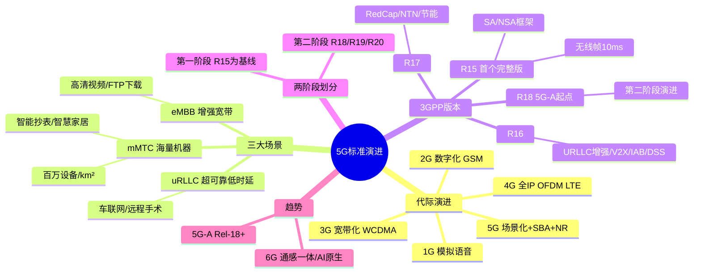

# 5G标准演进及趋势

> 大纲分类：一、通信关键技术 > 一、基本原理 > 5G标准演进及趋势  
> 考核要求：精通  
> 已有资料来源：通信通用知识 + 真题归纳

---

## 知识导图

---

## 核心知识点

### 一、从1G到5G的演进脉络

移动通信代际演进本质是：**业务需求驱动 → 频谱与波形革新 → 网络架构解耦**。

| 代际 | 典型制式/特征 | 业务与网络特点 |
|------|---------------|----------------|
| 1G | 模拟蜂窝（如 AMPS、TACS） | 仅语音，频谱效率低，安全性弱 |
| 2G | GSM、IS-95 | 数字化语音 + 低速数据（短信/GPRS） |
| 3G | WCDMA、cdma2000、TD-SCDMA | 移动宽带起步，可支撑网页与简单多媒体 |
| 4G | LTE/LTE-A | 全 IP、扁平 EPC、高谱效 OFDM，移动互联网爆发 |
| 5G | NR + 5GC | 三大场景、eMBB 与 URLLC/mMTC 能力分化、核心网 SBA、云原生 |

**记忆抓手**：2G 数字化、3G 宽带化、4G 全 IP 与 OFDM 规模化、5G **场景化 + 服务化核心网 + 新空口 NR**。

### 二、5G三大应用场景（ITU IMT-2020 / 3GPP 对齐表述）

1. **eMBB（增强移动宽带）**  
   峰值/体验速率、容量、广覆盖高清视频、热点大容量等。**大唐杯常考**：车联网（V2X 超低时延高可靠部分）更贴近 **uRLLC**，不要与“大带宽下载”混淆。

2. **uRLLC（超可靠低时延通信）**  
   工业控制、远程手术、车联网安全相关等，强调 **ms 级时延 + 高可靠性（如 99.999%）**。

3. **mMTC（海量机器类通信）**  
   海量低速小分组终端、长电池寿命；典型指标常考 **连接密度**（如每平方公里百万级设备为常见表述，具体数值以题目选项为准）。

**易混点**：智能家居、抄表等多属 **mMTC**；远程驾驶紧急制动等属 **uRLLC**。

### 三、3GPP 5G NR 标准版本与关键特性（R15→R18）

- **R15（5G 第一个完整版本）**  
  - SA/NSA 框架、NR 基础物理层与协议栈、5GC 基本流程。  
  - 考试高频：**无线帧 10ms**、基础信道与参数集、PDSCH 调制阶次上限等常与 R15 绑定出题。

- **R16**  
  - **URLLC 增强**、**NR-U / 免许可**、**IAB（集成接入回传）**、**V2X NR**、**DSS（动态频谱共享，LTE/NR 同载波）** 等。  
  - 题库常见：DSS 在 R16 进一步增强。

- **R17**  
  - **RedCap（轻量化终端）**、**NTN（非地面网络，卫星）**、**毫米波/上行增强**、**节能** 等；产业与 AI/ML 相关用例在标准中的讨论增多，题库可出现“R17 强调 AI/ML 潜力”类判断。

- **R18 及以后（5G-Advanced）**  
  - 面向 **5G-A**：更智能的网络、XR、更灵活 AI/ML 辅助空口与网管、进一步场景细化。可理解为 **Rel-18 = 5G 第二阶段演进起点**（与“两阶段”划分题目对应）。

**两阶段划分（题库常见说法）**：第一阶段以 **R15** 为主力商用基线；第二阶段多包含 **R16/R17** 及后续 Advanced 特性（具体选项以试卷为准）。

### 四、5G-A 与 6G 趋势（备考层面）

- **5G-A（5G-Advanced）**：在 Rel-18+ 上增强峰值/体验速率、确定性时延、RedCap 规模部署、天地一体化（NTN）、绿色节能与智能化运维。  
- **6G（研究阶段）**：更高频段与新型波形候选、通感一体、AI 原生空口、极致能效与全域覆盖等，**竞赛以概念与 ITU/3GPP 研究方向了解为主**，细节以官方白皮书为准。

---

## 考点速记

| 考点 | 记忆要点 |
|------|----------|
| 三大场景 | eMBB / uRLLC / mMTC，车联网业务场景归属常考 uRLLC |
| R15 定位 | 5G NR 首个完整版本，大量基础题默认 R15 |
| R16 关键词 | URLLC 增强、V2X、IAB、DSS |
| R17 关键词 | RedCap、NTN、上行/毫米波增强 |
| 5G-A | 多对应 Rel-18 及后续演进包 |
| 标准第四版 | 题库曾出现“第四版”与版本号对应，需按当年试卷解析记忆 |

---

## 相关真题

> 以下真题摘自 `真题题库/真题-按知识点分类.md`，含完整选项与标准答案。

**[来源：第十届大唐杯A组省赛第一场]** 单选题  
对于5G应用的三大场景而言，车联网属于哪种场景

- **A.** mMTC
- **B.** eMBB
- **C.** D2D
- **D.** uRLLC ✓
【答案】D

**[来源：第八届大唐杯本科组省赛]** 单选题  
5G mMTC 场景下，每平方公里至少支持多少台设备

- **A.** 1000
- **B.** 100 万 ✓
- **C.** 1 万
- **D.** 10 万
【答案】B

**[来源：第九届大唐杯B组省赛]** 单选题  
eMBB 场景下，不属于影响 5G 系统端到端时延的维度是

- **A.** 传输网(Transport)延时
- **B.** ftp 服务器延时 ✓
- **C.** 无线接入网(RAN)延时
- **D.** 核心网(Core)延时
【答案】B

**[来源：第十一届大唐杯研究生组省赛]** 单选题  
下列不属于5GmMTC应用场景的是

- **A.** 智能抄表
- **B.** 智慧城市
- **C.** 智慧家居
- **D.** 高清视频 ✓
【答案】D

**[来源：第十一届大唐杯研究生组省赛]** 单选题  
R15版本，5G NR的无线帧长度为

- **A.** 20ms
- **B.** 10ms ✓
- **C.** 0.5ms
- **D.** 1ms
【答案】B

**[来源：第八届大唐杯本科组省赛]** 单选题  
3GPP协议针对5G第一个商用版本为

- **A.** R14
- **B.** R15 ✓
- **C.** R17
- **D.** R16
【答案】B

**[来源：第十一届大唐杯本科B组省赛第一场]** 单选题  
5G标准的第四版对应为3GPP的( )版本

- **A.** R16
- **B.** R15
- **C.** R18 ✓
- **D.** R19
【答案】C

**[来源：第十一届大唐杯本科B组省赛第一场]** 多选题  
5G标准可以分为两个阶段，如下3GPP版本对应属于第二阶段的为

- **A.** R17
- **B.** R18 ✓
- **C.** R20 ✓
- **D.** R19 ✓
【答案】BCD

**[来源：第八届大唐杯本科组省赛]** 单选题  
在 5G 网络中，FTP 文件下载业务属于如下那一种业务场景

- **A.** 以上全部
- **B.** 海量机器类(mMTC)
- **C.** 超可靠低时延( URLLC)
- **D.** 增强型移动宽带(eMBB) ✓
【答案】D

---

## 参考资源

- [3GPP 38-series NR 规范索引](https://www.3gpp.org/ftp/Specs/html-info/38-series.htm) — NR 空口系列总入口，可查 TS 38.300/38.211 等  
- [ITU-R IMT-2020 官方专题](https://www.itu.int/en/ITU-R/study-groups/rsg5/rwp5d/imt-2020/Pages/default.aspx) — 三大场景与 IMT-2020 能力集权威出处  
- [3GPP TS 38.300 规范详情（NR 与 NG-RAN 总体描述）](https://portal.3gpp.org/desktopmodules/Specifications/SpecificationDetails.aspx?specificationId=3191) — 架构与流程 stage-2 总览  
