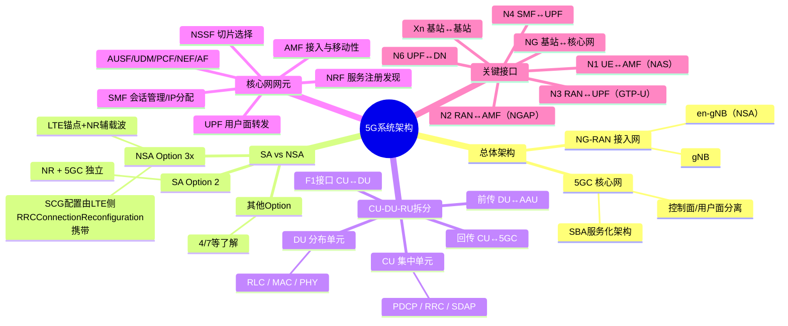

# 5G系统架构及原理

> 大纲分类：一、通信关键技术 > 一、基本原理 > 5G系统架构及原理  
> 考核要求：精通  
> 已有资料来源：课程通用笔记 + 真题归纳

---

## 知识导图

---

## 核心知识点

### 一、5G 网络总体架构：NG-RAN + 5GC

- **NG-RAN（Next Generation RAN）**：由 **gNB**（及 en-gNB，用于 NSA）组成，通过 **NG 接口**连接 5G 核心网 **5GC**。  
- **5GC**：基于 **SBA（服务化架构）**，网元以 **NF（网络功能）+ 服务接口** 方式协同，控制面与用户面分离进一步彻底（SMF/UPF）。

**数据路径简记**：UE —（Uu）→ gNB —（N3）→ UPF —（N6）→ DN（数据网络）；控制面经 AMF 等与 UE、RAN 交互。

### 二、SA 与 NSA 组网及 Option 系列

| 模式 | 含义 | 典型 Option | 要点 |
|------|------|-------------|------|
| **SA** | 独立组网，NR + 5GC | **Option 2** | 终端只驻留 NR，语音可走 VoNR 或 EPS Fallback |
| **NSA** | 非独立，依赖 LTE 锚点 | **Option 3 / 3a / 3x** | 控制面多在 LTE，NR 作辅载波增强；**我国早期商用常见 Option 3x** |
| | | Option 4/7 等 | 不同锚点与分流点组合，了解“分流在 SCG/主站”差异即可 |

**Option 3x（高频考点）**：用户面数据可从 NR（SCG）分流，E-UTRAN 仍承担部分控制面与测量配置；**SCG Add / PSCell Change** 相关配置可由 **LTE 侧 `RRCConnectionReconfiguration`** 携带（与接入网信令文档一致）。

### 三、接入网功能划分：CU / DU / RU（或 AAU）

- **CU（Centralized Unit）**：承载 **PDCP / RRC**（及 **SDAP**，视拆分选项）等，偏高层、可集中部署。  
- **DU（Distributed Unit）**：**RLC / MAC / PHY** 等实时性要求高的部分，靠近射频。  
- **F1 接口**：**CU 与 DU** 之间；**NG**：gNB—5GC；**Xn**：gNB—gNB。

**回传（backhaul）**：在 CU/DU 分离场景下，题库常考 **CU—5GC** 为回传；前传多为 **DU—AAU/RU**。

### 四、5GC 主要网元与职责（简表）

| 网元 | 主要职责（备考版） |
|------|-------------------|
| **AMF** | 接入与移动性管理、NAS MM 信令终结（与 SMF 会话管理分离）、寻呼触发等 |
| **SMF** | PDU Session 建立/修改/释放，IP 地址分配与会话级策略，控制 UPF |
| **UPF** | 用户面转发、锚点、与 RAN 的 **N3**、与 DN 的 **N6**；**SA 场景 UE IP 分配**常与 **UPF/SMF 协同**（题中常考 UPF） |
| **AUSF** | 鉴权服务 |
| **UDM** | 签约数据、订阅标识 |
| **PCF** | 策略控制 |
| **NSSF** | 网络切片选择 |
| **NRF** | NF 服务注册与发现（**自动化注册/发现** 为判断题考点） |
| **NEF** | 能力开放 |
| **AF** | 应用功能，与 5GC 交互 |

### 五、主要接口速记（N1–N11 常考子集）

- **N1**：UE ↔ AMF（NAS）  
- **N2**：RAN ↔ AMF（NGAP）  
- **N3**：RAN ↔ UPF（用户面 GTP-U）  
- **N4**：SMF ↔ UPF  
- **N6**：UPF ↔ 数据网络  
- **N9**：UPF ↔ UPF（漫游/多锚点）  
- **N11**：AMF ↔ SMF  

**基站与核心网之间接口**：题库多次出现 **NG 接口**（逻辑上含 N2+N3 的分工表述，单选常答 **NG**）。

---

## 考点速记

| 考点 | 记忆要点 |
|------|----------|
| 我国 NSA 早期部署 | **Option 3x** |
| NSA EN-DC SCG 配置 | **LTE 侧 RRCConnectionReconfiguration** |
| 基站—核心网 | **NG**；AMF—gNB 控制面属 NGAP/N2 |
| AMF | 接入与移动性、**NAS MM 终结**；不负责 PDU Session 用户面转发 |
| SA 用户面 IP | 常与 **UPF**（及 SMF 控制）关联 |
| CU-DU 分离 | **F1**；回传 **CU—5GC** |
| NRF | 服务注册、发现、自动化管理 |

---

## 相关真题

> 以下真题摘自 `真题题库/真题-按知识点分类.md`，含完整选项与标准答案。

**[来源：第九届大唐杯A组省赛]** 单选题  
5G NR 系统中，5G 基站和核心网通过哪个接口相连

- **A.** Xn
- **B.** NG ✓
- **C.** X2
- **D.** S1
【答案】B

**[来源：第九届大唐杯A组省赛]** 单选题  
目前，我国 5G 商用网采用的 NSA 组网部署方式为哪一种

- **A.** option3x ✓
- **B.** option7x
- **C.** option7
- **D.** option3
【答案】A

**[来源：第九届大唐杯A组省赛]** 单选题  
在 5G NSA 模式 opion3x EN-DC 中，下面哪个信令可以携带 SCG Add 或 PSCell Change 相关 SCG 配置

- **A.** NR 侧的 RRCReconfiguration
- **B.** LTE 侧的 RRCConnectionReconfiguration ✓
- **C.** LTE 侧的 RRCConnectionSetup
- **D.** NR 侧的 RRCConnectionSetup
【答案】B

**[来源：第九届大唐杯A组省赛]** 单选题  
在 5G 网络架构中，以下选项哪一项是 AMF 的功能

- **A.** 注册管理 ✓
- **B.** 下行数据的通知
- **C.** 无线资源分配
- **D.** 会话的建立修改删除
【答案】A

**[来源：第八届大唐杯本科组省赛]** 单选题  
5G NR系统中，对于SA场景，UE ip address allocation 功能由哪个功能模块实现

- **A.** UPF
- **B.** MME
- **C.** SMF ✓
- **D.** AMF
【答案】C

**[来源：第八届大唐杯本科组省赛]** 单选题  
5G网络架构中，CU/DU分离场景下，回传一般指哪两个之间的数据传送

- **A.** AAU-DU
- **B.** AAU-BBU
- **C.** CU-5GC ✓
- **D.** DU-CU
【答案】C

**[来源：第十届大唐杯A组省赛第二场]** 单选题  
5G SA场景下，Uu口控制面协议从上到下的次序依次是

- **A.** SDAP-PDCP-RLC-MAC-PHY
- **B.** RRC-PDCP-RLC-MAC-PHY ✓
- **C.** IP-PDCP-RLC-MAC-PHY
- **D.** SCTP-PDCP-RLC-MAC-PHY
【答案】B

**[来源：第十届大唐杯A组省赛第二场]** 单选题  
在5G网络架构中，以下选项哪一项是AMF的功能

- **A.** 注册管理 ✓
- **B.** 无线资源分配
- **C.** 会话的建立修改删除
- **D.** 下行数据的通知
【答案】A

**[来源：第十届大唐杯A组省赛第二场]** 单选题  
5G网络基本架构，AMF与gNB之间的接口是

- **A.** Xn
- **B.** NG-U
- **C.** NG-C ✓
- **D.** N11
【答案】C

**[来源：第九届大唐杯B组省赛]** 多选题  
现阶段，非独立组网架构(NSA)包括以下哪几种 option(选项)

- **A.** Option4/4a ✓
- **B.** Option3/3a/3x ✓
- **C.** Option2
- **D.** Option7/7a/7x ✓
【答案】ABD

---

## 参考资源

- [3GPP TS 23.501（5G 系统架构，Stage-2）规范目录](https://www.3gpp.org/ftp/Specs/archive/23_series/23.501/) — 网元、接口与流程的权威定义  
- [3GPP TS 38.300（NR 与 NG-RAN 总体描述）规范详情](https://portal.3gpp.org/desktopmodules/Specifications/SpecificationDetails.aspx?specificationId=3191) — NG-RAN、gNB、接口与协议栈位置  
- [3GPP 23-series 规范索引](https://www.3gpp.org/ftp/Specs/html-info/23-series.htm) — 快速定位 23.501/23.502 等  
