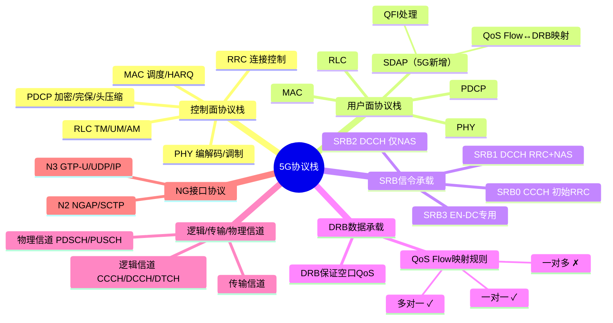

# 5G协议栈分层设计原理

> 大纲分类：一、通信关键技术 > 一、基本原理 > 5G协议栈分层设计原理  
> 考核要求：精通  
> 已有资料来源：`课程笔记/06-5G接入网协议与信令.md`（SRB/DRB、QoS）+ 真题归纳

---

## 知识导图

---

## 核心知识点

### 一、NR 空口协议栈总览

**控制面（Uu 控制面）**（自上而下）：

`RRC → PDCP → RLC → MAC → PHY`

**用户面（Uu 用户面）**（自上而下）：

`SDAP → PDCP → RLC → MAC → PHY`

**5G 相对 LTE 用户面最大差异**：新增 **SDAP** 子层，用于 **QoS Flow 与 DRB 的映射** 及 QoS 流标识（QFI）处理。

### 二、各层核心功能（备考精要）

| 层 | 控制面/用户面 | 核心功能 |
|----|----------------|----------|
| **RRC** | 控制面专属 | 连接控制（建立/释放/重配/重建/挂起恢复）、测量与移动性、系统信息、AS 安全激活等 |
| **SDAP** | 仅用户面 | **QoS Flow ↔ DRB 映射**、在上下行 PDU 中处理 **QFI** |
| **PDCP** | 两面 | **加密/完保**（DRB/SRB）、**头压缩（ROHC）**、重复承载（CA/双连接场景）、重排序与丢弃 |
| **RLC** | 两面 | **TM/UM/AM** 三种模式；**分段/级联**、ARQ（AM）、重排序 |
| **MAC** | 两面 | **调度**、HARQ、逻辑信道复用、随机接入相关、BWP 切换配合等 |
| **PHY** | 两面 | 编解码、调制、MIMO、波束、测量物理层过程 |

### 三、逻辑信道、传输信道与物理信道（关系）

- **RLC 与 MAC 之间**以 **逻辑信道** 区分业务类型（CCCH/DCCH/DTCH 等）。  
- **MAC 与 PHY** 之间为传输信道；再映射到 **PDSCH/PUSCH** 等物理信道。  
- 考试重点在 **SRB/DRB 与逻辑信道**，不必在卷面上展开全部传输信道映射。

### 四、SRB（信令无线承载）类型

| SRB | 映射 | 承载内容 |
|-----|------|----------|
| **SRB0** | CCCH | RRC 消息（如 RRCSetupRequest），无 PDCP 安全 |
| **SRB1** | DCCH | **RRC + NAS**（建立初期关键信令） |
| **SRB2** | DCCH | **NAS**（SRB1 建立并安全激活后；部分场景下仍可配合） |
| **SRB3** | DCCH | **NSA（EN-DC）** 下终端与 **SCG（NR）** 直接传部分 RRC 信息 |

**题库结论**：EN-DC 下可建立 **SRB0/1/2/3**（多选题常全选）。

### 五、DRB（数据无线承载）与 QoS Flow

- **DRB**：用户面数据在空口的承载；一条 DRB 对应 RLC/PDCP/SDAP 配置实例。  
- **QoS Flow**：5GC 中 SMF/UPF 侧会话内 QoS 粒度；空口侧经 **SDAP** 映射到 DRB。

**映射规则（大唐杯高频）**：

- **多个 QoS Flow 可映射到同一 DRB**（多对一）。  
- **一个 QoS Flow 在同一时刻只能映射到一个 DRB**（不可一对多）。  
- **一个 QoS Flow 也可独占一个 DRB**（一对一）。  
- **DRB 负责空口侧 QoS 保障机制落实**（调度、队列、参数集等），表述为“DRB 保证 QoS flow 空口质量”类选项常正确。

### 六、NG 接口与 Xn 接口上的“用户面协议栈”

- **N3（gNB—UPF）** 用户面典型为 **GTP-U / UDP / IP**，**不包含 SDAP/RLC**（空口协议止于 gNB）。  
- 题库若问“N2 协议栈是否含 SDAP”，一般 **不含**（N2 为 NGAP/SCTP）。

---

## 考点速记

| 考点 | 记忆要点 |
|------|----------|
| 用户面多了哪层 | **SDAP** |
| QoS Flow→DRB | **SDAP**；多对一、一对一可；**一对多不可** |
| 仅 NAS 的 SRB | **SRB2**（映射 DCCH） |
| RRC+NAS | **SRB1** |
| 控制面栈顶 | **RRC**；次序 **RRC-PDCP-RLC-MAC-PHY** |
| EN-DC SRB | **0/1/2/3 均可建立** |
| C-V2X PC5-U | 基于 LTE 的协议栈 **无 SDAP**（题库原题结论） |

---

## 相关真题

> 以下真题摘自 `真题题库/真题-按知识点分类.md`，含完整选项与标准答案。

**[来源：第九届大唐杯A组省赛]** 单选题  
5G NR 中哪类 SRB 仅承载 NAS 消息，映射到 DCCH 信道

- **A.** SRB2 ✓
- **B.** SRB0
- **C.** SRB3
- **D.** SRB1
【答案】A

**[来源：第九届大唐杯B组省赛]** 单选题  
5G NR 中哪类 SRB 不仅承载 NAS 消息还可以承载 RRC 消息，映射到 DCCH 信道

- **A.** SRB1 ✓
- **B.** SRB2
- **C.** SRB0
- **D.** SRB3
【答案】A

**[来源：第十届大唐杯A组省赛第二场]** 单选题  
5G NR协议栈，负责QoS流到DRB的映射的协议层为

- **A.** SDAP ✓
- **B.** RRC
- **C.** PLC
- **D.** PDCP
【答案】A

**[来源：第九届大唐杯B组省赛]** 单选题  
5G SA 场景下，Uu 口用户面协议从上到下的次序依次是

- **A.** SDAP-PHY-MAC-RLC-PDCP
- **B.** PDCP-PHY-MAC-RLC-SDAP
- **C.** SDAP-PDCP-RLC-MAC-PHY ✓
- **D.** PDCP-RLC-MAC-PHY-SDAP
【答案】C

**[来源：第十届大唐杯B组省赛第二场]** 单选题  
以下选择中，属于NR空口控制面协议栈的是

- **A.** GTP-U
- **B.** RRC ✓
- **C.** SCTP
- **D.** SDAP
【答案】B

**[来源：第十届大唐杯B组省赛第二场]** 单选题  
下面有关PDU会话，流，承载之间关系说法正确的是

- **A.** 一个DRB只能映射一个Qos流
- **B.** 一个UE只能建立一个会话
- **C.** 一个会话只能建立一个Qos流
- **D.** 一个Qos流只能映射一个DRB ✓
【答案】D

**[来源：第九届大唐杯B组省赛]** 多选题  
关于 5G 中 QoS flow 与 DRB 关系下面说法正确的是

- **A.** 多个 QoS flow 映射一个 DRB ✓
- **B.** DRB 保证 QoS flow 空口质量 ✓
- **C.** 一个 QoS flow 映射一个 DRB ✓
- **D.** 一个 QoS flow 可以映射多个 DRB
【答案】ABC

**[来源：第九届大唐杯B组省赛]** 多选题  
5G EN-DC 下可以建立哪些 SRB 类型

- **A.** SRB2 ✓
- **B.** SRB1 ✓
- **C.** SRB3 ✓
- **D.** SRB0 ✓
【答案】ABCD

**[来源：第九届大唐杯B组省赛]** 单选题  
C-V2X 中，基于 LTE 实现的 PC5-U 协议栈，没有下面哪个协议层

- **A.** SDAP ✓
- **B.** RLC
- **C.** PDCP
- **D.** MAC
【答案】A

**[来源：第八届大唐杯本科组省赛]** 单选题  
5G NSA 网络场景下，哪一层的统计更能准确反映用户在 5G NR 获得的下行速率

- **A.** 应用层
- **B.** RRC 层
- **C.** PDCP 层 ✓
- **D.** RLC 层
【答案】C

---

## 参考资源

- [3GPP TS 38.331（RRC）规范目录](https://www.3gpp.org/ftp/Specs/archive/38_series/38.331/) — SRB/DRB 与无线承载配置  
- [3GPP TS 37.340（MR-DC）](https://www.3gpp.org/ftp/Specs/archive/37_series/37.340/) — EN-DC 下 SRB3 等双连接细节  
- [3GPP TS 38.323（SDAP）规范目录](https://www.3gpp.org/ftp/Specs/archive/38_series/38.323/) — QoS 流与 DRB 映射规则  
