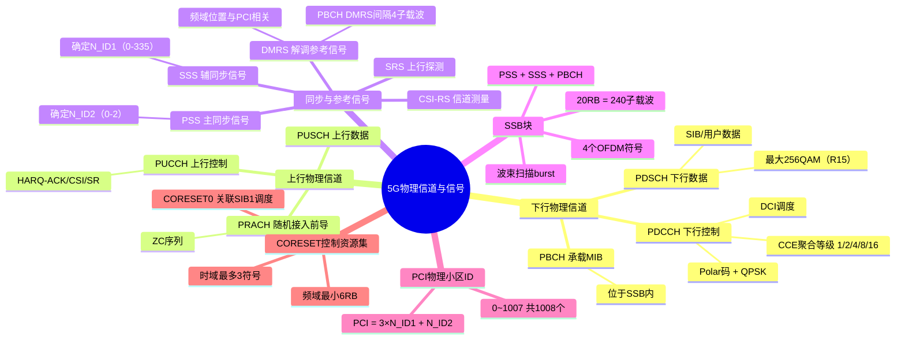

# 5G物理信道与信号

> 大纲分类：一、通信关键技术 > 一、基本原理 > 5G物理信道与信号  
> 考核要求：精通  
> 已有资料来源：`课程笔记/06-5G接入网协议与信令.md`（MIB/PBCH/SSB）+ 真题归纳

---

## 知识导图

---

## 核心知识点

### 一、下行物理信道（简要）

| 信道 | 作用 |
|------|------|
| **PBCH** | 承载 **MIB**，与 PSS/SSS 组成 **SSB** 的一部分 |
| **PDCCH** | 下行控制：调度 DCI、随机接入响应、功率控制等 |
| **PDSCH** | 下行共享数据：SIB（除 MIB）、用户数据、部分 RAR 等 |

**调制方式（题库）**：R15 中 **PDSCH** 支持高阶调制至 **256QAM**（选项常考“最大调制方式”）。

### 二、上行物理信道

| 信道 | 作用 |
|------|------|
| **PRACH** | **随机接入前导**（Msg1 / MsgA 中前导） |
| **PUCCH** | HARQ-ACK、CSI、SR 等上行控制；多种 **Format** |
| **PUSCH** | 上行数据 + 可复用部分 UCI |

### 三、参考信号与同步信号（下行/上行）

- **PSS / SSS**：主/辅同步信号；**PCI 获取**、符号定时与频域同步基础。  
- **DMRS**：解调参考信号，随 PDSCH/PUSCH/PBCH 等配置；**PBCH DMRS** 频域位置与 **PCI** 相关（题库）。  
- **CSI-RS**：信道测量、波束管理、CSI 采集；**PTRS** 相位噪声跟踪（高频重要）。  
- **SRS**：上行信道探测、码本/非码本调度与 TDD 互易性利用。

**小区搜索参与信号（多选常考）**：**PSS、SSS** 等；PBCH/MIB 在同步后读取。

### 四、SSB（SS/PBCH Block）

- 一个 **SSB** 在时域上占 **4 个连续 OFDM 符号**（题库多次）；频域占 **20 RB（240 子载波）** 量级（PBCH 子载波数等有具体数值题）。  
- **SSB 周期**、**波束扫描（SSB burst）** 与 **子帧配比**、频段（如 **2.6G、700M**）相关题目考 **最大 SSB 波束数** 或配置限制。  
- **同频测量**：基于 SSB 的 **SMTC** 窗口配置（measConfig）有最大个数等考点。

### 五、CORESET 与搜索空间（Search Space）

- **CORESET**：PDCCH 候选在频域与时域上的控制资源集；**频域最小配置粒度** 常与 **6 RB** 相关；**时域长度** 可为 **1–3 个 OFDM 符号**（R15 题库：CORESET 时域最多符号数）。  
- **搜索空间**：定义 UE 监听 **PDCCH 候选** 的集合（公共/UE 专用等）。  
- **Type0 PDCCH（CSS）**：用于 **SIB1** 调度，与 **CORESET0**、**SSB** 关联（**RA-RNTI、SI-RNTI** 监听）。

**易错判断**：部分题目考查 **“CORESET 频率分配必须连续”** 等表述正误，以 **当年官方答案** 为准（曾有“必须连续为错误”的考题）。

### 六、PCI（物理小区 ID）

- 取值 **0–1007**，共 **1008** 个。  
- **计算公式**：**N_cell_ID = 3 × N_ID^(1) + N_ID^(2)**  
  - **N_ID^(2)** ∈ {0,1,2}（由 **PSS** 指示）  
  - **N_ID^(1)** ∈ {0,…,335}（由 **SSS** 指示）  

**例题**：SSS ID=102，PSS ID=2 → **PCI = 3×102 + 2 = 308**。

**规划**：注意 **模 3 / 模 30** 等干扰规避（邻区 PCI 规划题）。

### 七、PDCCH 与编码（题库）

- NR **PDCCH** 信道编码为 **Polar 码**；调制方式题目常考 **QPSK**。

---

## 考点速记

| 考点 | 记忆要点 |
|------|----------|
| SSB OFDM 符号数 | **4** |
| PCI | **3×N_ID1 + N_ID2**；范围 **0–1007** |
| PBCH DMRS | 频域位置与 **PCI** 相关 |
| PBCH 相邻 DMRS 间隔 | 频域 **4 个子载波**（题库常考） |
| CORESET 时域 | **最多 3** 个 OFDM 符号（R15 题） |
| PDSCH 最大调制 | **256QAM**（R15 题） |
| PDCCH | **Polar + QPSK**（题库表述） |
| PRACH | ZC 序列；Format0–3 长度等有独立题 |

---

## 相关真题

> 以下真题摘自 `真题题库/真题-按知识点分类.md`，含完整选项与标准答案。

**[来源：第九届大唐杯A组省赛]** 单选题  
5G NR 系统 R15 版本中PDSCH 支持最大调制方式为

- **A.** 512QAM
- **B.** 128QAM
- **C.** 64QAM
- **D.** 256QAM ✓
【答案】D

**[来源：第九届大唐杯A组省赛]** 单选题  
5G NR 通信系统 R15 中，CORESET在时域上最多可以使用几个 OFDM 符号

- **A.** 3 ✓
- **B.** 2
- **C.** 1
- **D.** 4
【答案】A

**[来源：第九届大唐杯A组省赛]** 单选题  
在 5G NR 中 PBCH 信道上相邻DM-RS 在频域上的间隔是几个子载波

- **A.** 4 ✓
- **B.** 2
- **C.** 6
- **D.** 8
【答案】A

**[来源：第九届大唐杯B组省赛]** 单选题  
5G SSB 构成中，下面不属于 SSB 块的

- **A.** SSS
- **B.** PBCH
- **C.** PSS
- **D.** CRS ✓
【答案】D

**[来源：第十届大唐杯B组省赛第二场]** 单选题  
5G NR中，SSS ID为102，PSS ID为2，此时PCI为

- **A.** 302
- **B.** 308 ✓
- **C.** 1008
- **D.** 504
【答案】B

**[来源：第八届大唐杯本科组省赛]** 单选题  
5G NR系统中PCI取值范围为

- **A.** 1-504
- **B.** 0-1007 ✓
- **C.** 1-1008
- **D.** 0-503
【答案】B

**[来源：第十届大唐杯A组省赛第二场]** 单选题  
5G NR系统中，一个SS/PBCH block包含的OFDM symbols个数是

- **A.** 2
- **B.** 4 ✓
- **C.** 3
- **D.** 1
【答案】B

**[来源：第十届大唐杯B组省赛第一场]** 单选题  
在5G NR网络中PBCH的DMRS的频域位置和以下选项中哪个参数相关

- **A.** SI-RNTI
- **B.** Cell ID
- **C.** Bandwidth
- **D.** PCI ✓
【答案】D

**[来源：第十届大唐杯A组省赛第一场]** 多选题  
5G R15版本，PDCCH信道CCE聚合等级可能为

- **A.** 2 ✓
- **B.** 3
- **C.** 4 ✓
- **D.** 1 ✓
【答案】ACD

**[来源：第九届大唐杯A组省赛]** 多选题  
5G NR 系统中，UE 通过小区搜索过程完成下行同步，在此过程需要哪些信号参与

- **A.** PSS ✓
- **B.** CRS
- **C.** SRS
- **D.** SSS ✓
【答案】AD

---

## 参考资源

- [3GPP TS 38.211 规范目录](https://www.3gpp.org/ftp/Specs/archive/38_series/38.211/) — 物理信道、信号与资源映射  
- [3GPP TS 38.213 规范目录](https://www.3gpp.org/ftp/Specs/archive/38_series/38.213/) — CORESET、搜索空间、SSB 配置  
- [3GPP TS 38.331 规范目录](https://www.3gpp.org/ftp/Specs/archive/38_series/38.331/) — SIB、BWP、测量与 RRC 参数  
