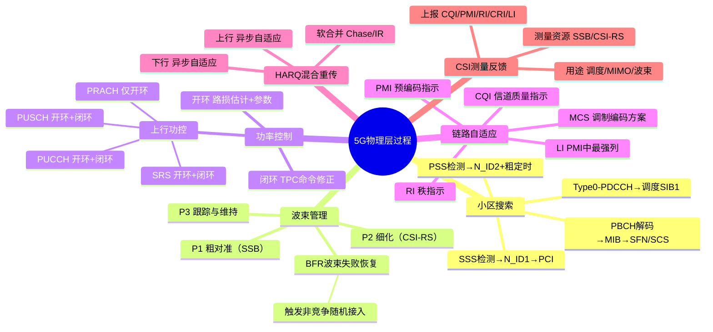

# 5G物理层过程

> 大纲分类：一、通信关键技术 > 一、基本原理 > 5G物理层过程  
> 考核要求：精通  
> 已有资料来源：真题归纳 + 3GPP 物理层过程通用知识

---

## 知识导图

---

## 核心知识点

### 一、小区搜索与下行同步

**目的**：获取 **符号/帧定时、频偏估计、PCI、读取 MIB/SIB**，完成 **下行同步**。

**典型顺序**：

1. **PSS 检测**：获得 **N_ID^(2)**（0–2）与粗定时/频偏。  
2. **SSS 检测**：获得 **N_ID^(1)**，联合得到 **PCI**。  
3. **PBCH（MIB）解码**：获取 **SFN、SCS、获取 SIB1 的 CORESET/搜索空间** 等。  
4. **按 MIB 指示监听 Type0-PDCCH**，调度 **SIB1（PDSCH）**。

**题库**：小区搜索目的包括与基站取得 **下行同步**；参与信号多选常含 **PSS/SSS**。

### 二、波束管理（Beam Management）

NR 在高频与大规模阵列下依赖 **波束赋形**。标准中波束管理含 **SSB/CSI-RS** 的测量、上报、波束切换与失败恢复等。

**过程分类（概念级，对应 P1/P2/P3）**：

- **P1**：**波束确定 / 粗对准**——例如基于 **SSB** 的测量与选择，终端与网络确定初始收发波束对。  
- **P2**：**波束细化**——在较窄波束集合上优化（可基于 **CSI-RS** 等）。  
- **P3**：**波束维持与跟踪**——业务过程中跟踪信道变化，必要时切换波束。

**波束失败恢复（BFR）**：检测到波束失败时，可触发 **非竞争随机接入** 等恢复流程（与 `06` 笔记中随机接入分类一致）。

**大唐杯延伸题**：大规模天线阵列与 **多用户波束成形**；SSB **波束扫描**定义；**“分级扫描由窄到宽”** 等判断需以试卷为准。

### 三、功率控制

- **上行**：PRACH、PUSCH、PUCCH、SRS 等均可能涉及功率控制。  
- **方式**：**开环**（基于路损估计与参数）+ **闭环**（网络 TPC 命令修正）。  
- **题库**：仅支持**开环**的信道/场景类选择题；PRACH **开环+闭环**表述题。

**下行**：主要为功率分配与波束能量集中，与 **SS 功率、业务调度** 相关，卷面少于上行。

### 四、链路自适应：CQI / MCS / PMI 等

- **CQI（Channel Quality Indicator）**：UE 反馈信道质量建议，网络选 **MCS**、码率等。  
- **MCS**：调制编码方案，决定 **频谱效率 vs 可靠性** 折中。  
- **PMI / RI / LI** 等：MIMO 预编码与层指示；题库曾考 **CSI 组成** 与 **LI** 含义。

**HARQ 与链路自适应协同**：初传与重传可使用不同 **RV、MCS**（实现细节依规范版本）。

### 五、HARQ（混合自动重传）

- **下行**：异步自适应 HARQ，UE 在 PUCCH/PUSCH 反馈 **ACK/NACK**。  
- **上行**：NR 上行 HARQ 机制题目曾考 **异步/同步** 选项（以 **官方答案** 为准，建议结合教材结论背诵）。

**软合并**：Chase 合并与增量冗余（IR）提升 **BLER** 性能。

### 六、CSI 测量与反馈

- **测量资源**：**SSB、CSI-RS**（非周期/周期/半持续）。  
- **上报内容**：**CQI、PMI、RI、CRI、SSBRI、LI、RIL** 等组合（R15 题库 CSI 内容多选）。  
- **用途**：调度、MIMO、波束管理、链路自适应。

---

## 考点速记

| 考点 | 记忆要点 |
|------|----------|
| 小区搜索 | **PSS → SSS → PBCH(MIB)**；PSS/SSS 参与 |
| 波束管理 | P1 粗对准、P2 细化、P3 跟踪；**BFR** |
| 功率控制 | 上行开环+闭环；题型区分“仅开环”对象 |
| CQI | 反馈信道质量；供 **MCS** 选择 |
| HARQ | 软合并；与调度、RV 配合 |
| CSI | 多分量；**LI** 等字段含义单独记 |

---

## 相关真题

> 以下真题摘自 `真题题库/真题-按知识点分类.md`，含完整选项与标准答案。

**[来源：第九届大唐杯A组省赛]** 多选题  
5G NR 系统中，UE 通过小区搜索过程完成下行同步，在此过程需要哪些信号参与

- **A.** PSS ✓
- **B.** CRS
- **C.** SRS
- **D.** SSS ✓
【答案】AD

**[来源：第八届大唐杯本科组省赛]** 多选题  
5G NR 系统中，需要进行功率控制的信道/信号包括

- **A.** CRS
- **B.** PHICH
- **C.** SRS ✓
- **D.** PUSCH ✓
【答案】CD

**[来源：第十届大唐杯A组省赛第一场]** 单选题  
5G功率控制方式分为闭环功率控制和开环功率控制如下选项中仅支持开环功率控制的是

- **A.** PUCCH
- **B.** SRS
- **C.** PUSCH
- **D.** PRACH ✓
【答案】D

**[来源：第十一届大唐杯本科A组省赛]** 单选题  
NR系统中，CSI可以包括CQI、PMI、CRI、SSBRI、LI、RIL以及L1-RSRP。其中，LI用于指示

- **A.** 资源指示
- **B.** 波束索引
- **C.** 波束强度
- **D.** PMI中最强的列 ✓
【答案】D

**[来源：第八届大唐杯本科组省赛]** 多选题  
5G R15版本中，信道状态信息CSI可能包括以下选项中的哪些内容

- **A.** CQI ✓
- **B.** SINR
- **C.** PMI ✓
- **D.** RI ✓
【答案】ACD

**[来源：第十一届大唐杯本科A组省赛]** 多选题  
下面有关5G PRACH功率控制说法正确的是

- **A.** 只有开环没有闭环 ✓
- **B.** 全部路径补偿
- **C.** 开环+闭环功率控制
- **D.** 每多发送一次会增加功率 ✓
【答案】AD

**[来源：第十一届大唐杯本科A组省赛]** 多选题  
NR中上行HARQ采用下列哪种方式

- **A.** 异步 ✓
- **B.** 同步
- **C.** 自适应 ✓
- **D.** 非自适应
【答案】AC

**[来源：第十一届大唐杯研究生组省赛]** 单选题  
NR系统中，随机接入的目的错误的是

- **A.** 实现UE和gNB之间的下行同步 ✓
- **B.** 获取MSG3的资源
- **C.** 获取C-RNTI基站识别UE的标识
- **D.** 实现UE和gNB之间的上行同步
【答案】A

---

## 参考资源

- [3GPP TS 38.213 规范目录](https://www.3gpp.org/ftp/Specs/archive/38_series/38.213/) — 随机接入、功率控制、波束失败恢复触发条件  
- [3GPP TS 38.214 规范目录](https://www.3gpp.org/ftp/Specs/archive/38_series/38.214/) — CSI、MCS、链路自适应  
- [3GPP TS 38.300 规范详情](https://portal.3gpp.org/desktopmodules/Specifications/SpecificationDetails.aspx?specificationId=3191) — 物理层过程与 RRC 协同的总览描述  
