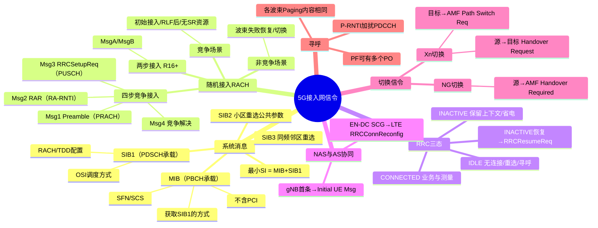

# 5G接入网信令流程

> 大纲分类：一、通信关键技术 > 一、基本原理 > 5G接入网信令流程  
> 考核要求：精通  
> 已有资料来源：**完整整合** `课程笔记/06-5G接入网协议与信令.md` + 真题归纳

---

## 知识导图



---

## 核心知识点

### 一、系统消息体系（MIB / SIB1 / 其他 SIB）

#### 1. MIB 与 SIB1 对比（原笔记精要）

| | MIB | SIB1 |
|---|-----|------|
| 承载信道 | **PBCH**（位于 **SSB** 内） | **PDSCH** |
| 广播方式 | **周期广播** | **周期广播** |
| 主要内容 | **SFN**、**SCS**、**如何获取 SIB1**（含 SIB1 的 PDCCH CORESET 配置） | **RACH**、**TDD**、**其他 SIB 调度**、是否周期广播 OSI 等 |
| **不包含** | **小区 ID**（由 PSS/SSS 得）、LTE 的 PHICH 等 | — |

- **最小系统消息** = **MIB + SIB1**。  
- **MIB 最重要作用之一**：通知 UE **如何获取 SIB1**。  
- **SIB2**（常考）：小区重选（同频/异频）**公共**参数等。  
- **同频邻区重选信息**：题库指向 **SIB3**。

**其他 SIB（OSI）**：广播方式（周期或按需）由 **SIB1** 指示。

---

### 二、随机接入（RACH）

#### 1. 四步竞争随机接入（Msg1–4）

```
UE                        gNB
 |== Msg1: Preamble =====→|   (PRACH)
 |←= Msg2: RAR ===========|   (PDSCH：TA、TC-RNTI、UL Grant 等)
 |== Msg3: RRC Setup Req →|  (PUSCH)
 |←= Msg4: 竞争解决 ======|   (PDSCH)
```

- **Msg4** 完成 **竞争解决**（题库）。  
- **Msg2 RAR** 使用 **RA-RNTI** 加扰的 PDCCH 调度。

#### 2. 两步随机接入（2-Step RACH，R16+ 概念）

- **MsgA**：UE 发送 **前导**（可与 **上行数据/信令** 一起，视配置）。  
- **MsgB**：gNB 响应，完成冲突解决与调度。  
- 适用于 **特定覆盖与场景**，可降低时延；竞赛掌握 **与四步对比、适用思想** 即可。

#### 3. 竞争 vs 非竞争

| 场景 | 随机接入类型 |
|------|----------------|
| **初始接入（RRC_IDLE）** | **竞争** |
| **无线链路失败后初始接入** | **竞争** |
| **上行失步且无 SR 资源** | **竞争** |
| **切换** | **可竞争也可非竞争** |
| **波束失败恢复** | **非竞争** |

---

### 三、RRC 三态与转换

| 状态 | 说明 |
|------|------|
| **RRC_IDLE** | 无 RRC 连接，监听寻呼，小区重选 |
| **RRC_INACTIVE** | **保留 AS 上下文**，省电；可快速恢复 |
| **RRC_CONNECTED** | 连续业务与测量配置 |

**注意**：**RM REGISTERED / DEREGISTERED** 属于 **NAS 移动性管理状态**，**不是** RRC 状态。

**INACTIVE → 有业务**：触发 **RRCResumeRequest**（题库：**RRC resume request**）。

**RRC 重建**触发原因（多选常全选）：**切换失败、重配失败、完保失败、gNB 检测到 RLF** 等。

**重建结果**（简记）：

- 上下文可恢复 → **Resume** 类流程；  
- 不可恢复但有资源 → **RRC Setup**；  
- 拒绝 → **RRC Reject**。

---

### 四、NAS 与 AS 协同要点

- gNB 向 5GC 发送的 **第一条消息**：**Initial UE Message**（承载初始 NAS，经 N2/NGAP）。  
- **NSA（EN-DC）**：携带 **SCG Add / PSCell Change** 的配置常在 **LTE 侧 `RRCConnectionReconfiguration`**。  
- **SRB3 未建立** 时，SCG 测量结果经 **UL Information Transfer MRDC** 上报（题库）。

---

### 五、SRB / DRB 与 QoS Flow（与协议栈文档一致）

- **SRB0**：CCCH；**SRB1**：DCCH，RRC+NAS；**SRB2**：DCCH，主要 NAS；**SRB3**：EN-DC 与 NR SCG。  
- **QoS Flow → DRB**：可多对一、一对一；**一 QoS Flow 不可同时映射多 DRB**。

---

### 六、寻呼（Paging）

- **PO（Paging Occasion）**：一套 **PDCCH 监听机会**。  
- **一个 PF 可有多个 PO**。  
- **一个 PO 长度** = 一个 **波束扫描周期**（与 SSB burst 相关）。  
- 各波束上发送的 **Paging 内容相同**（笔记强调：考题若说“不一样”多为错误选项）。

**RRC IDLE / INACTIVE 寻呼标识**：**P-RNTI**（判断题常考）。

---

### 七、切换信令（Xn vs NG）

**Xn 切换（基站直连）**：

```
源gNB → 目标gNB: Handover Request（第一条）
目标gNB → 源gNB: Handover Request Acknowledge
源gNB → UE: RRCReconfiguration
UE → 目标gNB: 随机接入 + RRCReconfigurationComplete
目标gNB → AMF: Path Switch Request
```

**NG 切换**：无 Xn 或经 AMF 协调时，**Handover Required（源→AMF）→ Handover Request（AMF→目标）** 等（细节以教材流程图为准）。

**Xn 切换后向核心网第一条**：题库曾考 **Path Switch Request**（相对于 Handover Required 等选项）。

---

### 八、仿真与流程串联（七大步骤）

| 序号 | 流程 | 要点 |
|------|------|------|
| 1 | 系统消息 | PSS/SSS → MIB → SIB1 |
| 2 | RACH + RRC | 四步 RACH；RRCSetup/Complete |
| 3 | NAS 鉴权加密 | Registration / Authentication |
| 4 | AS 安全 | SecurityModeCommand |
| 5 | RRC 重配 | RRCReconfiguration |
| 6 | PDU Session | DRB 建立 + QoS |
| 7 | 测量切换 | A3 等事件 → Handover |

**T300**：发送 **RRCSetupRequest** 时启动；收到 **RRCSetup** 或 **RRCReject** 停止。

**时延缩短技术（多选常全选）**：**RRC_INACTIVE**、**MEC**、**自包含帧**、**Shorter-TTI** 等。

---

## 考点速记

| 考点 | 记忆要点 |
|------|----------|
| 最小 SI | MIB + SIB1 |
| MIB | 告知 **SIB1** 获取方式；不含 PCI |
| RACH Msg4 | **竞争解决** |
| 切换 RACH | **可竞争可非竞争** |
| INACTIVE 恢复 | **RRC resume request** |
| 基站→核心网首条 | **Initial UE Message** |
| Xn 切换首条（源→目标） | **Handover Request** |
| Xn 切换后通知核心网 | **Path Switch Request** |
| T300 | SetupRequest 起，Setup/Reject 止 |

---

## 相关真题

> 以下真题摘自 `真题题库/真题-按知识点分类.md`，含完整选项与标准答案。

**[来源：第九届大唐杯A组省赛]** 单选题  
5G NR 系统中，MIB 一个最重要作用是通知 UE 如何获取哪个消息

- **A.** SIB3
- **B.** SIB1 ✓
- **C.** SIB2
- **D.** SIB4
【答案】B

**[来源：第十届大唐杯A组省赛第一场]** 多选题  
5G系统消息中，哪些系统消息一定是周期广播

- **A.** SIB1 ✓
- **B.** SIB3
- **C.** SIB4
- **D.** MIB ✓
【答案】AD

**[来源：第八届大唐杯本科组省赛]** 单选题  
5G NR 系统中，RRC INACTVE 状态，如果要恢复业务，则会出现哪条信令

- **A.** RRC resume request ✓
- **B.** RRC connection request
- **C.** RRC Connection reconfiguration
- **D.** RRC connection reject
【答案】A

**[来源：第九届大唐杯A组省赛]** 多选题  
5G NR 系统中，哪种情形下只能进行基于竞争的随机接入

- **A.** 无线链路失败后进行初始接入 ✓
- **B.** 切换时进行随机接入
- **C.** 由 Idle 状态进行初始接入 ✓
- **D.** 在 Active 情况下，上行数据到达，如果没有建立上行同步，或者没有资源发送调度请求，则需要随机接入 ✓
【答案】ACD

**[来源：第十届大唐杯A组省赛第一场]** 多选题  
SA组网随机接入分为两种，即基于竞争的随机接入和非竞争的随机接入，如下选项可以是基于非竞争随机接入的场景为

- **A.** 波束失败恢复 ✓
- **B.** RRC空闲态用户状态迁移
- **C.** 上行失步态UE下行数据到达 ✓
- **D.** 切换 ✓
【答案】ACD

**[来源：第十届大唐杯A组省赛第二场]** 单选题  
在5G NR网络中终端在初始接入过程中，基站向核心网发的第一条信息是

- **A.** Initial UE Message ✓
- **B.** Uplink NAS Transfer
- **C.** UE Capability Information
- **D.** RRC Setup Complete
【答案】A

**[来源：第九届大唐杯A组省赛]** 单选题  
5G NR 系统中基于基站间 Xn 链路切换，源基站侧向目标基站发送第一条信令为

- **A.** SN Status Transfer
- **B.** Handover Required
- **C.** Handover Request Acknowledge
- **D.** Handover Request ✓
【答案】D

**[来源：第十届大唐杯B组省赛第二场]** 单选题  
5G NR系统中基于基站间的Xn链路切换，基站侧向核心网发的第一条信令为

- **A.** Handover Request
- **B.** Handover Required ✓
- **C.** SN Status Transfer
- **D.** Handover Request Acknowledge
【答案】C

**[来源：第九届大唐杯B组省赛]** 多选题  
5G RRC 连接重建触发有如下原因

- **A.** 切换失败 ✓
- **B.** 重配失败 ✓
- **C.** 完保失败 ✓
- **D.** 基站检测 RLF ✓
【答案】ABCD

**[来源：第八届大唐杯本科组省赛]** 单选题  
同频小区重选邻区信息包含在哪个 SIB 中

- **A.** SIB2
- **B.** SIB3 ✓
- **C.** SIB4
- **D.** SIB5
【答案】B

---

## 参考资源

- [3GPP TS 38.331（RRC）规范目录](https://www.3gpp.org/ftp/Specs/archive/38_series/38.331/) — 系统信息、RRC 状态、重配与恢复  
- [3GPP TS 38.321（MAC）规范目录](https://www.3gpp.org/ftp/Specs/archive/38_series/38.321/) — 随机接入过程与定时器  
- [3GPP TS 38.413（NGAP）规范目录](https://www.3gpp.org/ftp/Specs/archive/38_series/38.413/) — Initial UE Message、切换与 Path Switch  
