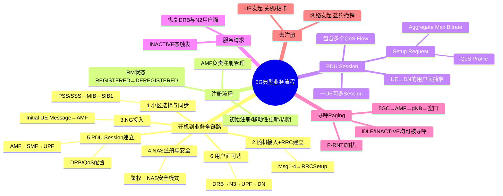

# 5G系统典型业务流程

> 大纲分类：一、通信关键技术 > 一、基本原理 > 5G系统典型业务流程  
> 考核要求：熟悉  
> 已有资料来源：`课程笔记/06-5G接入网协议与信令.md`（流程骨架）+ `真题题库/真题-按知识点分类.md`

---

## 知识导图

---

## 核心知识点

### 一、从开机到业务可用的端到端脉络

1. **小区选择与下行同步**：PSS/SSS → MIB → SIB1（获取接入与小区驻留参数）。  
2. **随机接入与 RRC 连接建立**：Msg1–4，**RRCSetup** / **RRCSetupComplete**（携带 **NAS**）。  
3. **NG 接入**：gNB — **Initial UE Message** → AMF，建立 UE 上下文。  
4. **NAS 注册与安全**：**注册请求/接受**、鉴权、**NAS 安全模式**；**RM 状态** 进入 **REGISTERED**。  
5. **PDU Session 建立**：AMF 选 **SMF**，SMF 选 **UPF**，通过 **N2/N3** 建立用户面路径；gNB 侧 **DRB/QoS** 配置（**PDU Session Resource Setup**）。  
6. **用户面可达**：UE 获得 IP（类型由 **IPv4/IPv6/Ethernet** 等会话类型决定），业务数据经 **DRB → N3 → UPF → DN**。

---

### 二、注册流程（Registration）

**目的**：UE 在网络中 **登记身份与位置**，获得 **移动性管理** 与 **会话管理** 的协调。

- **初始注册**：开机或新卡入网。  
- **移动性注册更新**：TA 变化等触发。  
- **周期性注册**：保活。  
- **紧急注册**等特例。

**AMF 职责边界（题库）**：**注册管理** 属于 AMF；**PDU 会话建立/修改/释放** 主要由 **SMF** 负责（选项辨析）。

**UE 与注册区**：题目如“UE 携带的 TAI 是当前注册区 TAI”类，考查 **注册区列表** 与 **寻呼范围** 概念。

---

### 三、PDU Session 建立 / 修改 / 释放

**PDU Session**：UE 与 **数据网络（DN）** 之间的用户面连接抽象；内含 **QoS Flow**。

**建立（简化信令链）**：

- AMF 与 SMF：**Nsmf_PDUSession_CreateSMContext** / **N1N2MessageTransfer** 等（名称不必死记）。  
- gNB：**PDU Session Resource Setup Request** 携带 **QoS profile、隧道端点（UPF TEID）、Aggregate Maximum Bit Rate** 等。  
- UE 侧：**RRCReconfiguration** 建立 **DRB**，**SDAP** 完成 **QoS Flow 映射**。

**修改**：QoS 变更、UPF 锚点重选、新增 QoS Flow 等。  
**释放**：会话删除，释放无线承载与 N3 隧道。

**题库**：

- **PDU Session Resource Setup Request** 包含 **PDU Session Aggregate Maximum Bit Rate** 等信息。  
- **一个 UE 可建立多个 PDU Session**；**一个会话多个 QoS Flow**（对比错误选项“只能一个会话/一个流”）。

---

### 四、服务请求（Service Request）

**典型触发**：**RRC_INACTIVE** 态有上行数据、**网络侧下行到达** 需恢复无线承载、**信令触发** 等。

- NAS 层 **Service Request**；AS 层可能对应 **RRCResume** 或 **RRCSetup**（视状态）。  
- 网络重建无线资源，恢复 **N2 用户面** 与 **DRB**。

---

### 五、寻呼（Paging）

**触发**：下行数据到达而 UE **无连续连接**、**系统信息变更**、**ETWS/CMAS** 等。

- CN 发起 → AMF → gNB → 空口 **Paging**（**P-RNTI** 加扰的 PDCCH）。  
- UE 在 **PF/PO** 监听；**INACTIVE 态** 同样可被寻呼（与 RNA/寻呼组相关）。

**题库**：**5GC 可寻呼**；**PO 与波束扫描周期关系**；**各波束 Paging 内容相同**。

---

### 六、去注册（Deregistration）

- **UE 发起**：关机、拔卡、用户操作。  
- **网络发起**：签约撤销、安全原因等。

**结果**：**RM DEREGISTERED**；PDU Session 释放；无线连接释放。

---

## 考点速记

| 考点 | 记忆要点 |
|------|----------|
| AMF | **注册管理**；NAS MM 终结 |
| SMF/UPF | **会话**与**用户面**；多会话、分布式 UPF |
| PDU Session | 多会话、多 QoS Flow；Setup Request 内容 |
| 寻呼 | **P-RNTI**；IDLE/INACTIVE；PO/PF |
| 服务请求 | INACTIVE/idle 恢复业务与资源 |
| 注册与会话 | 控制面与用户面功能分离 |

---

## 相关真题

> 以下真题摘自 `真题题库/真题-按知识点分类.md`，含完整选项与标准答案。

**[来源：第十届大唐杯A组省赛第二场]** 单选题  
在5G网络架构中，以下选项哪一项是AMF的功能

- **A.** 注册管理 ✓
- **B.** 无线资源分配
- **C.** 会话的建立修改删除
- **D.** 下行数据的通知
【答案】A

**[来源：第十届大唐杯B组省赛第一场]** 单选题  
在5G系统中，在手机开机流程中，负责业务承载建立的过程是

- **A.** 安全模式建立过程
- **B.** PDU会话建立过程 ✓
- **C.** 初始上下文建立过程
- **D.** RRC连接建立过程
【答案】B

**[来源：第十届大唐杯B组省赛第一场]** 多选题  
以下选项中属于5G中PDU会话属性的参数有

- **A.** S-NSSAI ✓
- **B.** PDU会话类型 ✓
- **C.** PDU会话ID ✓
- **D.** 数据网络名称 ✓
【答案】ABCD

**[来源：第十届大唐杯B组省赛第二场]** 多选题  
在5G PDU会话建立过程，PDU Session Resource setup request包含哪些信息

- **A.** PDU session Aggregate Maximum Bitrate ✓
- **B.** Qos ID ✓
- **C.** PDU-UE-NGAP-ID
- **D.** 终端业务ip地址
【答案】AB

**[来源：第十届大唐杯B组省赛第一场]** 单选题  
5G核心网中，NAS（N1）信令（MM消息）的终结点为

- **A.** UDR
- **B.** UPF
- **C.** AMF ✓
- **D.** SMF
【答案】C

**[来源：第十届大唐杯B组省赛第二场]** 单选题  
下面有关PDU会话，流，承载之间关系说法正确的是

- **A.** 一个DRB只能映射一个Qos流
- **B.** 一个UE只能建立一个会话
- **C.** 一个会话只能建立一个Qos流
- **D.** 一个Qos流只能映射一个DRB ✓
【答案】D

**[来源：第十届大唐杯A组省赛第一场]** 多选题  
以下选项中，关于5G寻呼的说法正确的是

- **A.** PO是一套PDCCH监听机会，由多个子帧，或OFDM符号组成 ✓
- **B.** 一个寻呼帧PF里可有多个PO ✓
- **C.** 一个PO的长度等于一个波束扫描周期 ✓
- **D.** 在每个波束上发送的Paging消息不一样
【答案】ABC

**[来源：第十届大唐杯B组省赛第二场]** 多选题  
以下选项中，属于MIB信令携带的内容的是

- **A.** cellBarred 信息 ✓
- **B.** 公共信道子载波间隔 ✓
- **C.** 系统帧号信息 ✓
- **D.** 调度SIB1的PDCCH信息 ✓
【答案】ABCD

**[来源：第十届大唐杯A组省赛第二场]** 单选题  
5G NR系统中，UE可通过哪条系统消息获取小区重选公共信息

- **A.** SIB4
- **B.** SIB1
- **C.** SIB3
- **D.** SIB2 ✓
【答案】D

---

## 参考资源

- [3GPP TS 23.502（5G 流程，Stage-2）规范目录](https://www.3gpp.org/ftp/Specs/archive/23_series/23.502/) — 注册、PDU Session、寻呼、服务请求流程  
- [3GPP TS 23.501 规范目录](https://www.3gpp.org/ftp/Specs/archive/23_series/23.501/) — AMF/SMF/UPF 职责与 QoS 模型  
- [3GPP TS 38.413（NGAP）规范目录](https://www.3gpp.org/ftp/Specs/archive/38_series/38.413/) — PDU Session Resource Setup 等 RAN 侧消息  
