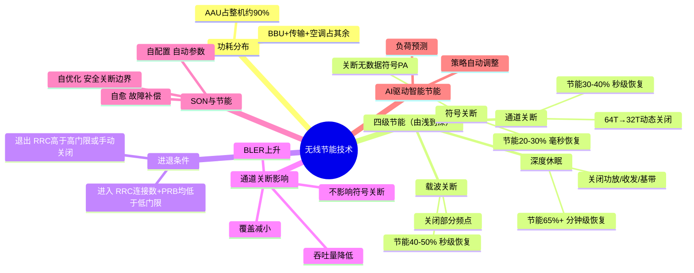

# 无线节能技术原理

> 大纲分类：一、通信关键技术 > 二、系统关键功能 > 无线节能技术原理
> 考核要求：掌握
> 已有资料来源：`课程笔记/05-5G网络节能技术及算法.md`（全文整合）；SON 节能与 AI/ML 节能为补充

---

## 知识导图

---

## 核心知识点

### 一、5G 基站功耗分布

- **AAU（有源天线单元）**功耗约占整机 **90%**，是节能优化的**首要对象**。
- BBU 与传输、空调等占剩余部分；策略上常采用**分级关断**，在保障 KPI 前提下逐级加深休眠深度。

### 二、四级节能技术体系（必背）

| 技术 | 原理 | 节能效果（参考） | 恢复时间 |
|------|------|------------------|----------|
| **符号关断** | 无数据发送时关断部分 OFDM 符号上的功放发射 | 约 **20%～30%** | **毫秒级** |
| **通道关断** | 动态关闭部分天线通道（如 64T→32T） | 约 **30%～40%** | **秒级** |
| **载波关断** | 低负载时关闭部分载波频点 | 约 **40%～50%** | **秒级** |
| **深度休眠** | 关闭功放、收发信机等模拟器件，更深时关闭中频/基带处理模块 | **65%+** | 可达 **数分钟**内恢复 |

**记忆顺序**：**符号 → 通道 → 载波 → 深度休眠**（由浅入深，对业务影响逐步增大）。

#### 更深休眠层级（扩展）

| 层级 | 关闭范围 | 效果（参考） |
|------|----------|--------------|
| 浅层休眠 | 功放、收发信机 | 30%+ |
| 深度休眠 | + 中频业务处理 + BBL 数据处理等 | 65%+ |
| 极致休眠 | 仅保留电源/定时/控制电路 | 功耗可降至 **<10W** 量级 |

### 三、通道关断的影响（真题陷阱）

通道关断可能导致：

- **小区覆盖范围减小**
- **误块率（BLER）上升**
- **用户业务吞吐量降低**

**不会**导致：**符号关断节能终止生效**（二者为不同机制，可并行按策略运行）。

### 四、符号节能进入 / 退出条件

| 条件类型 | 门限逻辑 |
|----------|----------|
| **进入** | RRC 连接数 **低于低门限** **且** PRB 利用率 **低于低门限** |
| **退出** | RRC 连接数 **高于高门限** **或** **手动关闭** **或** **超出设定时间段** |

**易错点**：退出条件中，PRB 需关注题干是“低门限”还是“高门限”；真题标准答案多为 **PRB 高于低门限不足以退出**（应 **高于高门限** 或与 RRC 组合判断，以原题为准）。

### 五、符号关断的“本质”（题库口径）

- 符号关断通过减少无效符号上的发射，降低 **PA（功率放大器）** 在**无业务符号**上的能量消耗；题库常考 **降低 PA 静态/动态功耗** 的表述，需以当年选项为准（常见正确：**降低 PA 相关功耗**）。

### 六、SON（自组织网络）与节能

SON 的三大经典功能与节能结合方式：

| SON 功能 | 与节能的关系 |
|----------|----------------|
| **自配置** | 新站入网自动下发邻区、功率、载波等参数，缩短人工试错导致的能耗与低效状态 |
| **自优化** | 根据负荷与覆盖自动调整切换、功率、载波开启策略，为**载波关断/通道关断**提供安全边界（避免过度关断引发质差） |
| **自愈** | 故障或劣化时自动补偿（如切换参数、备份载波），避免长期高功率补救 |

**备考一句话**：SON 不直接等于“关断”，而是**自动化运维**，使**分级关断**在**覆盖/容量/KPI**约束下可落地。

### 七、AI / ML 驱动的智能节能（补充）

在笔记与产业方案基础上，常见三类思路：

1. **基于负荷预测的 AI 节能**  
   利用 **小波神经网络** 等预测流量低谷，**提前**休眠、**提前**唤醒，减少“关晚/开晚”带来的能耗与突发质差；笔记称可显著延长有效节能时长、降低能耗（如 **~10%** 量级，以厂商数据为准）。

2. **基于强化学习的节能**  
   以 **Sarsa** 等算法，将**状态**（用户数、负载）、**动作**（休眠/唤醒）、**奖励**（节能量 − 服务质量损失）建模，在线学习策略，在**体验损失可控**下最大化节能。

3. **业务导航协同节能**  
   通过将用户导向少数载波或制式，集中负荷后**关断空闲载波**，实现多频多制式**协同**节能。

**核心网协同**：**PCF** 等可基于策略与大数据预测下发节能相关策略，与无线侧协同，平衡节能与 QoS。

---

## 考点速记

| 考点 | 记忆要点 |
|------|----------|
| AAU 功耗占比 | **90%** |
| 四级节能 | 符号 → 通道 → 载波 → **深度休眠** |
| 通道关断 **不会** | 导致 **符号关断终止** |
| 进入符号节能 | 低于**低**门限（RRC 与 PRB 同时低） |
| 退出符号节能 | 高于**高**门限 / 手动 / **超时** |
| 符号关断本质 | 减无效发射 → **降 PA 功耗**（以选项为准） |
| 功耗增加原因 | 大带宽、多通道、大功率、多流等（题库 ABCD 全选型） |
| SON 三功能 | **自配置 / 自优化 / 自愈** |
| AI 笔记关键词 | **小波神经网络**、**Sarsa**、业务导航 |

---

## 相关真题

> 以下真题摘自 `真题题库/真题-按知识点分类.md`，含完整选项与标准答案。

**[来源：第十届大唐杯A组省赛第一场] 单选题**

1. 基站功耗一般分为AAU和BBU两大部分，其中，AAU的功耗占整机的

- **A.** 0.9 ✓
- **B.** 0.5
- **C.** 0
- **D.** 1
【答案】A

---

**[来源：第十届大唐杯A组省赛第一场] 单选题**

2. 以下哪种不是通道关断节能生效后可能产生的影响

- **A.** 小区覆盖范围减小
- **B.** 误块率上升
- **C.** 符号关断节能终止生效 ✓
- **D.** 用户业务吞吐量降低
【答案】C

---

**[来源：第十届大唐杯A组省赛第二场] 单选题**

3. 关于基站节能，以下说法正确的是

- **A.** 基站应该在保证用户体验的前提下，尽可能多的节能 ✓
- **B.** 由于节能必然影响用户体验，因此该功能禁用
- **C.** 节能的优先级高于用户体验
- **D.** 节能不需要考虑任何业务影响
【答案】A

---

**[来源：第十届大唐杯B组省赛第一场] 单选题**

4. 符号关断是主要的节能技术，符号关断节能的本质是

- **A.** 降低PA静态功耗 ✓
- **B.** 以上三种说法均错误
- **C.** 降低PA动态功耗
- **D.** 降低BBU功耗
【答案】A

---

**[来源：第十届大唐杯B组省赛第二场] 单选题**

5. 关于基站节能功能，以下说法正确的是

- **A.** 载波关断节能不会影响用户接入功能
- **B.** 通道关断节能应该在业务量较多的时间段开启
- **C.** 符号关断节能可以全天开启 ✓
- **D.** 以上三种说法均错误
【答案】C

---

**[来源：第十届大唐杯A组省赛第一场] 多选题**

2. 对于已进入符号节能状态的基站，以下条件可以退出符号节能的选项是

- **A.** 时间段超出符号关断节能设定的时间段 ✓
- **B.** 手动关闭符号节能开关 ✓
- **C.** 小区的RRC连接数高于设定的符号关断节能RRC连接数的高门限 ✓
- **D.** 小区PRB利用率高于设定的符号关断节能PRB利用率低门限
【答案】ABC

---

**[来源：第十届大唐杯B组省赛第二场] 多选题**

3. 以下选项中，属于5G基站功耗增加的原因的选项为

- **A.** 大带宽 ✓
- **B.** 通道数增多 ✓
- **C.** 发射功率增加 ✓
- **D.** 多流业务 ✓
【答案】ABCD

---

## 参考资源

- [电子工程专辑 - 揭秘5G网络深夜智能休眠术](https://www.eet-china.com/mp/a473346.html) — 符号/通道关断通俗解读
- [4G/5G网络节能降耗技术白皮书](https://www.fxbaogao.com/detail/4632040) — 体系化节能策略
- [C114 - 基于阶梯式评估的5G基站智能关断方法](https://m.c114.com.cn/w6366-1257228.html) — 智能关断与评估
- [通信世界网 - 利用软关断功能的5G智能节能方法](https://www.cww.net.cn/article?id=476591) — 工程实现视角
- [3GPP TR 38.840](https://www.3gpp.org/ftp/Specs/archive/38_series/) — NR 节能研究课题（检索 38.840 及后续 Release 节能 WI）
