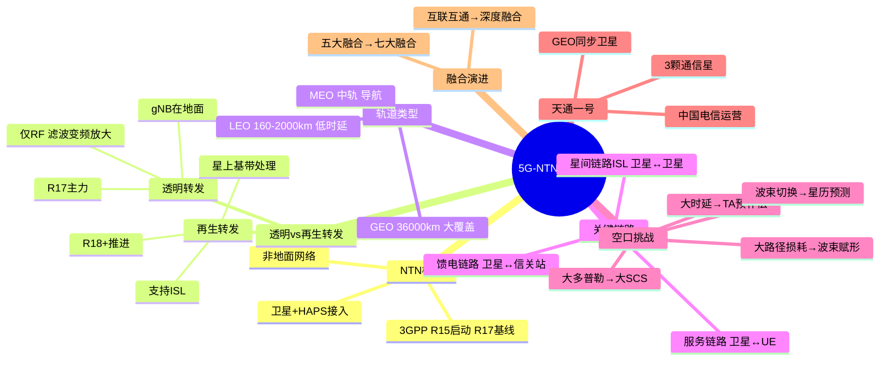

# 5G-NTN 星地融合技术

> 大纲分类：一、通信关键技术 > 二、系统关键功能 > 5G-NTN 星地融合技术
> 考核要求：熟悉
> 已有资料来源：`课程笔记/01-卫星网络架构及接口介绍.md`、`02-卫星产品分类分级及轨道.md`、`03-卫星通信空口技术.md`（精炼整合）

---

## 知识导图

---

## 核心知识点

### 一、NTN 与网络整体视图

**NTN（Non-Terrestrial Network，非地面网络）** 在 3GPP 中指通过**卫星、高空平台（HAPS）**等载体提供接入，与地面 5G **统一体制**演进。

卫星互联网系统可概括为 **“一个网络、两个平面”**：

- **卫星平面**：透明转发卫星（T）、再生转发卫星（R）等组成的星座或高轨系统。
- **地面基站平面**：地面蜂窝与信关站、核心网等。

**五大融合特征（笔记口径）**：终端、体制、系统、网络、业务融合。面向 6G 常扩展为**七大融合**（增加管理、频谱、平台等维度）。

### 二、关键链路

| 链路 | 英文 | 两端 | 说明 |
|------|------|------|------|
| **服务链路** | Service Link | 卫星 ↔ UE | 用户接入的无线段 |
| **馈电链路** | Feeder Link | 卫星 ↔ 信关站/网关 | 回传；**无 ISL 时必选** |
| **星间链路** | ISL | 卫星 ↔ 卫星 | 空间组网，减少对地面站依赖 |

### 三、透明转发 vs 再生转发（必考）

| 对比项 | **透明转发（Bent-Pipe）** | **再生转发（On-board Processing）** |
|--------|---------------------------|-------------------------------------|
| 卫星能力 | **仅 RF**：滤波、变频、放大 | RF + **调制解调、交换路由**等基带处理 |
| gNB 位置 | **地面**（NTN Gateway / 信关站侧） | **星上**（部分或全部） |
| ISL | 规范演进中早期方案**不支持**为主 | **支持**空间路由 |
| 复杂度/成本 | 低 | 高 |
| 3GPP 演进 | **R17** 主要支持 | **R18+** 推进上星基带 |

**类比**：透明转发像**镜子反射**；再生转发像**能拆包的中继站**。

### 四、轨道选择：LEO / MEO / GEO

| 类型 | 高度（约） | 特点 |
|------|------------|------|
| **LEO** | 160～2000 km | **时延低**（笔记：**20～50 ms** 量级 vs 地面近）、路径损耗相对小；卫星高速运动（约 **7.5～7.8 km/s**），**切换/波束管理复杂** |
| **MEO** | 2000～35786 km | 导航、部分中继场景 |
| **GEO** | ~36000 km | **覆盖大**；**单程时延约 270 ms 量级**，往返常称 **250～400 ms** 区间；相对地面静止（赤道面） |

**卫星互联网适配**：产业与题库常强调 **LEO** 更适配宽带互联网（低时延、可复用）。**GEO 轨道必在赤道平面**；**不必须 GEO 才能卫星通信**。

**天通一号**（Mate 60 系列卫星通话）：**GEO**、**中国电信**运营、**3 颗**通信星支撑；**用户可直连卫星**（非必须先经地面站转话，以业务定义为准）。

### 五、空口挑战与补偿（与 03 笔记一致）

| 挑战 | 原因 | 对策思路 |
|------|------|----------|
| **大时延** | 传播距离远（尤其 GEO） | UE **定时提前**结合**星历 + GNSS**预补偿；HARQ **禁用反馈或增大进程** |
| **大多普勒** | LEO 高速相对运动 | **发射端预补偿**（按 slot）、**大 SCS** 提高容忍度 |
| **大路径损耗** | 自由空间损耗 | 高增益终端、功率控制、波束赋形 |
| **波束切换与覆盖变化** | LEO 非静止 | 基于**星历**的切换规划；**时间/位置**触发为主 |

**物理层**：NTN 常用较大 **子载波间距**；**PRACH** 需加长以覆盖往返时延（R17 NTN 格式）。

### 六、星地融合网络与部署演进

**网络组成**：天基（GEO + MEO/LEO）+ 地基（核心网 + 地面基站）；核心网可基于 **5GC + IMS** 改造。

**融合三阶段**：**互联互通**（业务融合）→ **混合接入**（体制/资源共享）→ **深度融合**（无感知一致服务）。

**部署四阶段（中信科移动课件口径）**：

1. **透明转发**：gNB 全在地面。  
2. **仅 DU 上星**：CU/DU 分离，DU 在星上。  
3. **gNB 上星**：完整基站能力上星。  
4. **核心网上星**：核心网功能逐步上星。

**3GPP 时间线（题库）**：NTN 研究自 **R15 启动（2018 年）**；首个完整 NTN 规范以 **R17** 为里程碑；再生与更强星上能力向 **R18+** 发展。

### 七、关键接口（专网/高轨低轨笔记摘要）

高轨与低轨体系均常见：**S-NR-Uu**（UE—基站）、**S-N2 / S-NG-C**（基站—AMF）、**S-N3 / S-NG-U**（基站—UPF）、**S-Xn**（基站间）、**S-ISL**（星间路由与切换）、**S-R1**（路由与馈电相关）等。具体网元名（S-gNB、S-ROUTER、S-Feeder…）以教材图为准。

---

## 考点速记

| 考点 | 记忆要点 |
|------|----------|
| 服务/馈电/ISL | UE 链 / 信关站链 / **星间** |
| 透明转发 | **只 RF**；gNB 在**地面**；R17 主 |
| 再生转发 | **基带上星**；**ISL**；R18+ |
| LEO 时延 | **低**（~20～50 ms 笔记口径） |
| GEO 时延 | **高**（~250～400 ms 往返量级） |
| LEO 速度 | ~**7.8 km/s** |
| NTN 启动 | **R15**，**2018** |
| 首个 NTN 标准里程碑 | **R17** |
| 天通 | **GEO**、**电信**、**3 星** |
| 空口五大挑战 | 时延、多普勒、损耗、**波束切换**、覆盖变化 |
| 时延补偿 | **星历 + GNSS**；TA |
| 多普勒 | **预补偿** + **大 SCS** |

---

## 相关真题

> 以下真题摘自 `真题题库/真题-按知识点分类.md`，含完整选项与标准答案。

**[来源：第十一届大唐杯研究生组省赛] 单选题**

1. 卫星地球站通过赤道上空约36000km的通信卫星的转发进行通信，视地球站纬度高低，其一跳的单程空间距离为72000-（ ）km。

- **A.** 90000
- **B.** 92000
- **C.** 80000 ✓
- **D.** 82000
【答案】C

---

**[来源：第十一届大唐杯高职组省赛] 单选题**

2. 6G超低卫星网络中，使用的超低轨道卫星是指距离地面高度约（）公里的轨道。

- **A.** 300 ✓
- **B.** 400
- **C.** 450
- **D.** 350
【答案】A

---

**[来源：第十一届大唐杯本科B组省赛第一场] 单选题**

3. 3GPP未来将向6G逐步演进，3GPP的NTN标准是从哪一版本开始启动，一直朝着将卫星纳入3GPP技术规范的目标在前进

- **A.** R14
- **B.** R13
- **C.** R16
- **D.** R15 ✓
【答案】D

---

**[来源：第十一届大唐杯本科B组省赛第二场] 单选题**

4. 3GPP未来将向6G逐步演进，3GPP的NTN标准是从哪一年开始启动，一直朝着将卫星纳入3GPP技术规范的目标在前进

- **A.** R16
- **B.** R18
- **C.** R17
- **D.** R15 ✓
【答案】D

---

**[来源：第八届大唐杯本科组省赛] 单选题**

1. 对于大唐5G基站设备，当时钟同步时，至少需要锁定几颗卫星

- **A.** 3 ✓
- **B.** 4
- **C.** 5
- **D.** 6
【答案】A

---

**[来源：第十一届大唐杯研究生组省赛] 单选题**

2. 电信网的传输设备根据传输介质的不同分为：光纤传输设备、卫星传输设备、（ ）、缆线传输设备等。

- **A.** 业务传输设备
- **B.** 无线传输设备 ✓
- **C.** 双绞线传输设备
- **D.** 交换传输设备
【答案】B

---

**[来源：第十一届大唐杯研究生组省赛] 单选题**

3. 在实际应用中，GPS接收装置利用几颗以上卫星信号来定出使用者所在位置

- **A.** 2
- **B.** 4 ✓
- **C.** 6
- **D.** 1
【答案】B

---

**[来源：第十一届大唐杯研究生组省赛] 单选题**

4. 华为Mate 60pro的卫星通话功能采用中国自主研制的天通一号卫星移动通信系统，天通一号卫星是（ ）同步卫星

- **A.** 高轨道 ✓
- **B.** 低轨道
- **C.** 中高轨道
- **D.** 近地轨道
【答案】A

---

**[来源：第十一届大唐杯研究生组省赛] 单选题**

5. 卫星移动通信业务使用以下哪个频段

- **A.** Ku
- **B.** S
- **C.** C
- **D.** L ✓
【答案】D

---

**[来源：第十一届大唐杯本科B组省赛第一场] 单选题**

6. 华为Mate60pro的卫星通话功能采用中国自主研制的卫星移动通信系统由（ ）运营

- **A.** 中国联通
- **B.** 中国移动
- **C.** 中国电信 ✓
- **D.** 中国卫通
【答案】C

---

**[来源：第十一届大唐杯本科B组省赛第二场] 单选题**

7. 华为Mate60pro的卫星通话功能采用中国自主研制的卫星移动通信系统由谁运营

- **A.** 中国移动
- **B.** 中国卫通
- **C.** 中国联通
- **D.** 中国电信 ✓
【答案】D

---

**[来源：第十一届大唐杯本科A组省赛] 单选题**

9. 卫星互联网通信中，（ ）的性能更适配卫星互联网发展

- **A.** 都可以
- **B.** 低轨卫星 ✓
- **C.** 中轨卫星
- **D.** 高轨卫星
【答案】B

---

**[来源：第十一届大唐杯本科A组省赛] 单选题**

10. 卫星移动通信业务使用哪个频段

- **A.** C
- **B.** L ✓
- **C.** S
- **D.** Ku
【答案】B

---

**[来源：第十一届大唐杯本科A组省赛] 单选题**

11. 华为Mate60Pro的卫星通话功能采用中国自主研制的天通一号卫星移动通信系统目前由几颗通信卫星支撑。

- **A.** 2
- **B.** 3 ✓
- **C.** 4
- **D.** 5
【答案】B

---

**[来源：第十一届大唐杯本科A组省赛] 单选题**

12. 手机卫星电话通信允许用户在全球范围内进行语音通话，根据卫星电话系统的工作原理，该系统不包括

- **A.** 通信卫星组成的链路
- **B.** 卫星天线设备 ✓
- **C.** 地面站设备
- **D.** 用户终端设备
【答案】B

---

**[来源：第十一届大唐杯本科A组省赛] 多选题**

3. 数字卫星通信方式有

- **A.** 星上交换时分多址 ✓
- **B.** 不加话音插空的时分多址 ✓
- **C.** 卫星数字通道方式 ✓
- **D.** 数字话音插空的时分多址 ✓
【答案】ABCD

---

**[来源：第十一届大唐杯本科A组省赛] 多选题**

4. 手机卫星电话通信允许用户再全球范围内进行语音通话，根据卫星电话系统的工作原理，该系统需要包括如下设备

- **A.** 卫星天线设备
- **B.** 地面站设备 ✓
- **C.** 用户终端设备 ✓
- **D.** 通信卫星组成的链路 ✓
【答案】BCD

---

**[来源：第十一届大唐杯研究生组省赛] 判断题**

3. 静止卫星的轨道必然处于赤道平面上。

【答案】✓ 正确

---

**[来源：第十一届大唐杯研究生组省赛] 判断题**

4. 必须使用静止卫星才能实现卫星通信。

【答案】错误

---

**[来源：第十一届大唐杯高职组省赛] 判断题**

5. C-6G将会是一个整合了地面无线和卫星的全连接世界。

【答案】✓ 正确

---

**[来源：第十一届大唐杯高职组省赛] 判断题**

7. 华为Mate60Pro的卫星通话需要将信号先发给卫星系统的地面站进行通信。

【答案】错误

---

**[来源：第十一届大唐杯本科B组省赛第二场] 判断题**

8. 华为Mate60pro的卫星通话功能采用中国自主研制的卫星移动通信系统由中国电信运营。

【答案】✓ 正确

---

**[来源：第十一届大唐杯本科A组省赛] 判断题**

9. 卫星电话手机与普通手机相比，需要额外的卫星通信天线和硬件来支持与卫星通信系统进行通信。

【答案】✓ 正确

---

## 参考资源

- [3GPP - NTN Overview](https://www.3gpp.org/technologies/deep-dive/ntn-overview) — 标准范围与 Release 导航
- [3GPP TR 38.821 / TS 38.300](https://www.3gpp.org/ftp/Specs/archive/38_series/) — NTN 场景与 RAN 架构
- [C114 - 基于 3GPP 的 NTN 解决方案和关键技术研究](https://m.c114.com.cn/w6511-1281814.html) — 中文产业解读
- [Ericsson - 3GPP satellite communication](https://www.ericsson.com/en/reports-and-papers/ericsson-technology-review/articles/3gpp-satellite-communication) — 卫星与 5G 融合概述
- 学唐平台：中信科移动《卫星网络结构及接口介绍》课件（与笔记同源）
