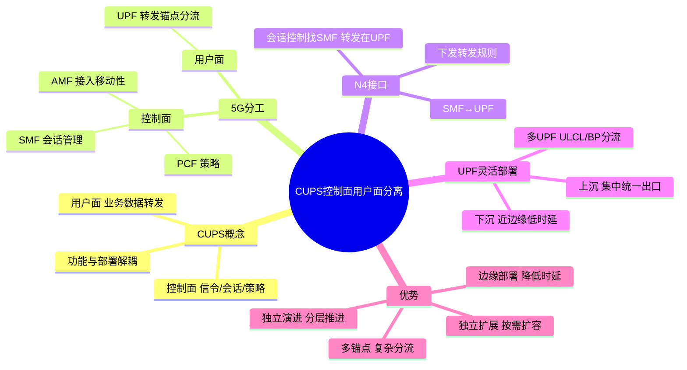

# 用户面控制面分离技术

> 大纲分类：一、通信关键技术 > 三、网络技术 > 用户面与控制面分离(CUPS)  
> 考核要求：掌握

---

## 知识导图

---

## 核心知识点

### 一、CUPS（Control and User Plane Separation）是什么

**CUPS** 指将**控制面（Control Plane）**与**用户面（User Plane）**在功能与部署上解耦：控制面负责**信令、会话与策略决策**；用户面负责**业务数据转发**。  
在 5G 中，这一思想体现在 **SMF（控制会话）+ UPF（转发用户面）** 的清晰分工，以及 **N4** 接口的标准化。

**与 4G 对比（理解用）**：EPC 中 SGW/PGW 曾部分融合控制与用户面功能；5G 进一步将用户面**分布式部署**、会话控制集中/分层灵活组合。

### 二、5G 中的控制面与用户面分工（掌握）

| 平面 | 典型网元/接口 | 职责 |
|------|---------------|------|
| **控制面** | AMF、SMF、PCF、UDM…；**N1/N2/N11** 等 | 注册与移动性、PDU 会话控制、策略与签约 |
| **用户面** | **UPF**；**N3**（RAN—UPF）、**N6**（UPF—数据网） | 分组转发、锚点、分流、QoS 执行 |

**AMF** 偏接入与移动性控制；**SMF** 管理 PDU 会话并与 **UPF** 通过 **N4** 下发转发规则。

### 三、N4 接口：SMF ↔ UPF

**N4** 是 **SMF 与 UPF** 之间的接口，用于会话建立/修改/释放过程中的**用户面规则与控制**：例如转发动作、隧道端点、QoS 与计费相关用户面信息、分流规则等（具体消息与 IE 以规范为准）。

**记忆口诀**：**“会话控制找 SMF，转发执行在 UPF，两者之间走 N4。”**

### 四、UPF 灵活部署：上沉 / 下沉

**UPF 下沉**（靠近边缘/RAN）：缩短数据路径，利于低时延与本地业务卸载（与 **MEC** 强相关）。  
**UPF 上沉/集中**（靠近核心汇聚点）：利于简化互通、统一出口与部分企业专网场景。

同一会话可能存在**多个 UPF**（如 UL CL/Branching Point 场景做本地分流），体现用户面**灵活拓扑**。

### 五、数据面 / 控制编排面 / 管理面（教学常用说法）

不同教材表述略有差异，可采用下列**逻辑分层**理解：

1. **用户数据面**：UPF 及承载网上的实际流量转发。  
2. **控制与编排面**：AMF/SMF/PCF 等信令，以及切片/MEC 策略编排。  
3. **管理面**：网管、切片生命周期管理、虚拟资源管理等（与 MANO/OSS 相关）。

### 六、分离带来的优势（考试简答高频）

- **独立扩展**：用户面按流量扩容，控制面按信令/会话控制扩容。  
- **独立演进**：协议版本、设备形态、云化节奏可分层推进。  
- **边缘部署**：UPF 靠近业务现场，降低时延与回传压力。  
- **多会话与多锚点**：支持复杂分流、专网与切片组合。

---

## 考点速记

| 考点 | 记忆要点 |
|------|---------|
| CUPS | 控制决策与媒体转发分离 |
| 5G 用户面核心 | **UPF** |
| 会话控制 | **SMF**；与 UPF 之间 **N4** |
| AMF | 接入/移动性；**非**用户面转发主体 |
| UPF 部署 | **下沉** = 近边缘低时延；可多级串联 |
| 优势 | 灵活扩展、独立演进、边缘卸载 |

---

## 相关真题

以下题目摘自《真题题库/真题-按知识点分类.md》原文。

### 单选题

**[来源：第十届大唐杯A组省赛第二场]** 119. 5G SA场景下，Uu口控制面协议从上到下的次序依次是

- **A.** SDAP-PDCP-RLC-MAC-PHY
- **B.** RRC-PDCP-RLC-MAC-PHY ✓
- **C.** IP-PDCP-RLC-MAC-PHY
- **D.** SCTP-PDCP-RLC-MAC-PHY
【答案】B

**[来源：第十届大唐杯B组省赛第一场]** 156. 5G核心网中，NAS（N1）信令（MM消息）的终结点为

- **A.** UDR
- **B.** UPF
- **C.** AMF ✓
- **D.** SMF
【答案】C

**[来源：第十一届大唐杯研究生组省赛]** 180. 5G系统核心网元SMF的功能不包括

- **A.** NAS信令及信令的加密和完整性保护 ✓
- **B.** UE IP地址的分配与管理
- **C.** 合法监听
- **D.** 会话的建立修改删除
【答案】A

**[来源：第十一届大唐杯本科A组省赛]** 260. 5G网络中，上行流量校验及上行流量上报是哪个网元的功能

- **A.** UPF ✓
- **B.** AMF
- **C.** AUSF
- **D.** SMF
【答案】A

**[来源：第十届大唐杯A组省赛第二场]** 129. 5G网络基本架构，AMF与gNB之间的接口是

- **A.** Xn
- **B.** NG-U
- **C.** NG-C ✓
- **D.** N11
【答案】C

### 多选题

**[来源：第九届大唐杯A组省赛]** 6. 5G 的网络架构描述正确的是

- **A.** 控制平面引入新的基于服务的设计思路 ✓
- **B.** 核心网抽取会话管理功能，形成独立模块 SMF ✓
- **C.** 分布式的用户面功能 UPF，无需汇聚点，支持多会话 ✓
- **D.** 架构设计以网元功能为单位，支持网络切片 ✓
【答案】ABCD

**[来源：第八届大唐杯本科组省赛]** 44. 5G 的网络架构描述正确的是

- **A.** 控制平面引入新的基于服务的设计思路 ✓
- **B.** 分布式的用户面功能 UPF，无需汇聚点，支持多会话 ✓
- **C.** 核心网抽取会话管理功能，形成独立模块 SMF ✓
- **D.** 架构设计以网元功能为单位，支持网络切片 ✓
【答案】ABCD

**[来源：第十一届大唐杯研究生组省赛]** 120. SBA与传统核心网架构的区别在于

- **A.** 移动性管理与会话管理解耦 ✓
- **B.** 控制面与媒体面分离 ✓
- **C.** 各种接入 方式都通过统一的机制接入网络 ✓
- **D.** 采用点对点通讯方式
【答案】ABC

**[来源：第十一届大唐杯高职组省赛]** 135. 在5G网络中，UPF集成了核心网的所有用户面功能，UPF通过N3接口连接基站，以下属于N3接口协议栈的为

- **A.** IP ✓
- **B.** UDP ✓
- **C.** SDAP
- **D.** GTP-U ✓
【答案】ABD

**[来源：第十一届大唐杯本科B组省赛第一场]** 155. 在5G网络中，AMF通过N2接口连接基站，以下属于N2接口协议栈的为

- **A.** SCTP ✓
- **B.** GTP-U ✓
- **C.** SDAP
- **D.** NGAP ✓
【答案】ABD

**[来源：第十一届大唐杯本科B组省赛第二场]** 161. 在5G网络中，AMF通过N2接口连接基站，以下属于N2接口协议栈的为

- **A.** GTP-U ✓
- **B.** NGAP ✓
- **C.** SCTP ✓
- **D.** SDAP
【答案】ABC

### 其他-通信基础 · 单选题

**[来源：第九届大唐杯B组省赛]** 1. 5G SA 场景下，Uu 口用户面协议从上到下的次序依次是

- **A.** SDAP-PHY-MAC-RLC-PDCP
- **B.** PDCP-PHY-MAC-RLC-SDAP
- **C.** SDAP-PDCP-RLC-MAC-PHY ✓
- **D.** PDCP-RLC-MAC-PHY-SDAP
【答案】C

### 判断题

**[来源：第八届大唐杯本科组省赛]** 23. 5G SA 场景下，业务转发的配置不属于 UPF 的功能。

【答案】✓ 正确

**[来源：第十一届大唐杯高职组省赛]** 71. 5GSA场景下，业务转发的配置是SMF的功能。

【答案】✓ 正确

---

## 参考资源

- [3GPP TS 23.501 规范目录](https://www.3gpp.org/ftp/Specs/archive/23_series/23.501/) — UPF、SMF、PDU 会话与分流相关架构描述  
- [3GPP TS 29.244（PFCP，N4 相关协议）规范目录](https://www.3gpp.org/ftp/Specs/archive/29_series/29.244/) — 需要深入 N4 信令细节时可查阅  
- [3GPP 5G 技术专题](https://www.3gpp.org/specifications-technologies/5g-3gpp-5g) — 官方总览  
