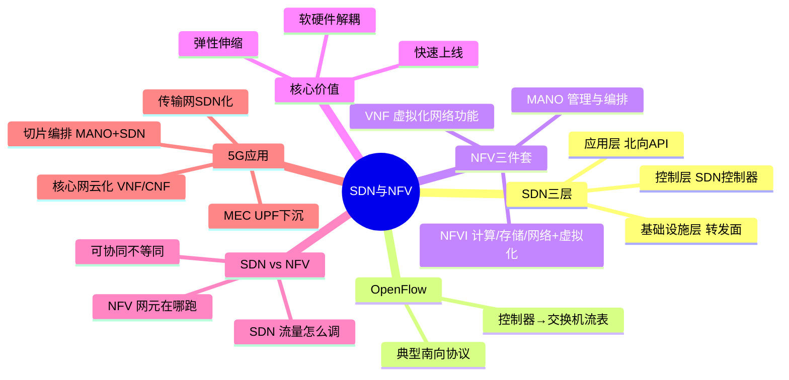

# SDN与NFV技术及5G应用

> 大纲分类：一、通信关键技术 > 三、网络技术 > SDN与NFV技术及5G应用  
> 考核要求：掌握

---

## 知识导图



---

## 核心知识点

### 一、SDN（Software Defined Networking）三层架构

经典 SDN 逻辑分层（教材常见表述）：

```
┌─────────────────────────────────────┐
│  应用层（业务/编排/控制器北向应用）   │
├─────────────────────────────────────┤
│  控制层（SDN 控制器：集中控制面）     │
├─────────────────────────────────────┤
│  基础设施层（转发面：交换机/路由器）   │
└─────────────────────────────────────┘
```

- **应用层**：如流量工程、切片承载管理、防火墙策略应用等，通过**北向 API** 向控制器下发意图。  
- **控制层**：维护网络拓扑视图，计算路径，向转发设备下发**流表/策略**。  
- **基础设施层**：负责**高速数据转发**，控制面与数据面分离。

### 二、OpenFlow 与 SDN 控制器

- **OpenFlow**：早期最具代表性的**南向接口协议**之一，用于控制器向交换机安装流表项（考试常考“OpenFlow 与 SDN 关系”）。  
- **SDN 控制器**：如 OpenDaylight、ONOS 等（了解即可）；实际网络也可能采用 **P4、BGP-LS + PCEP、NETCONF/YANG** 等多种南向/配置方式。

### 三、NFV（Network Functions Virtualization）架构要素

ETSI NFV 经典分层（掌握缩写）：

| 组件 | 含义 | 说明 |
|------|------|------|
| **NFVI** | NFV Infrastructure | 计算/存储/网络硬件 + 虚拟化层（Hypervisor/容器运行时） |
| **VNF** | Virtualized Network Function | 虚拟化形态的网络功能（vEPC、vFW、vUPF…） |
| **MANO** | Management and Orchestration | **NS（网络服务）**生命周期管理：VNFM、NFVO、VIM 协同 |

**核心价值**：**软硬件解耦**、弹性伸缩、快速上线、多厂商集成。

### 四、SDN 与 NFV 的关系

- **NFV 回答“网元以软件形态跑在哪里”**（云资源上的虚拟化/容器化）。  
- **SDN 回答“流量如何被灵活调度与控制”**（控制面集中、转发面可编程）。  
- **协同**：NFV 提供虚拟化网元实例；SDN 为业务链、SFC、承载侧路径提供**灵活连接**。

二者**不是同义词**：可单独使用，也可组合。

### 五、在 5G 中的应用（掌握答题方向）

1. **核心网云化**：5GC NF 以 **VNF/CNF** 形式部署在 DC，配合编排弹性伸缩。  
2. **网络切片编排**：切片实例化涉及虚拟资源分配、服务链连接，**MANO + SDN 承载**常联合出现。  
3. **传输网 SDN 化**：回传/中传网络按切片 SLA 做流量工程。  
4. **边缘计算**：MEC 与 UPF 下沉依赖底层 **NFVI** 与站点云资源。

---

## 考点速记

| 考点 | 记忆要点 |
|------|---------|
| SDN 三层 | 应用 / 控制 / 基础设施（转发） |
| OpenFlow | 典型南向协议代表 |
| NFV 三件套 | **NFVI + VNF + MANO** |
| 解耦 | **NFV** 实现软硬件解耦（真题高频） |
| 与 SDN | 分工不同、可协同 |
| 5G 应用 | 核心网云化、切片编排、承载 SDN、边缘 |

---

## 相关真题

以下题目摘自《真题题库/真题-按知识点分类.md》原文。

### 单选题

**[来源：第九届大唐杯A组省赛]** 3. 在 5G 网络架构中，我们所提到的软件和硬件解耦主要通过下面哪种技术实现

- **A.** 移动边缘计算
- **B.** 切片技术
- **C.** SDN
- **D.** NFV ✓
【答案】D


**[来源：第八届大唐杯本科组省赛]** 90. 在5G网络架构中，我们所提到的软件和硬件解耦主要通过下面哪种技术实现

- **A.** SDN
- **B.** NFV ✓
- **C.** 切片技术
- **D.** 移动边缘计算
【答案】B


**[来源：第十届大唐杯A组省赛第二场]** 132. 将网络设备分离为单独的控制设备及转发设备的网络技术是

- **A.** NFV
- **B.** 切片
- **C.** SDN ✓
- **D.** MEC
【答案】C


**[来源：第十届大唐杯B组省赛第一场]** 145. 网络使用x86架构的通用设备替代专用设备的网络技术为

- **A.** MEC
- **B.** SDN
- **C.** NFV ✓
- **D.** 切片
【答案】C


**[来源：第十一届大唐杯本科A组省赛]** 265. 下列选项中，哪个是NFV的技术基础

- **A.** 虚拟化 ✓
- **B.** 云计算
- **C.** 人工智能
- **D.** 大数据
【答案】A


**[来源：第十一届大唐杯高职组省赛]** 28. 在5G通信系统中，SDN是指

- **A.** 网络功能虚拟化
- **B.** 移动边缘计算
- **C.** 软件定义网络 ✓
- **D.** 控制功能重构
【答案】C


### 多选题

**[来源：第十一届大唐杯高职组省赛]** 134. NR系统中，关于SDN技术的特点，说法正确的是

- **A.** 控制器软件可编程 ✓
- **B.** 控制平面集中化 ✓
- **C.** 控制转发分离 ✓
- **D.** 转发平面通用化 ✓
【答案】ABCD


**[来源：第九届大唐杯B组省赛]** 4. 以下关于 5G 网络架构的发展方向，说法正确的是

- **A.** 支持面向客户的业务模式 ✓
- **B.** 同时支持各种差异化场景 ✓
- **C.** 支持业务的快速建立和修改 ✓
- **D.** 虚拟化、组件化、可编排是 5G 网络架构特点 ✓
【答案】ABCD


**[来源：第十届大唐杯B组省赛第一场]** 97. 以下选项中，属于5G核心网的主要特征的是

- **A.** 支持边缘计算 ✓
- **B.** 支持网络切片 ✓
- **C.** 服务化架构 ✓
- **D.** 网络设备虚拟化 ✓
【答案】ABCD


**[来源：第十届大唐杯B组省赛第二场]** 108. 以下选项中，属于5G核心网主要技术特征的是

- **A.** 服务化架构 ✓
- **B.** 网络设备虚拟化 ✓
- **C.** 支持网络切片 ✓
- **D.** 支持边缘计算 ✓
【答案】ABCD


**[来源：第十一届大唐杯研究生组省赛]** 118. 5G核心网的主要特征包括

- **A.** 服务化架构 ✓
- **B.** 网络设备虚拟化 ✓
- **C.** 支持边缘计算 ✓
- **D.** 支持网络切片 ✓
【答案】ABCD


### 说明

在《真题-按知识点分类.md》全文检索下，**暂无**题干或选项中直接出现 **OpenFlow、MANO、NFVI、VNF** 等关键词的完整四选项客观题；上述 SDN/NFV、软硬件解耦、网络虚拟化类题目为最主要可引用真题。


---

## 参考资源

- [ETSI NFV 技术专题](https://www.etsi.org/technologies/network-functions-virtualisation) — NFV 标准族与架构说明入口  
- [ETSI GS NFV 002（架构框架）PDF 索引](https://www.etsi.org/deliver/etsi_gs/NFV/001_099/002/) — 经典架构文档版本列表  
- [ONF / OpenFlow 相关标准入口](https://opennetworking.org/software-defined-standards/) — SDN/OpenFlow 标准化组织资料  
- [3GPP 5G 技术专题](https://www.3gpp.org/specifications-technologies/5g-3gpp-5g) — 5GC 与云原生结合的背景阅读  
