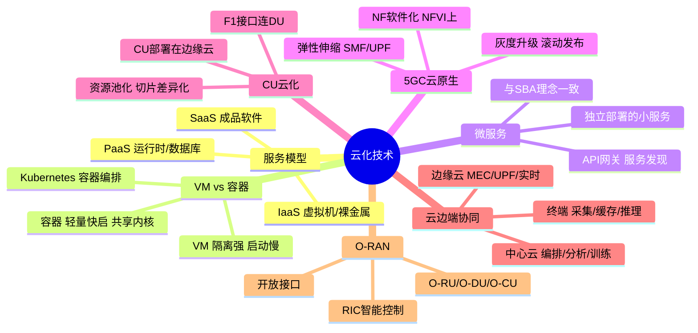

# 云化技术及5G应用

> 大纲分类：一、通信关键技术 > 三、网络技术 > 云化技术及5G应用  
> 考核要求：掌握

---

## 知识导图

---

## 核心知识点

### 一、云计算服务模型：IaaS / PaaS / SaaS

| 模型 | 用户获得什么 | 用户管理什么 | 举例 |
|------|--------------|--------------|------|
| **IaaS** | 虚拟机/裸金属/块存储/网络 | 操作系统、中间件、应用 | OpenStack、云主机 |
| **PaaS** | 运行时、数据库、消息队列等平台能力 | 应用与数据 | K8s 上的托管中间件 |
| **SaaS** | 成品软件服务 | 配置与数据 | 邮箱、在线文档 |

**5G 核心网云化**常见落在 **IaaS + PaaS** 组合：底层 NFVI（IaaS），上层容器平台与 CI/CD（PaaS 特征）。

### 二、虚拟机与容器

- **虚拟机（VM）**：硬件虚拟化隔离强，启动相对慢，适合传统 VNF。  
- **容器（Container）**：共享宿主机内核、**轻量、快启、易编排**，适合 **CNF（Cloud Native NF）**。  
- **Kubernetes**：事实上的容器编排标准，用于部署伸缩 5GC 微服务（了解名称与作用即可）。

### 三、微服务架构

将大单体网元拆为**可独立部署的小服务**，配合 **API 网关、服务发现、配置中心、可观测性** 等治理手段。

与 **5GC SBA** 的契合点：规范层面定义 NF **服务化接口**；工程层面常以**微服务 + API** 实现网元内部模块化（实现方式因厂商而异）。

### 四、5G 核心网云原生部署（掌握答题要点）

- **NF 软件化** 运行在 **NFVI** 上（VM 或容器）。  
- **弹性伸缩**：按信令/媒体负载水平扩展 SMF、UPF 等实例。  
- **灰度升级**：按微服务/容器镜像版本滚动发布。  
- **SBA + 云原生** 共同推动“电信功能 IT 化”。

### 五、CU 云化部署（RAN 侧）

5G RAN **CU（Central Unit）** 可部署在**边缘云或区域 DC**，与 **DU** 分离：

- 利于**资源池化**、协作调度与切片差异化。  
- 传输要求：**F1 接口**时延与带宽需满足部署形态（掌握“CU 可云化”即可）。

### 六、云—边—端协同

- **中心云**：全网编排、大数据分析、模型训练。  
- **边缘云**：MEC、UPF 下沉、实时处理。  
- **终端**：采集、缓存、轻量推理（如部分 AI 推理下沉）。

车联网等场景真题常考 **云-边-端** 角色分工。

### 七、O-RAN（开放无线接入网）概要

**O-RAN Alliance** 推动 RAN **开放接口、智能化、云化**：典型拆分 **O-RU / O-DU / O-CU**，引入 **RIC（无线智能控制）** 与 **xAPP/rAPP** 等概念。

**与云化关系**：CU/DU 软件可运行在通用云平台（O-Cloud），硬件加速通过 **AAL** 等抽象。

---

## 考点速记

| 考点 | 记忆要点 |
|------|---------|
| IaaS/PaaS/SaaS | 从基础设施→平台→软件逐层“托管上移” |
| 容器 vs VM | 容器轻量快启，适合云原生 NF |
| 微服务 | 模块化、独立扩缩、与 SBA 理念一致 |
| 5GC 云化 | NFVI + 编排 +（可选）K8s/CNF |
| CU 云化 | CU 可上云/边缘池化，DU 贴近射频 |
| 云边端 | 中心智能 + 边缘实时 + 端侧采集 |
| O-RAN | 开放、解耦、智能化、云化 RAN |

---

## 相关真题

以下题目摘自《真题题库/真题-按知识点分类.md》原文。

### 多选题

**[来源：第十一届大唐杯高职组省赛]** 2. 6G网络秉承兼容、跨域、分布、内生、至简、李生六大设计理志进行架构设计，以下说法正确的是

- **A.** 6G架构设计将由外挂式向内生式转变 ✓
- **B.** 6G架构设计将由集中规划式向分布自治式转变，满足大规模组网下的海量连接和极致性能要求 ✓
- **C.** 6G架构设计将支持固定、移动、卫星等多种接入 ✓
- **D.** 移动通信网络沿着IP化、云化、服务化的方向发展变革 ✓
【答案】ABCD

**[来源：第八届大唐杯本科组省赛]** 8. 与 4G 网络相比，5G 网络架构更加注重软件技术，包括了网络的

- **A.** 蜂窝化
- **B.** 云化 ✓
- **C.** 集中化
- **D.** 虚拟化 ✓
【答案】BD

**[来源：第十届大唐杯B组省赛第一场]** 97. 以下选项中，属于5G核心网的主要特征的是

- **A.** 支持边缘计算 ✓
- **B.** 支持网络切片 ✓
- **C.** 服务化架构 ✓
- **D.** 网络设备虚拟化 ✓
【答案】ABCD

**[来源：第十届大唐杯B组省赛第二场]** 108. 以下选项中，属于5G核心网主要技术特征的是

- **A.** 服务化架构 ✓
- **B.** 网络设备虚拟化 ✓
- **C.** 支持网络切片 ✓
- **D.** 支持边缘计算 ✓
【答案】ABCD

**[来源：第十一届大唐杯研究生组省赛]** 118. 5G核心网的主要特征包括

- **A.** 服务化架构 ✓
- **B.** 网络设备虚拟化 ✓
- **C.** 支持边缘计算 ✓
- **D.** 支持网络切片 ✓
【答案】ABCD

**[来源：第十一届大唐杯本科B组省赛第二场]** 53. 工业互联网平台应用层的作用是

- **A.** 提供工业微服务 ✓
- **B.** 工业数据管理 ✓
- **C.** 业务应用 ✓
- **D.** APP开发 ✓
【答案】ABCD

### 单选题

**[来源：第十一届大唐杯高职组省赛]** 5. “云-边-端”智能网联系统中，下列说法正确的是

- **A.** OBU主要实现车辆信息的广播，与其他设备的交互 ✓
- **B.** 智能路侧设备实现局部区域交通态势感知
- **C.** RSU可以实现高精地图服务，提供安全效率类服务
- **D.** 边缘云主要实现总体交通态势管理，全局调度
【答案】A

**[来源：第十一届大唐杯本科A组省赛]** 265. 下列选项中，哪个是NFV的技术基础

- **A.** 虚拟化 ✓
- **B.** 云计算
- **C.** 人工智能
- **D.** 大数据
【答案】A

### 说明

《真题-按知识点分类.md》中**暂无**题干或选项明确考查**容器、Kubernetes、O-RAN**的完整四选项客观题；云原生与开放 RAN 请结合教材与上文「云化 / 虚拟化 / 微服务 / 云-边-端」相关题目理解。

---

## 参考资源

- [3GPP 5G 技术专题](https://www.3gpp.org/specifications-technologies/5g-3gpp-5g) — 5G 系统与规范导航  
- [CNCF（云原生计算基金会）](https://www.cncf.io/) — Kubernetes 等云原生技术总入口（背景阅读）  
- [O-RAN ALLIANCE Specifications](https://www.o-ran.org/specifications) — 开放与云化 RAN 规范列表  
- [O-RAN 博客：规范发布与演进](https://www.o-ran.org/blog/o-ran-alliance-introduces-52-new-specifications-released-since-march-2022) — 了解 O-RAN 规范迭代动态  
