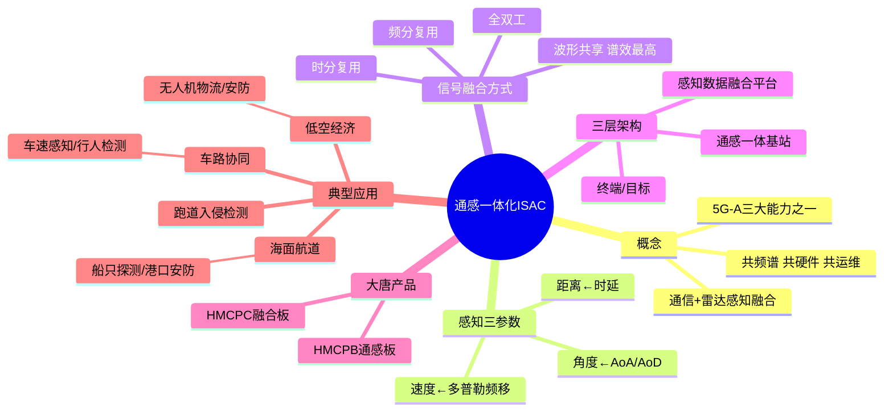

# 通感一体化技术应用

> 大纲分类：三、创新应用（20%）> 通感一体化技术应用  
> 考核要求：掌握  
> 已有资料来源：`课程笔记/04-通感技术应用及架构介绍.md` + 产业白皮书（概念补充）+ 真题归纳

---

## 知识导图



---

## 核心知识点

### 一、ISAC（Integrated Sensing and Communication）概念

**通感一体化**：在同一套 **频谱、硬件与站址** 上，融合 **通信** 与 **环境感知（类雷达）** 能力，实现 **“一网多能”** —— **共频谱、共硬件、共运维**，协议与信号处理 **软件协同**。

**与 5G-A / 6G**：通感一体是 **5G-Advanced（Rel-18 及后续）** 的核心特征之一；课件归纳 **5G-A 三大能力**：**上行增强、通感一体、AI 原生**。3GPP 在 **R19** 等版本持续推进通感标准化；亦为 **6G** 重点方向。

### 二、感知机理与三参数映射

基站发射信号 → 目标反射回波 → 基站接收并处理 → 提取 **距离、速度、角度** 等：

| 感知量 | 物理观测量 | 说明 |
|--------|------------|------|
| **距离** | **时延**（Round-trip delay） | 电磁波往返时间 × 光速/2 |
| **速度** | **多普勒频移** | 径向速度引起频偏 |
| **角度** | **AoA / AoD** 等 | 大规模阵列测向 |

**位置** 常由 **距离 + 角度** 联合估计得到。

### 三、通感信号融合方式

| 方式 | 思路 | 优劣概要 |
|------|------|----------|
| **时分复用** | 通信与感知占用不同时隙 | 实现简单；峰值能力受时隙比例限制 |
| **频分复用** | 不同子载波/频带划分 | 隔离度较好；频谱效率需权衡 |
| **全双工** | 同时发收 | 自干扰抑制难度大 |
| **波形共享** | 同一 OFDM 等波形同时承载通信与感知 | 谱效高；算法与标准复杂 |

### 四、系统架构（三层）

```
感知数据融合分析（云端/边缘平台）
              ↑
    通感一体基站（gNB + 感知引擎）
              ↑↓
   终端/目标（UE / 车辆 / 无人机等）
```

### 五、大唐相关产品（课件）

| 产品 | 说明 |
|------|------|
| **HMCPB** | 通感板 |
| **HMCPC** | 通信与感知融合板 |

### 六、典型应用场景

**低空经济**：

- **无人机物流**：航线监视、障碍物感知、偏航告警  
- **低空安防**：非法飞行器发现、轨迹跟踪  
- **文旅与监管**：低空流量管理  

**车路协同**：

- 车速/位置感知、行人检测、路口冲突预警（与 C-V2X 协同，见 `03-C-V2X技术应用.md`）

**海面 / 航道**：

- 船只探测、非法入侵告警、港口安防

**其他**：桥梁微形变、室内入侵检测、智慧工厂环境感知、机场跑道入侵与飞鸟检测等。

### 七、关键性能指标（理解）

- **感知侧**：距离/速度/角度精度、分辨率、虚警率、漏检率  
- **协同侧**：资源分配效率、通信与感知 **互干扰抑制** 能力

### 八、与传统雷达对比

| 对比项 | 传统雷达 | 通感一体 |
|--------|----------|----------|
| 设备 | 专用雷达站 | **复用基站** |
| 频谱 | 专用频段 | **共享通信频段** |
| 覆盖 | 局部 | **随蜂窝网扩展** |
| 成本 | 高 | **基础设施复用，成本低** |

---

## 考点速记

| 考点 | 记忆要点 |
|------|----------|
| ISAC 英文 | Integrated Sensing and Communication |
| 距离/速度/角度 | **时延 / 多普勒 / AoA** |
| 融合四方式 | 时分 / 频分 / 全双工 / **波形共享** |
| 大唐板卡 | **HMCPB**、**HMCPC** |
| 5G-A 三大能力 | **上行增强 + 通感一体 + AI 原生** |
| 低空关键词 | **无人机、物流、安防** |
| 标准化 | R18 引入方向；R19 推进 |

---

## 相关真题

> 以下真题摘自 `真题题库/真题-按知识点分类.md`，含完整选项与标准答案。

**[来源：第九届大唐杯A组省赛] 单选题**
车联网是实现自动驾驶的必要条件，以下不属于车联网优点的为

- **A.** 可提供丰富的网联应用
- **B.** 可增加感知范围，但感知成本会相应提升 ✓
- **C.** 提升交通效率
- **D.** 提升安全性
【答案】B

---

**[来源：第八届大唐杯本科组省赛] 单选题**
车联网是实现自动驾驶的必要条件，以下不属于车联网优点的为

- **A.** 提升安全性
- **B.** 可提供丰富的网联应用
- **C.** 提升交通效率
- **D.** 可增加感知范围，但感知成本会相应提升 ✓
【答案】D

---

**[来源：第十一届大唐杯研究生组省赛] 单选题**
激光雷达以激光作为载波，激光是光波段电磁辐射，波长比微波和毫米波

- **A.** 短 ✓
- **B.** 以上均不对
- **C.** 一样长
- **D.** 长
【答案】A

---

**[来源：第十一届大唐杯本科B组省赛第二场] 单选题**
关于摄像头、激光雷达、毫米波雷达三种传感器的比较，说法错误的是

- **A.** 毫米波雷达的测距范围高于摄像头和激光雷达 ✓
- **B.** 激光雷达在目标检测精度上优于毫米波雷达和摄像头
- **C.** 摄像头的精度相对较低，视野范围最大
- **D.** 激光雷达的成本最高
【答案】A

---

**[来源：第十一届大唐杯本科B组省赛第二场] 单选题**
毫米波雷达是一种重要的ADAS传感器，可以提供多种高精度的路面空间信息，其中，不包括

- **A.** 方位角
- **B.** 相对速度
- **C.** 距离
- **D.** 目标分类 ✓
【答案】D

---

**[来源：第十一届大唐杯本科B组省赛第一场] 多选题**
智能网联汽车环境感知传感器属于信息收集单元的重要组成部分，其信息收集能力主要有什么决定

- **A.** 传感器的数量 ✓
- **B.** 传感器感知范围 ✓
- **C.** 车辆所在位置
- **D.** 传感器感知精度 ✓
【答案】ABD

---

**[来源：第十一届大唐杯本科B组省赛第一场] 多选题**
车联网中，环境感知主要包括

- **A.** 行人感知，主要判断车辆行驶前方是否有行人，包括白天行人识别，夜晚行人识别，被障碍物遮挡的行人识别 ✓
- **B.** 车辆本身状态感知、包括行驶速度、行驶方向、行驶状态、车辆位置等 ✓
- **C.** 道路感知，包括道路类型检测、道路标线识别、道路状况判断、是否偏离行驶轨迹等 ✓
- **D.** 交通信号感知、自动识别交叉路口的信号灯、如何高效通过交叉路口等 ✓
【答案】ABCD

---

**[来源：第十一届大唐杯本科B组省赛第二场] 多选题**
车联网中，环境感知主要包括

- **A.** 车辆本身状态感知，包括行驶速度，行驶方向，行驶状态，车辆位置等 ✓
- **B.** 交通信号感知，自动识别交叉路口的信号灯，如何高效通过交叉路口等 ✓
- **C.** 道路感知、包括道路类型检测，道路标线识别，道路状况判断，是否偏离行驶轨迹等 ✓
- **D.** 行人感知，主要判断车辆行驶前方是否有行人，包括白天行人识别，夜晚行人识别，被障碍物遮挡的行人识别 ✓
【答案】ABCD

---

**[来源：第十一届大唐杯本科B组省赛第二场] 多选题**
智能网联汽车环境感知传感器属于信息收集单元的重要组成部分，其信息收集能力主要有什么决定

- **A.** 传感器感知精度 ✓
- **B.** 车辆所在位置
- **C.** 传感器的数量 ✓
- **D.** 传感器感知范围 ✓
【答案】ACD

---

**[来源：第十一届大唐杯本科A组省赛] 多选题**
关于激光雷达说法正确的是

- **A.** 不受大气和气象限制
- **B.** 可以获得目标反射的幅度、频率和相位等信息 ✓
- **C.** 全天候工作，不受白天和黑夜光照条件的限制 ✓
- **D.** 抗干扰性能好 ✓
【答案】BCD

---

**[来源：第十一届大唐杯高职组省赛] 判断题**
6G将具备的感知功能是指利用AI、数字李生等技术进行建模分析和自动决策，提升网络运营效率和系统性能。

【答案】✓ 正确

---

**[来源：第十一届大唐杯本科A组省赛] 判断题**
目前用在SLAM上的传感器主要分为这两类，一种是基于激光雷达的激光SLAM（Lidar SLAM）和基于视觉的VSLAM（VisualSLAM）。

【答案】✓ 正确

---

**[来源：第十一届大唐杯本科A组省赛] 多选题**
基于数字李生技术和人工智能技术，6G网络将成为具备以下功能的自治网络

- **A.** 自配置 ✓
- **B.** 自愈 ✓
- **C.** 自演进 ✓
- **D.** 自生长能力 ✓
【答案】ABCD

---

**[来源：第十一届大唐杯研究生组省赛] 判断题**
SLAM是Simultaneous localization and mapping缩写，意为同步定位与建图，主要用于解决机器人在未知环境运动时的定位与地图构建问题。

【答案】✓ 正确

---

**[来源：第十一届大唐杯高职组省赛] 多选题**
6G网络将在智享生活、智赋生成等方面催生全新的应用场景，这些场景将需要以下哪些全新的网络功能和能力

- **A.** 毫秒级的时延体验
- **B.** 太比特级的峰值速率 ✓
- **C.** 超过1000km/h的移动速度 ✓
- **D.** 数字李生 ✓
【答案】BCD

## 参考资源

- `课程笔记/04-通感技术应用及架构介绍.md`  
- [3GPP NTN / 5G-A 相关技术专题（通感标准进展）](https://www.3gpp.org/) — 以 Release 说明为准  
- 运营商与设备商《5G-A 通感一体》白皮书（赛文交通网、中国移动等公开材料，见 04 笔记链接）  
