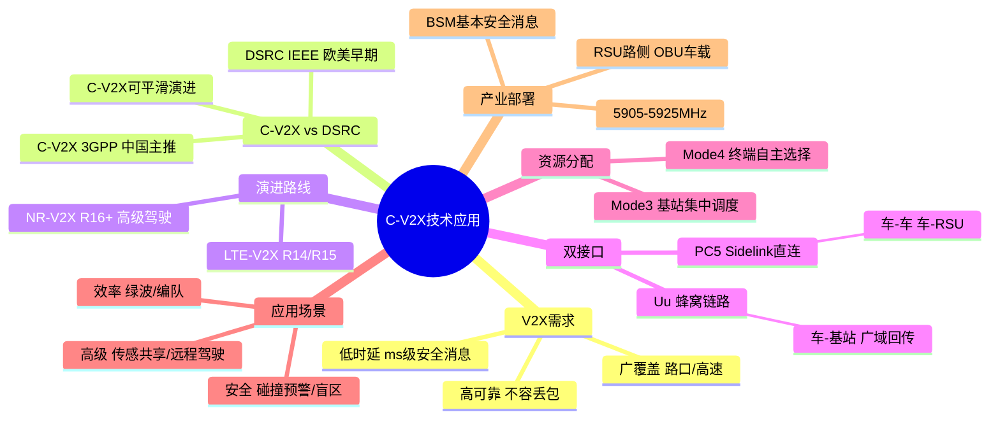

# C-V2X 技术应用

> 大纲分类：三、创新应用（20%）> C-V2X 技术应用  
> 考核要求：掌握  
> 已有资料来源：3GPP / 工信部车联网频率政策（公开）+ `真题题库/真题-按知识点分类.md` 归纳

---

## 知识导图

---

## 核心知识点

### 一、V2X 通信需求与痛点

**车联网（V2X）** 需支撑 **主动安全、交通效率、信息服务** 向 **协同感知与协同控制** 演进。

| 需求维度 | 说明 |
|----------|------|
| **低时延** | 前向碰撞、紧急制动等安全类消息 **ms~十 ms 级** |
| **高可靠** | 丢包与抖动直接影响安全 |
| **广覆盖** | 路口、高速、郊区路侧协同 |
| **高密度** | 城市路口多车多 RSU |

**痛点**：纯 **单车智能** 受传感器视距、天气、遮挡限制；需 **网联** 扩展感知半径并协同决策。

### 二、C-V2X vs DSRC（IEEE 802.11p）

| 对比项 | **DSRC** | **C-V2X（3GPP）** |
|--------|----------|-------------------|
| 标准化主体 | IEEE | **3GPP**（与蜂窝生态一致） |
| 产业路径 | 欧美早期路侧试验多 | **我国主推**；全球统一标准题常指向 **C-V2X** |
| 演进 | 相对固定 | **LTE-V2X → NR-V2X** 平滑演进 |

**真题**：V2X 两大阵营 — **IEEE（DSRC/WAVE）** vs **3GPP（C-V2X）**。

### 三、LTE-V2X → NR-V2X 演进

- **LTE-V2X（R14/R15）**：引入 **PC5 直连** 与 **Uu 蜂窝**；奠定基础安全消息。  
- **5G NR-V2X（R16+）**：更高吞吐、更灵活资源分配、更优 URLLC 能力，支持 **高级驾驶、编队、扩展传感器共享** 等。

**首个支持 5G-V2X 的协议版本**（第八届真题）：**R16**（以试卷选项为准）。

### 四、双接口：PC5 与 Uu

| 接口 | 名称 | 典型场景 |
|------|------|----------|
| **PC5（Sidelink）** | 终端/RSU **直连**（车—车、车—路） | 低时延广播/组播，路口安全 |
| **Uu** | 终端/RSU 与 **基站** 的蜂窝链路 | 广覆盖、大数据回传、平台下发 |

**真题辨析**：

- **车与 RSU** 直连：**PC5** ✓  
- **车与基站** “直连”若指 **蜂窝 Uu**，则 **不是 PC5**（曾出 **车辆与基站直连接口为 PC5** 的 **错误** 选项）。

**工作模式**（概括）：**仅 PC5**、**仅 Uu**、**PC5+Uu 协同**（题库考“不包括”的模式组合）。

### 五、PC5 资源分配（LTE-V2X 基线）

- **Mode 3**：**基站集中调度** 分配 PC5 资源。  
- **Mode 4**：**终端自主** 资源选择（分布式感知 + 预留）。

### 六、典型应用场景

| 类别 | 场景示例 |
|------|----------|
| **安全** | 前向碰撞预警（FCW）、交叉路口碰撞预警、盲区预警 |
| **效率** | 车速引导、绿波协调、编队行驶 |
| **高级协同** | 传感器共享、协同变道、**远程驾驶**（高可靠低时延 + 边缘算力） |

**BSM**（Basic Safety Message）：**基本安全消息**（多届真题）。

### 七、单车智能技术链

**感知**（摄像头、毫米波雷达、激光雷达）→ **融合定位** → **决策规划** → **控制执行**。  
V2X 在 **感知** 与 **决策** 环节提供 **超视距信息** 与 **协同策略**。

### 八、车路协同：V2I + MEC

- **RSU（路侧单元）**：路侧 **PC5 + 回传**；广播安全消息、提供局部地图与事件。  
- **OBU（车载单元）**：车载 **V2X 模组**，与车内 CAN/以太网对接。  
- **MEC（多接入边缘计算）**：路口 **低时延算力**，做融合感知、事件识别、区域广播策略；题库多次考 **MEC 部署目的/错误表述**。

**“云管端”架构**（判断题）：**管道** 负责 **数据回传与控制分发** 等（具体表述以原题为准）。

### 九、频率与标准（我国）

- 工信部 **5905–5925 MHz** 等车联网 **直连** 试验/商用频率（题库有 **具体数值** 单选，**以当年试卷为准**）。  
- **3GPP 全球统一车联网技术**：**C-V2X**（本科 B 组真题）。

### 十、与 5G 场景关系

- **车联网安全相关业务** 在 ITU/考试语境中常归 **uRLLC**（勿与 eMBB 纯下载混淆）。

---

## 考点速记

| 考点 | 记忆要点 |
|------|----------|
| 两大阵营 | **IEEE DSRC** vs **3GPP C-V2X** |
| 双接口 | **PC5 直连** + **Uu 蜂窝** |
| 车—RSU | **PC5** |
| 车—基站 | **Uu**（非 PC5） |
| BSM | **基本安全消息** |
| Mode3/4 | **基站调度** / **终端自主** |
| 5G-V2X | 协议版本题常记 **R16** 起点（以试卷为准） |
| 路侧/车载 | **RSU / OBU** |
| 中国主推 | **C-V2X** |

---

## 相关真题

> 以下真题摘自 `真题题库/真题-按知识点分类.md`，含完整选项与标准答案。

**[来源：第九届大唐杯A组省赛] 单选题**
车联网是实现自动驾驶的必要条件，以下不属于车联网优点的为

- **A.** 可提供丰富的网联应用
- **B.** 可增加感知范围，但感知成本会相应提升 ✓
- **C.** 提升交通效率
- **D.** 提升安全性
【答案】B

---

**[来源：第九届大唐杯B组省赛] 单选题**
C−V2X 中，部署 MEC 的主要目的下面不正确的是

- **A.** 为 UE 提供更快接入
- **B.** 传输网的负载也随之降低 ✓
- **C.** 降低端到端处理时延
- **D.** 提升用户感知
【答案】B

---

**[来源：第八届大唐杯本科组省赛] 单选题**
车联网是实现自动驾驶的必要条件，以下不属于车联网优点的为

- **A.** 提升安全性
- **B.** 可提供丰富的网联应用
- **C.** 提升交通效率
- **D.** 可增加感知范围，但感知成本会相应提升 ✓
【答案】D

---

**[来源：第十一届大唐杯高职组省赛] 单选题**
“云-边-端”智能网联系统中，下列说法正确的是

- **A.** OBU主要实现车辆信息的广播，与其他设备的交互 ✓
- **B.** 智能路侧设备实现局部区域交通态势感知
- **C.** RSU可以实现高精地图服务，提供安全效率类服务
- **D.** 边缘云主要实现总体交通态势管理，全局调度
【答案】A

---

**[来源：第十一届大唐杯本科B组省赛第一场] 多选题**
车联网中，环境感知主要包括

- **A.** 行人感知，主要判断车辆行驶前方是否有行人，包括白天行人识别，夜晚行人识别，被障碍物遮挡的行人识别 ✓
- **B.** 车辆本身状态感知、包括行驶速度、行驶方向、行驶状态、车辆位置等 ✓
- **C.** 道路感知，包括道路类型检测、道路标线识别、道路状况判断、是否偏离行驶轨迹等 ✓
- **D.** 交通信号感知、自动识别交叉路口的信号灯、如何高效通过交叉路口等 ✓
【答案】ABCD

---

**[来源：第十一届大唐杯本科B组省赛第二场] 多选题**
车联网中，环境感知主要包括

- **A.** 车辆本身状态感知，包括行驶速度，行驶方向，行驶状态，车辆位置等 ✓
- **B.** 交通信号感知，自动识别交叉路口的信号灯，如何高效通过交叉路口等 ✓
- **C.** 道路感知、包括道路类型检测，道路标线识别，道路状况判断，是否偏离行驶轨迹等 ✓
- **D.** 行人感知，主要判断车辆行驶前方是否有行人，包括白天行人识别，夜晚行人识别，被障碍物遮挡的行人识别 ✓
【答案】ABCD

---

**[来源：第九届大唐杯A组省赛] 单选题**
C-V2X 中，下面有关 MEC 部署位置不正确的是

- **A.** 与基站共址
- **B.** 接入汇聚机房
- **C.** 骨干汇聚机房
- **D.** 与 RRU 共址 ✓
【答案】D

---

**[来源：第九届大唐杯B组省赛] 单选题**
C-V2X 中，下面有关 PC5 接口表述错误的是

- **A.** 是 UE 与基站之间的参考点 ✓
- **B.** UE 之间的参考点
- **C.** 包括基于LTE的PC5
- **D.** 包括基于 NR 的 PC5
【答案】A

---

**[来源：第九届大唐杯B组省赛] 单选题**
C−V2X 中，下面有关 MEC 部署位置不正确的是

- **A.** 与基站共址
- **B.** 骨干汇聚机房
- **C.** 与 RRU 共址 ✓
- **D.** 接入汇聚机房
【答案】C

---

**[来源：第九届大唐杯B组省赛] 单选题**
C-V2X 中，BSM 消息是指的是

- **A.** 地图消息
- **B.** 路测分发交通参与者实时信息
- **C.** 信号灯消息
- **D.** 车辆基本安全类消息 ✓
【答案】D

---

**[来源：第九届大唐杯B组省赛] 单选题**
目前工信部已经发放车联网直连通信频率，在中国车联网直连通信使用频率为

- **A.** 5770-5850MHz
- **B.** 5855-5925MHz
- **C.** 5850-5925MHz
- **D.** 5905-5925MHz ✓
【答案】D

---

**[来源：第九届大唐杯B组省赛] 单选题**
针对弱势交通参与者碰撞预警应用，其涉及的通信方式为

- **A.** V2P/V2V
- **B.** V2V/V2N
- **C.** V2P/V2I ✓
- **D.** V2P/V2N
【答案】C

---

**[来源：第九届大唐杯B组省赛] 单选题**
C-V2X 中，下面不属于 V2X 范畴的是

- **A.** V2V
- **B.** V2I
- **C.** V2N
- **D.** V2C ✓
【答案】D

---

**[来源：第九届大唐杯B组省赛] 单选题**
C-V2X 中，基于 LTE 实现的 PC5-U 协议栈，没有下面哪个协议层

- **A.** SDAP ✓
- **B.** RLC
- **C.** PDCP
- **D.** MAC
【答案】A

---

**[来源：第八届大唐杯本科组省赛] 单选题**
第一个支持5G-V2X 标准的 3GPP 协议版本为

- **A.** R14
- **B.** R13
- **C.** R15
- **D.** R16 ✓
【答案】D

---

**[来源：第八届大唐杯本科组省赛] 单选题**
目前工信部已经发放车联网直连通信频率，在中国车联网直连通信使用频率为

- **A.** 5905-5925MHz ✓
- **B.** 5855-5925MHz
- **C.** 5850-5925MHz
- **D.** 5770-5850MHz
【答案】A

---

**[来源：第八届大唐杯本科组省赛] 单选题**
在LTE-V2X中，基于PC5接口，基站集中调度分配模式是

- **A.** mod3 ✓
- **B.** mod2
- **C.** mod5
- **D.** mod4
【答案】A

---

**[来源：第八届大唐杯本科组省赛] 单选题**
5G NR C-V2X中，车与基站之间直连通信接口是

- **A.** Xn
- **B.** Uu ✓
- **C.** Ng
- **D.** PC5
【答案】B

---

**[来源：第十届大唐杯A组省赛第一场] 单选题**
C-V2X中，基于LTE实现的PC5-U协议栈，没有下面哪个协议层

- **A.** MAC
- **B.** RLC
- **C.** SDAP ✓
- **D.** PDCP
【答案】C

---

**[来源：第十届大唐杯A组省赛第一场] 单选题**
对于5G应用的三大场景而言，车联网属于哪种场景

- **A.** mMTC
- **B.** eMBB
- **C.** D2D
- **D.** uRLLC ✓
【答案】D

---

**[来源：第十届大唐杯A组省赛第二场] 单选题**
C-V2X中，车与RSU之间的通信接口是

- **A.** Ng
- **B.** Xn
- **C.** Uu
- **D.** PC5 ✓
【答案】D

---

**[来源：第十届大唐杯A组省赛第二场] 单选题**
C-V2X中，车辆与基站之间直连通信接口为

- **A.** Xn
- **B.** Uu ✓
- **C.** PC5
- **D.** Ng
【答案】B

---

**[来源：第十届大唐杯B组省赛第一场] 单选题**
C-V2X的标准化可分为多个阶段进行，其中2017年正式发布的支持LTE-V2X的3GPP协议版本是

- **A.** R13
- **B.** R14 ✓
- **C.** R16
- **D.** R15
【答案】B

---

**[来源：第十届大唐杯B组省赛第一场] 单选题**
在LTE-V2X中，基于PC5接口，基站集中调度分配模式是

- **A.** mod2
- **B.** mod4
- **C.** mod3 ✓
- **D.** mod5
【答案】C

---

**[来源：第十届大唐杯B组省赛第一场] 单选题**
C-V2X系统中，BSM消息指的是

- **A.** 信号灯消息
- **B.** 路测分发交通参与者实时消息
- **C.** 车辆基本安全类消息 ✓
- **D.** 地图消息
【答案】C

---

**[来源：第十届大唐杯B组省赛第二场] 单选题**
在C-V2X中，PC5资源分配方式中，终端自主的资源分配模式是指

- **A.** mod2
- **B.** mod4 ✓
- **C.** mod3
- **D.** mod5
【答案】B

---

**[来源：第十届大唐杯B组省赛第二场] 单选题**
C-V2X中，车与RSU之间的通信接口是

- **A.** Xn
- **B.** PC5 ✓
- **C.** Uu
- **D.** Ng
【答案】B

---

**[来源：第十一届大唐杯高职组省赛] 单选题**
我国发布的V2X标准定义了5大类消息来满足不同场景的需求，其中不包括

- **A.** RRC ✓
- **B.** SPAT
- **C.** BSM
- **D.** MAP
【答案】A

---

**[来源：第十一届大唐杯本科B组省赛第一场] 单选题**
3GPP发布全球统一标准的车联网通信技术是指

- **A.** V2P
- **B.** V2I
- **C.** C-V2X ✓
- **D.** DSRC
【答案】C

---

**[来源：第十一届大唐杯本科B组省赛第一场] 单选题**
以下哪些不是车联网汽车必须具备的条件

- **A.** 融合网络技术
- **B.** 支持环境温湿度检测 ✓
- **C.** 搭配控制器
- **D.** 搭载传感器
【答案】B

---

**[来源：第十一届大唐杯本科B组省赛第二场] 单选题**
5G车联网技术在智慧交通系统中的作用不包括

- **A.** 车辆定位与导航
- **B.** 紧急情况下的通信
- **C.** 实时路况监控
- **D.** 车辆娱乐技术 ✓
【答案】D

---

**[来源：第十一届大唐杯本科A组省赛] 单选题**
C-V2X的工作模式不包括

- **A.** V2C ✓
- **B.** V2V
- **C.** V2I
- **D.** V2P
【答案】A

---

**[来源：第九届大唐杯A组省赛] 多选题**
下面哪些接口属于 C−V2X 的 PC5 接口

- **A.** 车之间 ✓
- **B.** 车与 RSU(UE 级别) ✓
- **C.** 车与人 ✓
- **D.** 车与基站
【答案】ABC

---

**[来源：第九届大唐杯A组省赛] 多选题**
C-V2X 可提供两种通信接口，分别是

- **A.** Xn
- **B.** PC5 ✓
- **C.** Uu ✓
- **D.** Ng
【答案】BC

---

**[来源：第九届大唐杯B组省赛] 多选题**
下面那些接口属于 C−2X 的 PC5 接口

- **A.** 车与 RSU（UE 级别） ✓
- **B.** 车与基站
- **C.** 车与车之间 ✓
- **D.** 车与人 ✓
【答案】ACD

---

**[来源：第八届大唐杯本科组省赛] 多选题**
以下哪些选项属于 NR-V2X 可支持传输模式

- **A.** 广播 ✓
- **B.** 单播 ✓
- **C.** 分播
- **D.** 组播 ✓
【答案】ABD

---

**[来源：第八届大唐杯本科组省赛] 多选题**
以下选项中，属于 NR−V2X 资源分配模式的

- **A.** Mode2 ✓
- **B.** Mode3
- **C.** Mode1 ✓
- **D.** Mode4
【答案】AC

---

**[来源：第十届大唐杯A组省赛第一场] 多选题**
V2X技术在国际上存在两大阵营，一种是IEEE主导的，一种是3GPP主导的，分别为

- **A.** SAE
- **B.** ITU
- **C.** C-V2X ✓
- **D.** DSRC ✓
【答案】CD

---

**[来源：第十届大唐杯A组省赛第二场] 多选题**
以下哪些选项属于NR-V2X可支持传输模式

- **A.** 组播 ✓
- **B.** 广播 ✓
- **C.** 单播 ✓
- **D.** 多播
【答案】ABC

---

**[来源：第十届大唐杯A组省赛第二场] 多选题**
有关C-V2X说法正确的是

- **A.** X可以代表人车网等 ✓
- **B.** 可以基于LTE技术实现 ✓
- **C.** 基于DSRC的技术实现
- **D.** 可以基于NR技术实现 ✓
【答案】ABD

---

**[来源：第十届大唐杯B组省赛第一场] 多选题**
根据C-V2X标准定义，以下哪些属于车联网工作模式

- **A.** V2P ✓
- **B.** V2N ✓
- **C.** V2V ✓
- **D.** V2I ✓
【答案】ABCD

---

**[来源：第十届大唐杯B组省赛第二场] 多选题**
关于C-V2X的特点，以下说法正确的是

- **A.** 只能短距离通信
- **B.** 将Uu口和PC5接口相结合 ✓
- **C.** 5G通信低时延，大带宽，海量连接性 ✓
- **D.** 基于成熟的4G，以及复用5G网络，部署成本低 ✓
【答案】BCD

---

**[来源：第十一届大唐杯研究生组省赛] 多选题**
目前C-V2X正在向交通安全和效率类应用发展，并逐步向支持实现自动驾驶的协同服务类应用演进，以下属于交通效率类应用的包括

- **A.** 车辆编队
- **B.** 车速引导 ✓
- **C.** 远程遥控驾驶
- **D.** 紧急呼叫 ✓
【答案】BD

---

**[来源：第九届大唐杯B组省赛] 判断题**
C-V2X 只能采用 NR 实现，不能采用 LTE 技术实现。

【答案】错误

---

**[来源：第九届大唐杯B组省赛] 判断题**
C-V2X 网络架构中的管即管道，负责终端采集数据的回传和控制信息的分发。

【答案】✓ 正确

---

**[来源：第八届大唐杯本科组省赛] 判断题**
借助于人，车，路，云平台之间的全方位连接和高效信息交互，C-V2X 目前正从信息服务类应用向交通安全和效率类应用发展，并将逐步向支持实现自动驾驶的协同服务类应用演进。

【答案】✓ 正确

---

**[来源：第八届大唐杯本科组省赛] 判断题**
C-V2X 只能采用 NR 实现，不能采用 LTE 技术实现。

【答案】错误

---

**[来源：第十一届大唐杯研究生组省赛] 判断题**
C-V2X相对于ADAS更成熟更早商用。

【答案】错误

---

**[来源：第十一届大唐杯研究生组省赛] 判断题**
C-V2X的接口只有PC5和Uu口。

【答案】✓ 正确

---

**[来源：第十一届大唐杯高职组省赛] 判断题**
车联网环境下，两车交互数据只能通过PC5接口交换。

【答案】✓ 正确

---

**[来源：第十一届大唐杯本科B组省赛第一场] 判断题**
车联网场景中紧急防碰撞预警系统应用属于高频率低时延业务。

【答案】✓ 正确

---

**[来源：第十一届大唐杯本科B组省赛第一场] 判断题**
C-V2X是融合蜂窝通信与直连通信的车联网通信技术，也叫做NR-V2X。

【答案】错误

---

**[来源：第十一届大唐杯本科B组省赛第二场] 判断题**
车联网环境中，两车相距较远时，相互之间可以通过Pc5接口通信。

【答案】错误

---

**[来源：第十一届大唐杯本科B组省赛第二场] 判断题**
在交叉路口中，车联网汽车可以通过V2V方式获取路口信息，降低碰撞风险。

【答案】✓ 正确

---

**[来源：第十一届大唐杯本科A组省赛] 判断题**
C-V2X的网络技术包含4G或者5G。

【答案】✓ 正确

---

**[来源：第十一届大唐杯本科A组省赛] 判断题**
5G网络可以根据车联网业务提供高密度连接切片。

【答案】✓ 正确

---

**[来源：第九届大唐杯B组省赛] 多选题**
根据不同应用对通信频率和时延的不同需求，将 17 个一期应用分为两大类，分别为

- **A.** 低时延、低频率
- **B.** 高时延、低频率 ✓
- **C.** 低时延、高频率 ✓
- **D.** 高时延、高频率
【答案】BC

---

**[来源：第九届大唐杯B组省赛] 多选题**
根据合作式智能运输系统车用通信系统应用层及应用数据交互标准，选取 17 个典型应用作为一期应用，这些应用可分为不同类别，分别为

- **A.** 自动驾驶
- **B.** 信息服务 ✓
- **C.** 安全 ✓
- **D.** 效率 ✓
【答案】BCD

## 参考资源

- 3GPP TS 23.285 / 38.885 系列 — V2X 服务与 NR 侧链（查阅最新 Release）  
- 工信部《车联网（智能网联汽车）直连通信使用 5905-5925MHz 频段管理规定》等公开文件  
- `真题题库/真题-按知识点分类.md` — **C-V2X / V2X / PC5 / RSU / OBU / MEC** 关键词  
