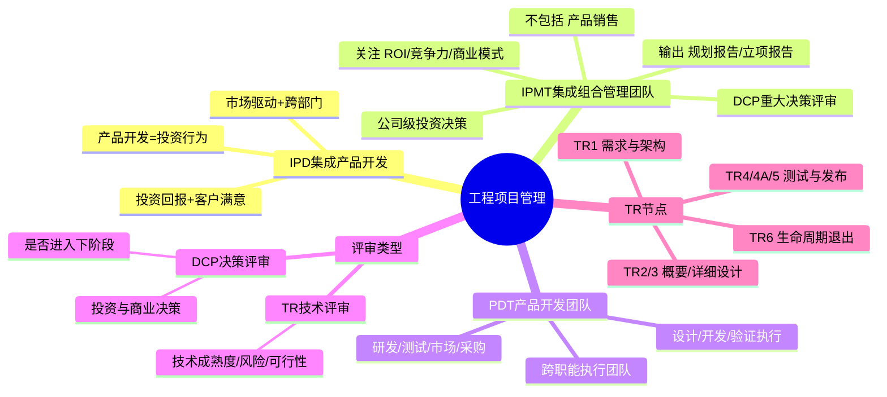

# 工程项目管理

> 大纲分类：二、工程思维（40%）> 工程项目管理  
> 考核要求：熟悉  
> 已有资料来源：`课程笔记/09-工程概论基础-信科赛专项培训.md` + IPD 通用体系 + 真题归纳

---

## 知识导图

---

## 核心知识点

### 一、IPD（集成产品开发，Integrated Product Development）

**核心理念**（竞赛高频）：

- 把 **产品策划与立项** 视为 **投资行为**，而非单纯的“研发部门内部项目”。  
- 强调 **市场驱动 + 结构化流程 + 跨部门团队 + 分层决策**。  
- 追求 **投资回报与客户满意** 的平衡，反对唯技术导向的封闭式开发。

**与错误表述的辨析**（真题陷阱）：  
“将新产品开发作为 **技术型决策** 而非 **投资性决策**” —— 该说法与 IPD 本质 **相反**，IPD 强调 **投资与商业成功**。

### 二、IPMT（集成组合管理团队 / Integrated Portfolio Management Team）

**定位**：公司级（或业务单元级）**投资决策与组合管理**团队。

**职责侧重**（理解即可，不必背诵过细职能表）：

- 产品方向、**组合排序**、战略对齐与资源大盘。  
- **重大决策评审（DCP）** 的裁决与阶段关口放行。  
- **不直接**承担日常开发活动执行（执行在 PDT）。

**IPMT 投资决策关注**（09 与多届真题一致）：

- 产品最终 **综合竞争力**  
- **投资回报率（ROI）**  
- **商业模式**  

**刻意不作为 IPMT 投资决策“核心选项”的**：单纯 **技术因素**（技术是达成商业目标的手段，不是投资决策的唯一或核心维度）。

**IPMT 职责“不包括”类题目**（研究生组真题）：**产品销售** 一般 **不属于** IPMT 核心职责（偏执行与渠道体系）。

**流程输出（必背）**：

| 阶段 | 典型输出（题库） |
|------|------------------|
| **第一阶段** | **新产品规划建设报告**（研究生组真题） |
| **第二阶段** | **新产品立项批准报告**（第十届 A 组、第十一届研究生组等） |

**IPMT 中文全称**（本科 A 组真题）：**集成组合管理团队**（选项曾用“集成组合管理团队”为正确答案）。

### 三、PDT（Product Development Team，产品开发团队）

**定位**：执行 **产品开发任务** 的跨职能核心团队（研发、测试、制造、市场、采购、质量等代表）。

**与 IPMT 分工**（多选真题）：

- **IPMT**：投资决策、组合与重大里程碑 **决策**。  
- **PDT**：在授权范围内推动 **设计/开发/验证** 与 **项目计划执行**。  
- **错误表述**：IPMT 负责具体设计开发流程实施；PDT 负责“重大投资决策” —— 与 IPD 分工 **相反**。

**PDT 计划阶段**（本科 A 组真题）：考查“**不包括**”类工作 —— 需理解计划阶段重在范围、进度、资源、风险与依赖，而非替代 **商业模式终审** 或 **市场销售执行** 等 IPMT 层事项（具体选项以试卷为准）。

### 四、技术评审（TR）vs 决策评审（DCP）

| 类型 | 目的 | 典型关注点 |
|------|------|------------|
| **TR（Technical Review）** | 评估 **技术成熟度、风险、方案可行性** | 架构、指标、测试策略、缺陷与遗留问题 |
| **DCP（Decision Review）** | **投资与商业决策**：是否进入下一阶段、是否追加资源、是否终止/转向 | 市场、财务、组合、发布准备度 |

**真题表述**：产品开发评审主要有 **决策评审** 和 **技术评审**。

**决策评审族**（本科 B 组真题“不包含”题）：常含 **概念决策评审、计划决策评审、发布决策评审** 等；**规格书评审** 更偏 **技术/文档评审**，**不属于**“公司决策评审”的同一分类（以当年答案为准）。

### 五、传统项目管理 vs IPD

| 维度 | 传统（偏职能/项目制） | IPD |
|------|----------------------|-----|
| 决策 | 易停留在部门层级 | **分层决策：IPMT + PDT** |
| 目标 | 易偏重进度/功能交付 | **商业成功 + 客户满意 + 投资回报** |
| 需求 | 易后期变更失控 | **结构化流程 + 阶段关口** 控制变更成本 |
| 跨部门 | 协调成本高 | **重量级团队** 常态化 |

### 六、产品设计开发流程与非技术制约因素

与 **技术方案** 并行的常见约束（09 与工程常识）：

- **专利/IP**：避让、交叉许可、许可费（见 `01-产品开发全生命周期.md` 与 09 专利策略）。  
- **法规/准入**：电信设备进网、环保、安规、行业监管。  
- **安全**：人身与网络安全、数据合规。  
- **环保与可持续**：材料、能耗、回收与绿色设计。

**产品属性**（真题）：**技术属性 + 经济属性**；不能只追求技术先进性（09）。

### 七、通信工程项目管理要素（09 归纳）

- 范围、时间、成本、质量、风险 —— 与 **验收**（设备安装、线缆、调测、文档）共同构成交付闭环。

---

## 考点速记

| 考点 | 记忆要点 |
|------|----------|
| IPMT 决策三要素 | 竞争力、ROI、商业模式（**非**“技术因素”作核心） |
| IPMT ≠ 销售执行 | “产品销售”类常作为 **不包括** 项 |
| 第二阶段输出 | **新产品立项批准报告** |
| 第一阶段输出 | **新产品规划建设报告** |
| IPMT 中文 | **集成组合管理团队** |
| 评审双轨 | **技术评审 TR** + **决策评审 DCP** |
| IPD 变革 | 设 **IPMT + PDT**；管理分 **两个层面** |
| 错误说法 | 把 IPD 说成“技术型决策而非投资性决策” |

---

## 相关真题

> 以下真题摘自 `真题题库/真题-按知识点分类.md`，含完整选项与标准答案。

**[来源：第十一届大唐杯研究生组省赛] 单选题**
IPMT流程第一阶段的输出成果是什么

- **A.** 新产品规划建设报告 ✓
- **B.** 新产品
- **C.** 客户反馈信息
- **D.** 企业自身能力
【答案】A

---

**[来源：第十一届大唐杯研究生组省赛] 单选题**
IPMT职责不包括哪个

- **A.** 产品销售 ✓
- **B.** 战略投资决策
- **C.** 产品布局
- **D.** 竞争策略制定
【答案】A

---

**[来源：第十一届大唐杯本科B组省赛第二场] 单选题**
下列哪个不是IPD的主流程

- **A.** 市场规划流程
- **B.** 物料申请流程 ✓
- **C.** 技术开发流程
- **D.** 产品开发流程
【答案】B

---

**[来源：第十届大唐杯A组省赛第一场] 多选题**
集成产品开发模式把产品策划和产品立项都看作为投资行为，战略决策及企业高层的决策行为，IPMT进行决策的关键内容包括哪些

- **A.** 产品最终综合竞争力 ✓
- **B.** 投资回报率 ✓
- **C.** 商业模式 ✓
- **D.** 技术因素
【答案】ABC

---

**[来源：第十届大唐杯A组省赛第一场] 单选题**
IPMT流程第二阶段的输出成果是什么

- **A.** 新产品
- **B.** 产品测试报告
- **C.** 战略投资决策
- **D.** 新产品立项批准报告 ✓
【答案】D

---

**[来源：第十届大唐杯A组省赛第二场] 单选题**
IPMT产品生命周期管理阶段的周期长短取决于什么因素

- **A.** 产品亏损数额
- **B.** 产品的投资回报率 ✓
- **C.** 产品盈利数额
- **D.** 产品用户数
【答案】B

---

**[来源：第十一届大唐杯研究生组省赛] 单选题**
IPMT流程第二阶段的输出成果是

- **A.** 新产品
- **B.** 战略投资决策
- **C.** 产品测试报告
- **D.** 新产品立项批准报告 ✓
【答案】D

---

**[来源：第十一届大唐杯本科B组省赛第一场] 单选题**
在IPD模式的流程中，哪个阶段开始产品正式立项

- **A.** 第二阶段
- **B.** 第一阶段 ✓
- **C.** 第四阶段
- **D.** 第三阶段
【答案】B

---

**[来源：第十一届大唐杯本科B组省赛第一场] 单选题**
新产品开发的启动和终结由（ ）来决定

- **A.** IPD
- **B.** IPMT ✓
- **C.** PDT
- **D.** SPT
【答案】B

---

**[来源：第十一届大唐杯本科B组省赛第一场] 单选题**
以下说法错误的是

- **A.** IPD模式对新产品的开发是以客户为中心的市场行为，追求的是客户对新产品的满意度
- **B.** IPD模式对新产品的开发是以技术创新为目的，追求的是新产品的市场应用
- **C.** IPD模式采用技术驱动和市场驱动相结合，将新产品开发作为技术型决策，而非投资性决策 ✓
- **D.** IPD模式对新产品的开发是作为投资进行管理的，追求的是投资回报
【答案】C

---

**[来源：第十一届大唐杯本科B组省赛第二场] 单选题**
产品开发评审主要有什么评审

- **A.** 设计评审和测试评审
- **B.** 决策评审和技术评审 ✓
- **C.** 市场评审和生产评审
- **D.** 立项评审和开发评审
【答案】B

---

**[来源：第十一届大唐杯本科B组省赛第二场] 单选题**
公司决策评审不包含

- **A.** 发布决策评审
- **B.** 规格书评审 ✓
- **C.** 概念决策评审
- **D.** 计划决策评审
【答案】B

---

**[来源：第十一届大唐杯本科A组省赛] 单选题**
IPMT是指

- **A.** 集成决策管理团队
- **B.** 集成技术管理团队
- **C.** 集成组合管理团队 ✓
- **D.** 集成管理层团队
【答案】C

---

**[来源：第十一届大唐杯本科A组省赛] 单选题**
IPD模式流程中，哪一阶段才能开始产品的正式立项？

- **A.** IPMT第一阶段
- **B.** IPMT第四阶段
- **C.** IPMT第三阶段
- **D.** IPMT第二阶段 ✓
【答案】D

---

**[来源：第十届大唐杯B组省赛第二场] 多选题**
集成产品开发模式在项目管理上的重大变革有哪些

- **A.** 成立了IPMT集成产品管理团队和PDT产品开发团队 ✓
- **B.** IPMT专门负责项目的设计/开发流程实施及项目管理
- **C.** 将项目管理分为IPMT和PDT团队两个层面 ✓
- **D.** PDT专门负责项目管理中的重大决策
【答案】AC

---

**[来源：第十一届大唐杯本科A组省赛] 多选题**
集成产品开发模式把项目管理分为了哪些方面

- **A.** PDT ✓
- **B.** IPMT ✓
- **C.** PMP
- **D.** PMO
【答案】AB

---

**[来源：第十一届大唐杯本科A组省赛] 单选题**
PDT计划阶段的主要工作内容不包括

- **A.** 新产品市场需求确认
- **B.** 新产品中试需求确认
- **C.** 新产品投资回报率确认 ✓
- **D.** 新产品开发模式确认
【答案】C

---

**[来源：第十一届大唐杯本科A组省赛] 多选题**
PDT团队的作用包括哪些方面

- **A.** 中试 ✓
- **B.** 销售 ✓
- **C.** 开发 ✓
- **D.** 服务 ✓
【答案】ABCD

## 参考资源

- `课程笔记/09-工程概论基础-信科赛专项培训.md`  
- 华为公开资料：《IPD 集成产品开发》相关介绍（概念理解用）  
- `真题题库/真题-按知识点分类.md` — IPD / IPMT / PDT / 评审 关键词检索  
