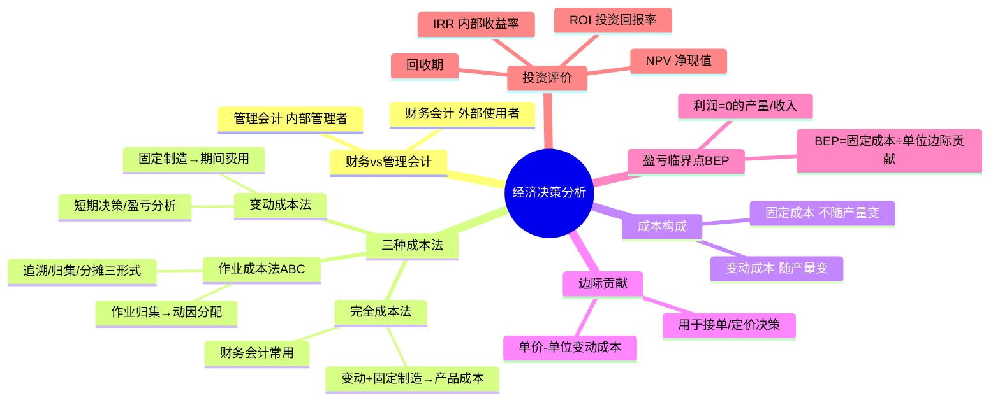

# 经济决策分析

> 大纲分类：二、工程思维（40%）> 经济决策分析  
> 考核要求：掌握  
> 已有资料来源：`课程笔记/09-工程概论基础-信科赛专项培训.md` + 管理会计/工程经济常识 + 真题归纳

---

## 知识导图

---

## 核心知识点

### 一、财务会计 vs 管理会计（09 与真题）

| 维度 | 财务会计 | 管理会计 |
|------|----------|----------|
| **主要使用者** | **企业外部**（投资者、债权人、监管） | **企业内部** 管理者 |
| **规则** | 受会计准则约束强 | 更灵活，服务决策 |
| **典型产品** | 三大报表、合规披露 | 本量利分析、作业成本、预算与责任会计 |

**判断题陷阱**：“管理会计报表使用者是企业外部” → **错误**。

**产品成本“定义”题**（第十届 A 组多选）：  
- **财务会计**：企业为生产一定种类和数量的产品所支出的 **生产费用之和**。  
- **管理会计**：产品形成中及交付后仍由企业支付的 **生产服务费用之和**（全成本视角更宽）。

### 二、完全成本法 vs 变动成本法 vs 作业成本法（ABC）

**完全成本法（吸收成本法）**：

- 将 **变动制造费用 + 固定制造费用** 计入产品成本。  
- **真题**：属于 **财务会计** 核算成本的常用方法。

**变动成本法**：

- 固定制造费用多作为期间费用；便于 **短期经营决策** 与 **分产品盈亏** 分析。  
- **优点**（研究生组多选真题）：利于责任划分、业绩评价；直接提供变动成本支持决策分析等。  
- **缺点**：**未**纳入对外财务报告通用准则体系（真题辨析）。

**作业成本法（ABC）**：

- 通过 **作业** 归集资源消耗，再按 **成本动因** 分配到产品。  
- **分配形式**（本科 A 组真题）：**3 种**（题库答案为 **3**）。  
- **分配路径**（多选）：**成本追溯、动因归集、分摊** 等。

**作业变动成本法**（题库归类在 **管理会计** 方法中，与完全成本法区分）。

### 三、产品成本构成：变动成本 + 固定成本

**变动成本**：随产量/销量 **成比例变化** 的部分（材料、计件人工、按销量计提费用等）。

**固定成本**：一定相关范围内 **不随产量** 变化（厂房折旧、管理人员工资、**部分研发与验证设施** 等）。

**真题**：

- 变动成本完整式（第十届 A 组）：**生产 + 销售 + 服务** 环节变动成本之和。  
- 降低 BOM **变动成本** **不正确** 的方法：**用硬件代替软件**（第十届 B 组）。  
- 产本性态为固定成本（多选）：曾出现 **测试验证、技术预研、策划、开发** 等环节（以选项为准）。  
- **生产计划管理环节** 曾作为 **固定成本** 单选考点。

### 四、边际贡献（Contribution Margin）分析

- **单位边际贡献** = 销售单价 − 单位变动成本。  
- **总边际贡献** = 销售收入 − 总变动成本。  
- **利润** = 总边际贡献 − 固定成本（及期间费用，视模型而定）。

用于：**短期接单决策、产品组合、促销定价底线**。

### 五、盈亏临界点（BEP, Break-Even Point）

令 **利润 = 0**：

- **临界点销售量** \(Q^* = \dfrac{F}{P - V}\)  
  - \(F\)：相关固定成本  
  - \(P\)：单价  
  - \(V\)：单位变动成本  

**损益方程式**（第十届 B 组）：利润 = (单价 − 单位变动成本)×销量 − 分摊的成本总额；利润为 0 时的销量即 **临界点销售量**。

**定价策略**（第十届 B 组单选）：正常策略要求单价 **高于** 单位变动成本与单位分摊固定成本之和（具体选项见原题）。

### 六、产品定价策略（概要）

- **成本加成**：在完全成本或目标成本上加成。  
- **竞争导向**：对标竞品与渠道策略。  
- **价值导向**：按客户感知价值与差异化定价。  
- **底线**：长期看价格应覆盖 **变动成本** 并贡献 **固定成本与利润**（与真题选项对照）。

### 七、投资回报率（ROI）

\[
ROI = \dfrac{\text{净利润（或息税前利润）}}{\text{投资额}} \times 100\%
\]

用于：**项目比选、IPMT 投资视角**（与生命周期阶段“取决于 ROI”真题呼应）。

### 八、净现值（NPV）与内部收益率（IRR）

**NPV**：将未来现金流按 **折现率** 折现后与初始投资比较；**NPV > 0** 通常表示 **创造价值**。

**IRR**：使 NPV=0 的折现率；与资本成本比较判断可行性。

**竞赛层面**：掌握 **含义、比较规则、再投资假设差异** 即可，复杂计算以题目给定数据为准。

### 九、经济决策方法论

- **成本—效益分析（CBA）**：量化收益与成本，选净效益更优方案。  
- **敏感性分析**：关键参数（价格、销量、良率、汇率）波动对 NPV/利润的影响。  
- **情景分析**：乐观/基准/悲观多套假设，看策略鲁棒性。

### 十、与 09 的衔接

- **开发成本产生环节**：**产品设计**（真题）。  
- **技术重用与固定成本**：通过平台化、器件归一化等 **优化固定成本分摊**（与“通过技术重用可优化产品固定成本”类表述一致）。  
- **工程经济学中“经济”**：资源的 **合理利用**（本科 B 组真题）。

---

## 考点速记

| 考点 | 记忆要点 |
|------|----------|
| 财务会计使用者 | **外部**；**完全成本法** 常归财务会计 |
| 管理会计使用者 | **内部**；**作业成本法、变动成本法、作业变动成本法** 常归管理会计 |
| 变动成本三环节 | **生产 + 销售 + 服务**（真题完整式） |
| BEP | 利润=0 的销量；\(F/(P-V)\) |
| 损益方程 | 作业成本法能否使用需按 **试卷解析**（曾出“有误”辨析题） |
| ABC 分配形式数量 | 题库曾考 **3** |
| 降变动成本 | **硬件代替软件** 为 **不正确** 手段（真题） |
| 开发成本环节 | **产品设计** |

---

## 相关真题

> 以下真题摘自 `真题题库/真题-按知识点分类.md`，含完整选项与标准答案。

**[来源：第十届大唐杯A组省赛第一场] 单选题**
用户需要性价比高的产品，产品具有双重属性，即经济属性和

- **A.** 成本属性
- **B.** 技术属性 ✓
- **C.** 策略属性
- **D.** 优势属性
【答案】B

---

**[来源：第十届大唐杯A组省赛第一场] 单选题**
若通过专利检索发现自己的核心技术已经被他人申请专利，一般采用的措施不包括

- **A.** 专利避让
- **B.** 交叉许可
- **C.** 交纳专利使用费
- **D.** 不影响，继续申请专利 ✓
【答案】D

---

**[来源：第十届大唐杯A组省赛第一场] 单选题**
技术创新方式有多种，其中最有技术难度的创新方式为

- **A.** 改进创新
- **B.** 原始创新 ✓
- **C.** 集成创新
- **D.** 简约创新
【答案】B

---

**[来源：第十届大唐杯A组省赛第一场] 单选题**
根据产品全成本的概念，以下作业环节对应产生开发成本的为

- **A.** 产品中试
- **B.** 产品策划
- **C.** 产品设计 ✓
- **D.** 产品立项
【答案】C

---

**[来源：第十届大唐杯A组省赛第二场] 单选题**
IPMT产品生命周期管理阶段的周期长短取决于什么因素

- **A.** 产品亏损数额
- **B.** 产品的投资回报率 ✓
- **C.** 产品盈利数额
- **D.** 产品用户数
【答案】B

---

**[来源：第十届大唐杯A组省赛第二场] 单选题**
以下选项中，哪一个选项属于财务会计核算成本的方法

- **A.** 作业变动法
- **B.** 变动成本法
- **C.** 完全成本法 ✓
- **D.** 作业变动成本法
【答案】C

---

**[来源：第十届大唐杯A组省赛第二场] 单选题**
以下关于产品全成本概念下的变动成本表示正确的是

- **A.** 产品变动成本=产品生产变动成本+产品服务变动成本
- **B.** 产品变动成本=产品销售变动成本+产品服务变动成本
- **C.** 产品变动成本=产品生产变动成本+产品销售变动成本
- **D.** 产品变动成本=产品生产变动成本+产品销售变动成本+产品服务变动成本 ✓
【答案】D

---

**[来源：第十届大唐杯B组省赛第一场] 单选题**
下面降低元器件材料清单的变动成本方法不正确的是

- **A.** 技术模块的技术重用
- **B.** 用硬件代替软件 ✓
- **C.** 利用摩尔定律降低系统成本
- **D.** 元器件的归一化
【答案】B

---

**[来源：第十届大唐杯B组省赛第一场] 单选题**
产品各生产作业环节成本分析中，产本性态为固定成本的选项为

- **A.** 采购环节
- **B.** 生产计划管理环节 ✓
- **C.** 装配生产环节
- **D.** 单板测试环节
【答案】B

---

**[来源：第十届大唐杯B组省赛第二场] 单选题**
产品开发测试中分为不同的环节，其中黑箱测试的主要目的是

- **A.** 验证产品内部的实现方式
- **B.** 实现透明测试
- **C.** 检测客户需求是否实现 ✓
- **D.** 验证设计规范的实现
【答案】C

---

**[来源：第十届大唐杯B组省赛第二场] 单选题**
以下选项中，属于正常的产品销售定价策略的为

- **A.** 产品销售单价低于单位产品变动成本与单位产品对应分摊的固定成本之和
- **B.** 产品销售单价高于单位产品变动成本，低于单位变动成本与单位产品对应分摊的固定成本之和
- **C.** 产品销售单价等于单位产品变动成本
- **D.** 产品销售单价高于单位产品中变动成本与单位产品对应分摊的固定成本之和 ✓
【答案】D

---

**[来源：第十届大唐杯B组省赛第二场] 单选题**
损益方程式是经济决策的核心，以下关于损益方程式说法有误的有

- **A.** 作业成本法可以使用损益方程式 ✓
- **B.** 作业变动成本法可以使用损益方程式
- **C.** 损益方程式可表示为：利润=（单价收入-单位产品变动成本）*产品销量-分摊的成本总额
- **D.** 令损益方程式中利润为0时对应的产品销售量为临界点销售量
【答案】A

---

**[来源：第十届大唐杯B组省赛第二场] 单选题**
在集成产品开发模式中引入了平台开发的概念，以下不同的产品平台中层级最高的产品平台是

- **A.** 产品级平台
- **B.** 板级平台
- **C.** 子系统平台
- **D.** 系统级平台 ✓
【答案】D

---

**[来源：第十一届大唐杯研究生组省赛] 单选题**
以下说法错误的是

- **A.** 产品的变动成本仅存在于生产的作业环节中 ✓
- **B.** 产品的全成本不是在一个作业环节中形成的
- **C.** 成本控制以完成预定成本限额为目标
- **D.** 产品策划阶段最重要的工作就是对新产品的正确描述
【答案】A

---

**[来源：第十一届大唐杯研究生组省赛] 单选题**
降低生产作业环节变动成本的方式不包括

- **A.** 整机自动测试
- **B.** 整机测试生产线柔性化改造
- **C.** 单板测试生产线刚性化改造 ✓
- **D.** 单板自动测试
【答案】C

---

**[来源：第十一届大唐杯本科B组省赛第一场] 单选题**
以下( )产品成本核算方法属于财务会计范畴

- **A.** 完全成本法 ✓
- **B.** 作业变动成本法
- **C.** 作业成本法
- **D.** 变动成本法
【答案】A

---

**[来源：第十一届大唐杯本科B组省赛第一场] 单选题**
工程经济学中经济的含义主要是指

- **A.** 资源的合理利用 ✓
- **B.** 经济制度
- **C.** 生产关系
- **D.** 经济基础
【答案】A

---

**[来源：第十一届大唐杯本科B组省赛第二场] 单选题**
以下哪个方法适用于对生产周期短、生产数量大的产品进行成本降低、成本控制的管理

- **A.** 作业变动成本法
- **B.** 完全成本法
- **C.** 变动成本法 ✓
- **D.** 作业成本法
【答案】C

---

**[来源：第十一届大唐杯本科A组省赛] 单选题**
作业成本法认为，将成本分配到成本对象有多少种不同的形式。

- **A.** 3 ✓
- **B.** 4
- **C.** 5
- **D.** 2
【答案】A

---

**[来源：第十一届大唐杯本科A组省赛] 单选题**
产品变动成本管理要做的第一件基础性工作是

- **A.** 根据产品型号建立产品变动成本数据库 ✓
- **B.** 建立产品变动成本考核体系
- **C.** 确定数据库的成本数据项字段
- **D.** 数据库中产品作业环节变动成本数据录入
【答案】A

---

**[来源：第十届大唐杯A组省赛第一场] 多选题**
关于产品成本描述，以下说法正确的是

- **A.** 在财务会计中，产品形成中及产品交付后仍由交付企业支付的各种生产，服务费用之和为产品成本
- **B.** 在管理会计中，产品形成中及产品交付后仍由交付企业支付的各种生产，服务费用之和为产品成本 ✓
- **C.** 在管理会计中，企业为生产一定种类，一定数量的产品所支出的各种生产费用之和为产品成本
- **D.** 在财务会计中，企业为生产一定种类，一定数量的产品所支出的各种生产费用之和为产品成本 ✓
【答案】BD

---

**[来源：第十届大唐杯A组省赛第二场] 多选题**
根据产品研发流程各环节的成本分析，属于产品固定成本的为

- **A.** 产品测试验证环节的成本 ✓
- **B.** 技术预研环节的成本 ✓
- **C.** 产品策划环节的成本 ✓
- **D.** 产品开发环节的成本 ✓
【答案】ABCD

---

**[来源：第十届大唐杯A组省赛第二场] 多选题**
下面哪个环节产生的成本属于变动成本

- **A.** 生产安装环节 ✓
- **B.** 装配生产环节 ✓
- **C.** 采购管理环节 ✓
- **D.** 研发流程环节
【答案】ABC

---

**[来源：第十届大唐杯B组省赛第一场] 多选题**
作业成本法将成本分配到成本对象有下面哪几种形式

- **A.** 未来预估
- **B.** 成本追溯 ✓
- **C.** 动因归集 ✓
- **D.** 分摊 ✓
【答案】BCD

---

**[来源：第十届大唐杯B组省赛第二场] 多选题**
关于产品成本存在多种产品核算方法，其中属于管理会计中的产品核算方法为

- **A.** 作业变动成本法 ✓
- **B.** 变动成本法 ✓
- **C.** 完全成本法
- **D.** 作业成本法 ✓
【答案】ABD

---

**[来源：第十一届大唐杯研究生组省赛] 多选题**
变动成本法的优点包括

- **A.** 便于分清各部门的经济责任，有利于对成本的控制与业绩的评价 ✓
- **B.** 作为财务会计成本核算方式，已经纳入会计准则，成为通行标准
- **C.** 能直接提供各种产品的变动成本，可依此直接进行分产品型号的盈亏核算，有利于管理人员的决策分析 ✓
- **D.** 简化了产品成本计算 ✓
【答案】ACD

---

**[来源：第十一届大唐杯研究生组省赛] 多选题**
管理会计理论中生产模式大致分为哪些类型

- **A.** 迭代法
- **B.** 分批法 ✓
- **C.** 品种法 ✓
- **D.** 分步法 ✓
【答案】BCD

---

**[来源：第十一届大唐杯研究生组省赛] 多选题**
作业成本法的优点包括

- **A.** 利于管理控制
- **B.** 有助于改进成本控制 ✓
- **C.** 开发和维护费用低
- **D.** 可以获得更准确的产品和产品线成本 ✓
【答案】BD

---

**[来源：第十一届大唐杯研究生组省赛] 多选题**
技术创新方式包括哪几种

- **A.** 自主创新
- **B.** 原始创新 ✓
- **C.** 集成创新 ✓
- **D.** 改进创新 ✓
【答案】BCD

---

**[来源：第十一届大唐杯本科B组省赛第一场] 多选题**
以下不属于作业成本法优点的是

- **A.** 可以获得更准确的产品和产品线成本
- **B.** 利于管理控制 ✓
- **C.** 有助于改进成本控制
- **D.** 开发和维护费用低 ✓
【答案】BD

---

**[来源：第十一届大唐杯本科A组省赛] 多选题**
作业成本法认为，将成本分配到成本对象有以下哪几种形式？

- **A.** 成本追溯 ✓
- **B.** 资源分解
- **C.** 分摊 ✓
- **D.** 动因归集 ✓
【答案】ACD

---

**[来源：第十一届大唐杯本科A组省赛] 多选题**
以下哪个环节的成本性态为变动成本？

- **A.** 生产管理
- **B.** 采购管理 ✓
- **C.** 整机测试 ✓
- **D.** 单板测试 ✓
【答案】BCD

---

**[来源：第十届大唐杯A组省赛第一场] 判断题**
管理会计主要是对产品进行财务管理，管理报表的使用者是企业外部的管理者。

【答案】错误

---

**[来源：第十一届大唐杯本科B组省赛第一场] 判断题**
降低产品变动成本是财务部门的责任。

【答案】错误

---

**[来源：第十一届大唐杯本科B组省赛第二场] 判断题**
产品变动成本是与产品紧密联系的，产品总的变动成本与产品数量是线性关系。

【答案】错误

---

**[来源：第十一届大唐杯本科B组省赛第二场] 判断题**
完全成本法是管理会计主要采用的成本核算方法。

【答案】错误

---

**[来源：第十一届大唐杯本科A组省赛] 判断题**
完全成本法按经济用途将成本分为制造成本和非制造成本。

【答案】✓ 正确

---

**[来源：第十一届大唐杯本科A组省赛] 判断题**
完全成本法的理论依据是：凡是同产品生产有关的消耗都应计入产品成本。

【答案】✓ 正确

## 参考资源

- `课程笔记/09-工程概论基础-信科赛专项培训.md`  
- 管理会计入门教材：本量利、变动成本法与作业成本法章节  
- `真题题库/真题-按知识点分类.md` — 成本、变动成本、固定成本、盈亏、作业成本 等关键词  
