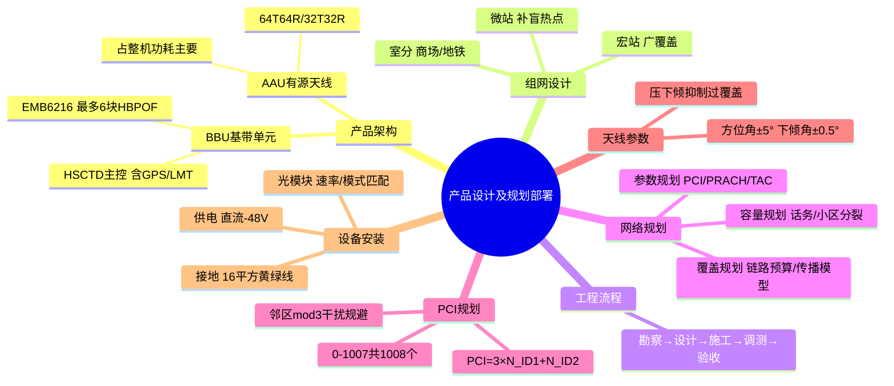

# 产品设计及规划部署

> 大纲分类：二、工程思维（40%）> 产品设计及规划部署  
> 考核要求：掌握  
> 已有资料来源：`课程笔记/07-5G基站产品及解决方案.md` + 5G 组网与规划常识 + `课程笔记/04-通感技术应用及架构介绍.md`（通感部署）+ 真题归纳

---

## 知识导图

---

## 核心知识点

### 一、5G 通信产品设计流程（概括）

与全生命周期对齐：**需求与场景 → 系统架构与指标分解 → 软硬件详细设计 → 试制与测试 → 量产与工程化导入**。

通信基站类产品额外强调：**环境适应性（温湿度、防水）、供电与接地、EMC、防雷、可维护性（LMT/网管）、可制造性（线缆与结构）**。

### 二、移动通信产品系统架构：BBU + AAU/RRU

- **BBU（基带处理单元）**：基带、主控、传输汇聚；典型型号 **EMB6216**，最大 **6** 块 **HBPOF** 基带板（07）。  
- **AAU（有源天线单元）**：射频与天线一体化；城区宏站常见 **64T64R**，郊区 **32T32R**，室内 **4T4R/8T8R**（07）。  
- **板卡（07）**：**HBPOF/HBPOD** 基带；**HSCTD** 主控传输板（接口含 **GPS、LMT**）；**MPU** 主控。

**功耗**（真题）：基站功耗常分 **AAU** 与 **BBU** 两大部分，**AAU 占整机功耗主要部分**。

### 三、组网设计：宏站 / 微站 / 室分

- **宏站**：广覆盖、道路与郊区主力；高频段 Massive MIMO。  
- **微站 / 杆站**：补盲、热点吸收。  
- **室分**：商场、地铁、场馆；小功率多天线、数字化室分（DAS / 皮飞站等，按题目选项）。

**NSA/SA**（真题）：我国商用曾以 **Option 3x** 等 NSA 方案为主流（具体选项以试卷为准）；SA **Option 2** 为独立组网。

### 四、工程实施流程

**勘察 → 设计 → 施工 → 调测 → 验收**（与 09 工程链一致）。

### 五、移动通信网络规划

| 规划类型 | 内容要点 |
|----------|----------|
| **覆盖规划** | 链路预算、传播模型、站高与方位/下倾、频段选择 |
| **容量规划** | 话务与流量模型、小区分裂、载波与参数配置 |
| **参数规划** | PCI、PRACH、TAC、邻区、功率与互操作 |

**PCI 规划**（多届真题）：

- NR **PCI 取值范围** 等基础题常见。  
- **NCGI** = MCC + MNC + gNB ID + Cell ID（07）。  
- 相邻小区 **模 3** 干扰与 **SSB** 相关；规划时常要求 **相邻小区模 3 不同**；**模 30** 等规则以原题选项为准。  
- 研究生组：**PCI 规划应考虑 mod（3）影响**。

### 六、天线参数：方位角与下倾角

- **方位角**：天线水平指向；路测与优化中常与 **重叠覆盖、越区** 联合分析。  
- **下倾角**：机械下倾 + 电子下倾；**压下倾** 常用于抑制 **过覆盖**（真题判断题存在不同表述，**以当年解析为准**）。  
- **大唐安装精度（07）**：方位角 **±5°**，下倾角 **±0.5°**。  
- **SSB 波束软调**：**不能**完全代替硬调方位角与下倾角（真题判断）。

### 七、传输与路由（07）

商用基站 **必须** 配置路由：**AMF（控制面）**、**UPF（用户面）**、**OMC（网管）**；到业务服务器路由 **非** 必选。

**本地小区建立前提**：传输 + GPS + 基带 + 射频 资源正常（全选真题）。

### 八、大唐设备安装要点（整合 07）

**供电**：BBU/AAU **直流 −48V**（注意负号）；非交流 110/220V 作为基站主供（真题）。

**接地**：BBU 接地线 **16 平方** 黄绿线。

**光纤与光模块**：

- BBU—AAU 路由 **>100m** 用 **单模** 集束光纤。  
- 光模块常用 **25G-1310**；BBU 侧最小发送光功率 **不低于 −10dBm**。  
- 光模块插反、DCPD 未合闸等会导致 **AAU 无法接入**；**修改小区物理 ID 列表** **不**影响 AAU 接入（真题）。

**BBU 安装**：

- 竖装前方维护空间 **800mm**；并柜/并架；多排机柜前后间隔 **≥800mm**、同风向。

**GPS 天线（07）**：

- 竖直向上视角 **>120°**；塔上安装宜在铁塔 **最靠南** 一角，与铁塔间距 **2m**；遮挡 **不超过 30°**。  
- 时钟同步至少锁定 **4 颗** 卫星。  
- 国内运营商题库曾考：**时钟源优先级最高不是北斗，是 GPS**（判断 **错误** 题：说北斗最高 → 错）。  

**真题差异**：部分试卷考 **多 GPS 天线间距 >1m**（防反射干扰）；07 课件曾强调 **“两 GPS 间距>1米”为错误说法** —— **备考以学唐课件与当年官方解析为准**。

### 九、通感融合网络部署特点（衔接 04）

- **共站址、共设备、共频段、共运维**；在 5G-A 中与 **上行增强、AI 原生** 并列为能力方向。  
- 网络侧需预留 **感知数据回传**、**边缘算力** 与 **安全隐私** 策略；规划阶段需评估 **通信与感知资源时分/频分/波形共享** 对 **容量与干扰** 的影响。

---

## 考点速记

| 考点 | 记忆要点 |
|------|----------|
| EMB6216 | 最多 **6** 块 HBPOF |
| HSCTD 接口 | **GPS + LMT** |
| 供电 | **直流 −48V** |
| 接地线 | **16 平方** 黄绿 |
| >100m 光纤 | **单模** 集束 |
| 光模块 | **25G-1310**；发送功率 ≥ **−10dBm** |
| 必配路由 | **AMF + UPF + OMC** |
| 方位/下倾精度 | **±5° / ±0.5°** |
| PCI 规划 | 关注 **mod3**、邻区规则 |
| NCGI | MCC+MNC+gNB ID+Cell ID |
| AAU 功耗 | 占基站整机功耗 **大头** |

---

## 相关真题

> 以下真题摘自 `真题题库/真题-按知识点分类.md`，含完整选项与标准答案。

**[来源：第九届大唐杯A组省赛] 单选题**
对于大唐 5G 设备，单模集束光纤在 BBU 与 AAU 路由长度超过多少米使用

- **A.** 40
- **B.** 60
- **C.** 80
- **D.** 100 ✓
【答案】D

---

**[来源：第九届大唐杯A组省赛] 单选题**
下列哪个因素不影响 AAU 正常接入

- **A.** DCPD 给 AAU 供电的开关未闭合
- **B.** 修改了小区物理 ID 列表 ✓
- **C.** 对应的光模块插反了
- **D.** 对应的 HBPOD 板卡状态为未初始化状态
【答案】B

---

**[来源：第九届大唐杯A组省赛] 单选题**
大唐 5G 基站设备，BBU 接地线采用多少平方黄绿接地线

- **A.** 6
- **B.** 16 ✓
- **C.** 35
- **D.** 25
【答案】B

---

**[来源：第九届大唐杯B组省赛] 单选题**
大唐 5G 基站产品 EMB6216，最大支持安插几块 HBPOF 基带板

- **A.** 6 ✓
- **B.** 5
- **C.** 3
- **D.** 4
【答案】A

---

**[来源：第八届大唐杯本科组省赛] 单选题**
对于大唐 5G 基站设备，HSCTD 板卡插在 0 槽位，则其登录的物理 IP 地址为

- **A.** 172.27.245.92
- **B.** 172.27.245.100
- **C.** 172.27.45.250
- **D.** 172.27.245.91 ✓
【答案】D

---

**[来源：第八届大唐杯本科组省赛] 单选题**
对于大唐 64TRAAU，小区降质的定义是

- **A.** AAU 有三分之一或者三分之一以上通道故障即可造成小区降质
- **B.** AAU 有二分之一或者二分之以上通道故障即可造成小区降质
- **C.** AAU 有 8 个以上通道故障即可造成小区降质
- **D.** AAU 有四分之一或者四分之一以上通道故障即可造成小区降质 ✓
【答案】D

---

**[来源：第八届大唐杯本科组省赛] 单选题**
单模光纤是什么类型光纤

- **A.** 渐变型
- **B.** 阶跃型 ✓
- **C.** 梯度型
- **D.** 自聚焦型
【答案】B

---

**[来源：第八届大唐杯本科组省赛] 单选题**
5G 中从 BBU 到 AAU 需要保证多少Gbps 的传输带宽

- **A.** 15
- **B.** 25 ✓
- **C.** 10
- **D.** 5
【答案】B

---

**[来源：第八届大唐杯本科组省赛] 单选题**
EMB6116未使用的槽位必须加装空面板，否则影响散热。下列（ ）槽位为空时需安装带导风板的空面板。

- **A.** SLOT1
- **B.** SLOT3
- **C.** SLOT2
- **D.** SLOT6 ✓
【答案】D

---

**[来源：第八届大唐杯本科组省赛] 单选题**
大唐5G基站设备-EMB6116，HBPOD板卡不具备的功能

- **A.** SDAP
- **B.** 与BBU内部各板卡之间的业务、信令交换处理功能 ✓
- **C.** L2处理功能
- **D.** 物理层处理功能
【答案】B

---

**[来源：第八届大唐杯本科组省赛] 单选题**
大唐5G基站设备，BBU接地线采用多少平方黄绿接地线？

- **A.** 16 ✓
- **B.** 25
- **C.** 6
- **D.** 35
【答案】A

---

**[来源：第八届大唐杯本科组省赛] 单选题**
对于大唐5G设备，单模集束光纤在BBU与AAU路由长度超过多少米使用。

- **A.** 80
- **B.** 60
- **C.** 40
- **D.** 100 ✓
【答案】D

---

**[来源：第八届大唐杯本科组省赛] 单选题**
对于大唐5G基站设备维护时，当传输状态正常时，HSCTD指示灯GE、Ofp1应显示为

- **A.** 常亮 ✓
- **B.** 慢闪
- **C.** 不亮
- **D.** 快闪
【答案】A

---

**[来源：第八届大唐杯本科组省赛] 单选题**
下列哪个因素不影响AAU正常接入

- **A.** 对应的HBPOD板卡状态为未初始化状态
- **B.** 修改了小区物理ID列表 ✓
- **C.** DCPD给AAU供电的开关未闭合
- **D.** 对应的光模块插反了
【答案】B

---

**[来源：第八届大唐杯本科组省赛] 单选题**
对于大唐5G设备EMB6116，HDPSD输出电压为多少伏特

- **A.** 24
- **B.** 5
- **C.** 12 ✓
- **D.** 48
【答案】C

---

**[来源：第八届大唐杯本科组省赛] 单选题**
对于大唐5G基站设备，AAU进行近端直连升级时，需要登录的IP地址为

- **A.** 172.27.245.100 ✓
- **B.** 172.27.45.250
- **C.** 172.27.245.91
- **D.** 172.27.245.92
【答案】A

---

**[来源：第八届大唐杯本科组省赛] 单选题**
对于大唐5G基站设备，GPS天线的工作电压为

- **A.** 直流-12V
- **B.** 直流5V ✓
- **C.** 交流220V
- **D.** 直流-48V
【答案】B

---

**[来源：第十届大唐杯A组省赛第二场] 单选题**
下列传输介质中，传输效率最高的是

- **A.** 无线介质
- **B.** 同轴电缆
- **C.** 网线
- **D.** 光纤 ✓
【答案】D

---

**[来源：第十届大唐杯B组省赛第二场] 单选题**
大唐5G设备天线安装时，方位角以及下倾角要求偏差度为

- **A.** 正负5度，正负5度
- **B.** 正负5度，正负1度 ✓
- **C.** 正负1度，正负1度
- **D.** 正负1度，正负5度
【答案】B

---

**[来源：第十届大唐杯B组省赛第二场] 单选题**
按目前天线排列方式，32TR AAU垂直面最多支持的波束层数为

- **A.** 3
- **B.** 1
- **C.** 4 ✓
- **D.** 2
【答案】C

---

**[来源：第十一届大唐杯研究生组省赛] 单选题**
下列哪个因素不影响AAU正常接入

- **A.** 对应的HBPOD板卡状态为未初始化状态
- **B.** 修改了小区物理ID列表 ✓
- **C.** DCPD给AAU供电的开关未闭合
- **D.** 对应的光模块插反了
【答案】B

---

**[来源：第十一届大唐杯高职组省赛] 单选题**
一般情况下，EMB6216BBU与AAU电源线规格分别是

- **A.** 25方，8方
- **B.** 16方，10方 ✓
- **C.** 25方，10方
- **D.** 16方，8方
【答案】B

---

**[来源：第十一届大唐杯高职组省赛] 单选题**
大唐5G基站设备升级时，基站BBU升级安装包选择下载到基站的文件路径为

- **A.** /data
- **B.** /ata1
- **C.** /ata2 ✓
- **D.** /cgf
【答案】C

---

**[来源：第十一届大唐杯高职组省赛] 单选题**
5G基站设备中，当DCPD至AAU电源线长度大于50米，小于等于80米时，直流电源线应使用

- **A.** 2×25mm²
- **B.** 2×10mm²
- **C.** 2×6mm²
- **D.** 2×16mm² ✓
【答案】D

---

**[来源：第十一届大唐杯高职组省赛] 单选题**
大唐5G设备开通调测时，采用近端开站的方式，所使用的开站软件是

- **A.** ATP
- **B.** Wireshark
- **C.** LMT ✓
- **D.** OMC
【答案】C

---

**[来源：第十一届大唐杯高职组省赛] 单选题**
在5G基站安装时，DCPD与电源柜之间的电源线规格应为

- **A.** 10方
- **B.** 16方
- **C.** 25方 ✓
- **D.** 8方
【答案】C

---

**[来源：第十一届大唐杯高职组省赛] 单选题**
6G上游行业不包括

- **A.** 射频器件
- **B.** 光纤光缆
- **C.** 芯片
- **D.** 智能制造 ✓
【答案】D

---

**[来源：第十一届大唐杯高职组省赛] 单选题**
大唐5G基站安装时，当BBU安装+AAU设备安装2台时，上级输入空开建议为

- **A.** 2路80A ✓
- **B.** 1路63A
- **C.** 2路100A
- **D.** 1路80A
【答案】A

---

**[来源：第十一届大唐杯高职组省赛] 单选题**
5G基站BBU设备EMB6216机框，仅有2块基带板板卡的情况下，应当优先插几槽位？

- **A.** 2和3槽位 ✓
- **B.** 2和7槽位
- **C.** 2和5槽位
- **D.** 2和6槽位
【答案】A

---

**[来源：第十一届大唐杯高职组省赛] 单选题**
5G基站安装时，为避免自激，GPS放大器安装位置应距离GPS天线至少多少米

- **A.** 10
- **B.** 20 ✓
- **C.** 30
- **D.** 40
【答案】B

---

**[来源：第十一届大唐杯本科B组省赛第一场] 单选题**
在5G基站安装中，DCPD与电源柜之间的电源线规格应为

- **A.** 16方
- **B.** 8方
- **C.** 10方
- **D.** 25方 ✓
【答案】D

---

**[来源：第十一届大唐杯本科B组省赛第一场] 单选题**
大唐5G基站安装时，当BBU安装+AAU设备安装2台时，上级输入空开建议为

- **A.** 2路80A ✓
- **B.** 2路100A
- **C.** 1路80A
- **D.** 1路63A
【答案】A

---

**[来源：第十一届大唐杯本科B组省赛第一场] 单选题**
5G基站设备中，当DCPD至AAU电源线长度大于50米，小于等于80米，直流电源线应使用

- **A.** 2*25mm^2
- **B.** 2*16mm^2 ✓
- **C.** 2*10mm^2
- **D.** 2*6mm^2
【答案】B

---

**[来源：第十一届大唐杯本科B组省赛第二场] 单选题**
在5G基站安装中，DCPD与电源柜之间的电源线规格应为

- **A.** 10方
- **B.** 16方
- **C.** 25方 ✓
- **D.** 8方
【答案】C

---

**[来源：第十一届大唐杯本科A组省赛] 单选题**
5G设备EMB6116加装理线架总计高度是

- **A.** 3U
- **B.** 2U
- **C.** 5U
- **D.** 4U ✓
【答案】D

---

**[来源：第九届大唐杯A组省赛] 多选题**
针对大唐 5G 产品，进行巡检工作时，常用的工具有哪些

- **A.** uem5000 ✓
- **B.** LMT ✓
- **C.** OSP
- **D.** NodeBSpider ✓
【答案】ABD

---

**[来源：第九届大唐杯B组省赛] 多选题**
有关 GPS 天线安装，下面要求正确的是

- **A.** 两个 GPS 天线间距大于 1 米
- **B.** 天线竖直向上的视角应大于 120 度 ✓
- **C.** 在塔上安装 GPS 天线，应使 GPS 天线位于铁塔最面向南方一角并保持与铁塔 2 米间距 ✓
- **D.** 周围对天线的遮挡不超 30 度 ✓
【答案】BCD

---

**[来源：第九届大唐杯B组省赛] 多选题**
大唐 5G 设备安装时，以下 BBU 竖装规范要求，描述正确的是

- **A.** BBU竖装时，前方需留有 800mm 的维护通道 ✓
- **B.** BBU 竖装时，机柜后部不支持靠墙安装，与墙的可距离≤800mm
- **C.** BBU 竖装支持并柜或并架安装 ✓
- **D.** BBU 竖装双排或多排机柜安装时，机柜前后间隔≥800mm，同时需要同风向安装； ✓
【答案】ACD

---

**[来源：第八届大唐杯本科组省赛] 多选题**
大唐 5G 设备维护过程中，以下哪些选项可能造成 RRU 和 BBU 之间的光纤连接异常

- **A.** 光纤头子受污染 ✓
- **B.** 光纤长度过长 ✓
- **C.** 光纤走纤时曲率半径过大
- **D.** 光模块类型不匹配 ✓
【答案】ABD

---

**[来源：第八届大唐杯本科组省赛] 多选题**
大唐 5G 基站开通后，关于板卡状态，说法正确的是

- **A.** 管理状态应为解锁定状态 ✓
- **B.** 管理状态应为锁定状态
- **C.** 板卡过程状态应为初始化结束状态 ✓
- **D.** 板卡过程状态为未初始化状态
【答案】AC

---

**[来源：第八届大唐杯本科组省赛] 多选题**
大唐 EMB6116 BBU 未使用的槽位必须加装空面板。下列哪些槽位为空时，需安装带导风板的空面板

- **A.** SLOT6 ✓
- **B.** SLOT3
- **C.** SLOT2
- **D.** SLOT7 ✓
【答案】AD

---

**[来源：第八届大唐杯本科组省赛] 多选题**
对于大唐5G产品，以下选项关于AAU的描述正确的是

- **A.** AAU集成了RRU和天线两个模块 ✓
- **B.** AAU具有简化天面、安装方便、加快建网的优点跃型 ✓
- **C.** AAU架构更有利于天线校准精度，减少由于线缆连接而造成的不可控因素，获得更好的波束赋型性能 ✓
- **D.** AAU的全称为ActiveAntennaUnit ✓
【答案】ABCD

---

**[来源：第八届大唐杯本科组省赛] 多选题**
进行5G基站安装时，关于TDAU5164N78安装最小空间要求（单位：mm），以下说法正确的是

- **A.** AAU 顶部应预留 300mm 布线和维护空间 ✓
- **B.** AAU左侧应预留350mm布线和维护空间
- **C.** AAU右侧应预留350mm布线和维护空间
- **D.** AAU底部应预留600mm布线空间，为方便维护建议底部距地面至少1200mm ✓
【答案】AD

---

**[来源：第八届大唐杯本科组省赛] 多选题**
大唐5G设备安装时，以下BBU竖装规范要求，描述正确的是

- **A.** BBU竖装时，前方需留有800mm的维护通道 ✓
- **B.** BBU竖装时，机柜后部不支持靠墙安装，与墙的可距离800mm
- **C.** BBU竖装支持并柜或并架安装； ✓
- **D.** BBU竖装双排或多排机柜安装时，机柜前后间隔≥800mm，同时需要同风向安装； ✓
【答案】ACD

---

**[来源：第八届大唐杯本科组省赛] 多选题**
针对大唐5G产品，进行巡检工作时，常用的工具有哪些

- **A.** OSP
- **B.** LMT ✓
- **C.** NodeBSpider ✓
- **D.** uem5000 ✓
【答案】BCD

---

**[来源：第八届大唐杯本科组省赛] 多选题**
对于大唐5G设备，AAU版本升级前必须的检查项有哪些？

- **A.** 先保证链路正常，光口光纤同步 ✓
- **B.** AAU能够正常接入 ✓
- **C.** AAU与BBU连接是否正常 ✓
- **D.** OSP上相应处理器能连接上 ✓
【答案】ABCD

---

**[来源：第八届大唐杯本科组省赛] 多选题**
大唐5G设备安装时，如果发现现场空开规格不满足要求，以下做法正确的是

- **A.** 暂时不接电，先进行设备安装其他作业 ✓
- **B.** 艺高人胆大”继续接电作业
- **C.** 直接对空开进行改造使其符合开通要求
- **D.** 上报客户现场存在的问题 ✓
【答案】AD

---

**[来源：第八届大唐杯本科组省赛] 多选题**
大唐5G基站产品EMB6216，HBPOF可以插在哪些槽位

- **A.** 3、7 ✓
- **B.** 0、4
- **C.** 2、6 ✓
- **D.** 1、5 ✓
【答案】ACD

---

**[来源：第八届大唐杯本科组省赛] 多选题**
5G网络巡检使用LMT时，随LMT同步打开的两个软件分别是

- **A.** LMT
- **B.** LmtAgent ✓
- **C.** FTP server ✓
- **D.** FTP client
【答案】BC

---

**[来源：第十届大唐杯A组省赛第一场] 多选题**
在5G基站开通调试中，本地小区建立的前提条件包括

- **A.** 传输资源正常 ✓
- **B.** GPS正常 ✓
- **C.** 基带资源正常 ✓
- **D.** 射频资源正常 ✓
【答案】ABCD

---

**[来源：第十届大唐杯A组省赛第一场] 多选题**
关于5G基站设备的供电类型，下面描述不正确的是

- **A.** BBU一般为交流110V供电 ✓
- **B.** AAU一般为直流48V供电 ✓
- **C.** BBU一般为交流220V供电 ✓
- **D.** BBU一般为直流-48V供电
【答案】ABC

---

**[来源：第十届大唐杯A组省赛第一场] 多选题**
以下选项中，属于HSCTD板卡上接口的是

- **A.** GPS接口 ✓
- **B.** IR接口
- **C.** 时钟级联接口
- **D.** LMT接口 ✓
【答案】AD

---

**[来源：第十届大唐杯A组省赛第二场] 多选题**
下面有关5G室分解决方案中说法正确的是

- **A.** 针对高容量，大面积。高价值的场景可采用数字化室分（皮站）进行解决。 ✓
- **B.** 针对话务高发但人员密集度相对较低的区域可采用一体化小基站（飞站）进行解决。 ✓
- **C.** 传统室内分布解决方案一定都是无源的
- **D.** Slsite解决方案适用于中等容量，多隔断环境复杂，中等价值场景 ✓
【答案】ABD

---

**[来源：第十届大唐杯B组省赛第一场] 多选题**
在5G基站日常维护过程中，导致AC校准问题的原因可能是

- **A.** 输出功率问题 ✓
- **B.** 驻波比问题 ✓
- **C.** 光链路异常问题 ✓
- **D.** GPS时钟源异常问题 ✓
【答案】ABCD

---

**[来源：第十届大唐杯B组省赛第一场] 多选题**
5G系统日常维护，现场系统人员主要工作内容包括

- **A.** 设备巡检 ✓
- **B.** 专项核查 ✓
- **C.** 指标监控 ✓
- **D.** 告警分析 ✓
【答案】ABCD

---

**[来源：第十届大唐杯B组省赛第一场] 多选题**
大唐5G基站设备维护时，需要使用的工具包括

- **A.** 斜口钳 ✓
- **B.** 十字螺丝刀 ✓
- **C.** 光功率计 ✓
- **D.** 万用表 ✓
【答案】ABCD

---

**[来源：第十届大唐杯B组省赛第二场] 多选题**
针对大唐5G产品，以下选项关于AAU的描述正确的是

- **A.** AAU集成了RRU和天线两个模块 ✓
- **B.** AAU具有简化天面，安装方便，加快建网的优点 ✓
- **C.** AAU全称为Active Antenna Unit ✓
- **D.** AAU架构更有利于天线校准精度，减少由于线缆连接而造成的不可控因素，获得更好的波束赋型性能 ✓
【答案】ABCD

---

**[来源：第十一届大唐杯研究生组省赛] 多选题**
6G上游行业包括

- **A.** 智能制造
- **B.** 光纤光缆 ✓
- **C.** 自动驾驶
- **D.** 芯片 ✓
【答案】BD

---

**[来源：第十一届大唐杯研究生组省赛] 多选题**
对于大唐5G设备EMB6216，5G基站开通网元布配的内容说法正确的是

- **A.** 电源板卡在5槽位
- **B.** 风扇板卡无需配置
- **C.** AAU光口的速率要与基带板光口的速率相同 ✓
- **D.** 基带板可以放在1槽位上 ✓
【答案】CD

---

**[来源：第十一届大唐杯高职组省赛] 多选题**
关于GPS的安装规范，以下哪些说法是正确的

- **A.** 放大器安装在离GPS天线50m-150m处，安装在墙上或走线架上 ✓
- **B.** 一定要在避雷针的45度防雷保护范围内 ✓
- **C.** GPS安装不需要接地
- **D.** GPS天线宜远离其他发射或接收设备，不要安装在微波天线、高压线下方，避免发射天线的辐射方向对准GPS天线。 ✓
【答案】ABD

---

**[来源：第十一届大唐杯高职组省赛] 多选题**
关于HSCTA板卡功能，下列说法正确的是

- **A.** 基站系统与GPS的同步功能 ✓
- **B.** 提供与AAU连接的Ir接口 ✓
- **C.** L2处理功能 ✓
- **D.** 与BBU内部各板卡之间的业务、信令交换处理功能 ✓
【答案】ABCD

---

**[来源：第十一届大唐杯高职组省赛] 多选题**
基站设备安装时，GPS的安装环境要求有

- **A.** GPS天线位于避雷针保护范围内，最好是区域内的最高点
- **B.** 一般来说GPS天线安装建议选取位置较开阔，天空可视性较好，垂直方向无阻挡且便于安装的位置 ✓
- **C.** 严禁将GPS天线安装在基站等系统的辐射天线主瓣面内，不能和全向天线安装在同水平面内 ✓
- **D.** 尽量将GPS天线安装在安装地点的南边，周围对天线的遮挡不超过30度，天线竖直向上的视角应大于120度 ✓
【答案】BCD

---

**[来源：第十一届大唐杯高职组省赛] 多选题**
大唐5G基站开通后，关于板卡状态，说法正确的是

- **A.** 管理状态应为解锁定状态 ✓
- **B.** 板卡过程状态为未初始化状态
- **C.** 板卡过程状态应为初始化状态 ✓
- **D.** 运行状态应为正常 ✓
【答案】ACD

---

**[来源：第十一届大唐杯本科B组省赛第一场] 多选题**
关于GPS的安装规范，以下说法正确的有

- **A.** 放大器安装在离GPS天线50m-150m处，安装在墙上或走线架上 ✓
- **B.** 一定要在避雷针的45度防雷保护范围内 ✓
- **C.** GPS安装不需要接地
- **D.** GPS天线宜远离其他发射或接收设备，不要安装在微波天线，高压线下方，避免发射天线的辐射方向对准GPS天线 ✓
【答案】ABD

---

**[来源：第十一届大唐杯本科B组省赛第一场] 多选题**
在5G到6G，超大规模天线技术持续升级，其中未来重大研究方向的是

- **A.** 精准定位 ✓
- **B.** 智能超表面RIS ✓
- **C.** 太赫兹 ✓
- **D.** 电磁波角动能 ✓
【答案】ABCD

---

**[来源：第十一届大唐杯本科B组省赛第二场] 多选题**
在5G基站日常维护过程中，导致AC校准问题的原因可能是

- **A.** 驻波比问题 ✓
- **B.** 输出功率问题 ✓
- **C.** GPS时钟源异常问题 ✓
- **D.** 光链路异常问题 ✓
【答案】ABCD

---

**[来源：第十一届大唐杯本科B组省赛第二场] 多选题**
大唐5G基站设备维护是，下列那些原因可能导致AAU发送功率异常

- **A.** UE类型
- **B.** 滤波器故障 ✓
- **C.** 通道故障 ✓
- **D.** AC系数 ✓
【答案】BCD

---

**[来源：第十一届大唐杯本科B组省赛第二场] 多选题**
从5G到6G，超大规模天线技术持续升级，其中什么是其未来重大研究方向

- **A.** 精准定位 ✓
- **B.** 超维度无边界链接 ✓
- **C.** 智能超表面RIS ✓
- **D.** 电磁波角动能 ✓
【答案】ABCD

---

**[来源：第十一届大唐杯本科A组省赛] 多选题**
随着工业互联网安全攻击日益呈现出的新型化、多样化、复杂化，现有的工业互联网安全暴露出哪些问题

- **A.** 工业生产迭代周期短，存量设备可以快速进行安全防护升级换代
- **B.** 工业信息安全存在先天不足，安全防护能力难以快速提升 ✓
- **C.** OT与IT两个领域人员融合较慢，安全意识急需提升 ✓
- **D.** 数据隐私和数据安全防护缺乏有效手段 ✓
【答案】BCD

---

**[来源：第十一届大唐杯本科A组省赛] 多选题**
电信网的传输设备根据传输介质的不同分为：

- **A.** 无线传输设备 ✓
- **B.** 光纤传输设备、 ✓
- **C.** 微波传输设备 ✓
- **D.** 缆线传输设备 ✓
【答案】ABCD

---

**[来源：第十一届大唐杯本科A组省赛] 多选题**
大唐5G基站设备维护时，哪些时钟状态不会造成小区退服

- **A.** HoldOver状态 ✓
- **B.** HoldOver超时状态
- **C.** 预热状态 ✓
- **D.** 锁定状态 ✓
【答案】ACD

---

**[来源：第九届大唐杯B组省赛] 判断题**
大唐 5G 网络运维过程中，BBU 侧发送光功率最小值不能低于-10dBm。

【答案】✓ 正确

---

**[来源：第八届大唐杯本科组省赛] 判断题**
大唐 5G 网络版本默认的时钟源是 GPS。

【答案】✓ 正确

---

**[来源：第八届大唐杯本科组省赛] 判断题**
大唐 5G 基站设备EMB6116，HBPOD 板卡 RUN 灯快闪表示板卡正在固件升级。

【答案】✓ 正确

---

**[来源：第八届大唐杯本科组省赛] 判断题**
5G 的 AAU 设备包括天线，所以不用额外部署天线。

【答案】✓ 正确

---

**[来源：第八届大唐杯本科组省赛] 判断题**
大唐 5G 产品 EMB6116 机框仅支持 8/9/10 槽位插装 HBPOF 单板。

【答案】错误

---

**[来源：第八届大唐杯本科组省赛] 判断题**
大唐5G设备安装时，电源线、地线与各种信号线缆水平间距大于150mm，不同设备的电源线禁止捆扎在一起：平行走线时，间距推荐大于100mm。

【答案】✓ 正确

---

**[来源：第十届大唐杯B组省赛第一场] 判断题**
中移如果使用2.6GHz部署5G室分，那么在原有的DAS系统直接合路即可。

【答案】错误

---

**[来源：第十届大唐杯B组省赛第一场] 判断题**
大唐5G设备EMB6216的高度为3U。

【答案】错误

---

**[来源：第十届大唐杯B组省赛第二场] 判断题**
大唐5G基站设备开通调测时，可以将PC机ip地址配置为172.27.245.100。

【答案】✓ 正确

---

**[来源：第十一届大唐杯研究生组省赛] 判断题**
GPS避雷器安装在GPS射频馈线进入馈线窗后1m处。

【答案】✓ 正确

---

**[来源：第十一届大唐杯高职组省赛] 判断题**
LMT接口是BBU和本地维护终端连接的接口。

【答案】✓ 正确

---

**[来源：第十一届大唐杯高职组省赛] 判断题**
按照5G物理网络架构，前传是用来连接AAU和BBU设备。

【答案】✓ 正确

---

**[来源：第十一届大唐杯高职组省赛] 判断题**
不要用力拉扯光纤，或用脚及其它重物踩压光纤，以免造成光纤的损坏。

【答案】✓ 正确

---

**[来源：第十一届大唐杯高职组省赛] 判断题**
浪涌保护器也要做室内接地。

【答案】✓ 正确

---

**[来源：第十一届大唐杯高职组省赛] 判断题**
在5G基站设备EMB6116中，HSCTD板卡可以放在0槽位或者1槽位上。

【答案】✓ 正确

---

**[来源：第十一届大唐杯高职组省赛] 判断题**
HBPOD板卡能够支持时钟同步和分发功能。

【答案】✓ 正确

---

**[来源：第十一届大唐杯本科B组省赛第二场] 判断题**
在塔上安装GPS天线，应使GPS天线位于铁塔最面向南方一角并保持与铁塔0.5米间距。

【答案】错误

---

**[来源：第十一届大唐杯本科B组省赛第二场] 判断题**
在位置满足要求的情况下，GPS到接收机的馈线可以长一些减少成本支出。

【答案】✓ 正确

---

**[来源：第十一届大唐杯本科B组省赛第二场] 判断题**
AAU和BBU间的数据传输称为回传。

【答案】错误

---

**[来源：第十届大唐杯A组省赛第一场] 单选题**
基站功耗一般分为AAU和BBU两大部分，其中，AAU的功耗占整机的

- **A.** 0.9 ✓
- **B.** 0.5
- **C.** 0
- **D.** 1
【答案】A

---

**[来源：第十一届大唐杯研究生组省赛] 单选题**
在实际应用中，GPS接收装置利用几颗以上卫星信号来定出使用者所在位置

- **A.** 2
- **B.** 4 ✓
- **C.** 6
- **D.** 1
【答案】B

---

**[来源：第十一届大唐杯本科A组省赛] 单选题**
手机卫星电话通信允许用户在全球范围内进行语音通话，根据卫星电话系统的工作原理，该系统不包括

- **A.** 通信卫星组成的链路
- **B.** 卫星天线设备 ✓
- **C.** 地面站设备
- **D.** 用户终端设备
【答案】B

---

**[来源：第八届大唐杯本科组省赛] 多选题**
EMB6116 支持的时钟源同步方式包括

- **A.** GPS ✓
- **B.** 1588 v2 ✓
- **C.** BD(北斗) ✓
- **D.** 级联时钟 ✓
【答案】ABCD

---

**[来源：第十一届大唐杯高职组省赛] 多选题**
6G网络秉承兼容、跨域、分布、内生、至简、李生六大设计理志进行架构设计，以下说法正确的是

- **A.** 6G架构设计将由外挂式向内生式转变 ✓
- **B.** 6G架构设计将由集中规划式向分布自治式转变，满足大规模组网下的海量连接和极致性能要求 ✓
- **C.** 6G架构设计将支持固定、移动、卫星等多种接入 ✓
- **D.** 移动通信网络沿着IP化、云化、服务化的方向发展变革 ✓
【答案】ABCD

---

**[来源：第十一届大唐杯本科A组省赛] 多选题**
手机卫星电话通信允许用户再全球范围内进行语音通话，根据卫星电话系统的工作原理，该系统需要包括如下设备

- **A.** 卫星天线设备
- **B.** 地面站设备 ✓
- **C.** 用户终端设备 ✓
- **D.** 通信卫星组成的链路 ✓
【答案】BCD

---

**[来源：第八届大唐杯本科组省赛] 判断题**
大唐 5G 基站设备安装时，GPS/北斗馈线的长度大于 60 米，需要 1 处接地。

【答案】错误

---

**[来源：第十一届大唐杯高职组省赛] 判断题**
5G基站设备EMB6116能够支持的时钟同步方式包括北斗、GPS、1588v2等。

【答案】✓ 正确

---

**[来源：第十一届大唐杯本科A组省赛] 判断题**
卫星电话手机与普通手机相比，需要额外的卫星通信天线和硬件来支持与卫星通信系统进行通信。

【答案】✓ 正确

---

**[来源：第十一届大唐杯本科B组省赛第二场] 单选题**
毫米波雷达是一种重要的ADAS传感器，可以提供多种高精度的路面空间信息，其中，不包括

- **A.** 方位角
- **B.** 相对速度
- **C.** 距离
- **D.** 目标分类 ✓
【答案】D

---

**[来源：第十届大唐杯B组省赛第一场] 单选题**
符号关断是主要的节能技术，符号关断节能的本质是

- **A.** 降低PA静态功耗 ✓
- **B.** 以上三种说法均错误
- **C.** 降低PA动态功耗
- **D.** 降低BBU功耗
【答案】A

---

**[来源：第十一届大唐杯研究生组省赛] 单选题**
6G网络将采用一种由大量超材料单元构成的无源阵列，能以很低的功耗和成本灵活调控无线环境中的电磁波，从而大幅提高接受信号质量的关键技术，该技术是

- **A.** 智能超表面技术 ✓
- **B.** 电磁波角动能
- **C.** 无线蜂窝大规模MIMO技术
- **D.** 无源天线阵列技术
【答案】A

---

**[来源：第九届大唐杯A组省赛] 单选题**
NR 系统中，下列哪项不属于 5G 无线技术

- **A.** 大规模天线阵列
- **B.** 超密集组网
- **C.** 新型多址
- **D.** 网络功能虚拟化 ✓
【答案】D

---

**[来源：第九届大唐杯A组省赛] 单选题**
目前，我国 5G 商用网采用的 NSA 组网部署方式为哪一种

- **A.** option3x ✓
- **B.** option7x
- **C.** option7
- **D.** option3
【答案】A

---

**[来源：第九届大唐杯A组省赛] 单选题**
在 5G NR 超密集组网的场景中，哪一项是解决边界效应的关键

- **A.** 小区虚拟化 ✓
- **B.** 软扇区
- **C.** 回传技术
- **D.** 全频谱接入
【答案】A

---

**[来源：第九届大唐杯A组省赛] 单选题**
C-V2X 中，下面有关 MEC 部署位置不正确的是

- **A.** 与基站共址
- **B.** 接入汇聚机房
- **C.** 骨干汇聚机房
- **D.** 与 RRU 共址 ✓
【答案】D

---

**[来源：第九届大唐杯B组省赛] 单选题**
C−V2X 中，下面有关 MEC 部署位置不正确的是

- **A.** 与基站共址
- **B.** 骨干汇聚机房
- **C.** 与 RRU 共址 ✓
- **D.** 接入汇聚机房
【答案】C

---

**[来源：第九届大唐杯B组省赛] 单选题**
为了解决NR网络深度覆盖问题，以下哪些措施是不可取的

- **A.** 采用低频段组网
- **B.** 增加 AAU 发射功率
- **C.** 增加 NR 系统带宽 ✓
- **D.** 使用小站提供室分覆盖
【答案】C

---

**[来源：第九届大唐杯B组省赛] 单选题**
5G 方位角规划原则不正确的是

- **A.** 同站两个扇区夹角不要小于 90 度
- **B.** 天线主瓣不要朝向湖面、江面等区域
- **C.** 为了覆盖更好，天线主瓣和道路的夹角越小越好 ✓
- **D.** 天线主瓣朝向用户密集区域
【答案】C

---

**[来源：第八届大唐杯本科组省赛] 单选题**
大规模天线形成阵列技术的英文简称是

- **A.** mMTC
- **B.** Massive MIMO ✓
- **C.** MIMO
- **D.** MU-MIMO
【答案】B

---

**[来源：第八届大唐杯本科组省赛] 单选题**
在 5G 无线网络规划中使用规划软件仿真时，修改以下哪项数值不需要重新计算路损

- **A.** 天线型号
- **B.** 站点位置
- **C.** 天线下倾角
- **D.** 基站发射功率 ✓
【答案】D

---

**[来源：第八届大唐杯本科组省赛] 单选题**
5G NR 系统中，100M 带宽组网，30kHz 子载波间隔，单小区最大支持的 PRB 为

- **A.** 273PRB ✓
- **B.** 175PRB
- **C.** 100PRB
- **D.** 200PRB
【答案】A

---

**[来源：第八届大唐杯本科组省赛] 单选题**
5G NR 构架中数据传输的方式不包括

- **A.** 回传
- **B.** 中传
- **C.** 后传 ✓
- **D.** 前传
【答案】C

---

**[来源：第八届大唐杯本科组省赛] 单选题**
关于大唐5GRAN设备（EMB6116）技术特点描述正确的是

- **A.** AAU接口仅支持25G光接口
- **B.** 支持NR新型帧结构、新参数集、新型编码 ✓
- **C.** 基带单板300MHz处理能力
- **D.** 仅支持GPS、BD时钟获取方式
【答案】B

---

**[来源：第八届大唐杯本科组省赛] 单选题**
目前，我国5G商用网采用的NSA组网部署方式为哪一种

- **A.** option3x ✓
- **B.** option7
- **C.** option7x
- **D.** option3
【答案】A

---

**[来源：第八届大唐杯本科组省赛] 单选题**
5G网络架构中，CU/DU分离场景下，回传一般指哪两个之间的数据传送

- **A.** AAU-DU
- **B.** AAU-BBU
- **C.** CU-5GC ✓
- **D.** DU-CU
【答案】C

---

**[来源：第八届大唐杯本科组省赛] 单选题**
NR系统中，下列哪项不属于5G无线技术

- **A.** 新型多址
- **B.** 大规模天线阵列
- **C.** 超密集组网
- **D.** 网络功能虚拟化 ✓
【答案】D

---

**[来源：第八届大唐杯本科组省赛] 单选题**
5G NR 大唐5G基站安装时，2×16平电源线长期允许载流量是

- **A.** 45A
- **B.** 76A ✓
- **C.** 80A
- **D.** 100A
【答案】B

---

**[来源：第八届大唐杯本科组省赛] 单选题**
5G NR系统中PCI取值范围为

- **A.** 1-504
- **B.** 0-1007 ✓
- **C.** 1-1008
- **D.** 0-503
【答案】B

---

**[来源：第十届大唐杯A组省赛第一场] 单选题**
国内运营商2.6G组网采用的子帧配比及特殊时隙配置为

- **A.** DDDSUDDSUU S时隙10：2：2
- **B.** DDDDDDDSUU S时隙6：4：4 ✓
- **C.** 下行DDDDDDDDDD 上行UUUUUUUUUU
- **D.** DDDSUDDSUU S时隙6：4：4
【答案】B

---

**[来源：第十届大唐杯A组省赛第二场] 单选题**
700M组网采用的子帧配比是

- **A.** DDDSUDDSUU S时隙6：4：4
- **B.** DDDSUDDSUU S时隙10：2：2
- **C.** DDDDDDDSUU S时隙6：4：4
- **D.** 下行DDDDDDDDDD上行UUUUUUUUUU ✓
【答案】D

---

**[来源：第十届大唐杯A组省赛第二场] 单选题**
NR 3.5G组网时，终端目前实现的最大流数为

- **A.** UL 1流 DL 2流 ✓
- **B.** UL 2流 DL 2流
- **C.** UL 2流 DL 1流
- **D.** UL 1流 DL 1流
【答案】A

---

**[来源：第十届大唐杯B组省赛第一场] 单选题**
在5G系统中：组网频段为3.5GHz，系统带宽为100M，帧结构为2.5ms双周期，则时域频域可调度资源分别为

- **A.** 时域DL：1400/UL：600 频域：273RB ✓
- **B.** 时域DL：1000/UL：1000 频域：5M：28RB 10M：52RB
- **C.** 时域DL：1000/UL：1000 频域：20M：106RB 40M：216RB
- **D.** 时域DL：1000/UL：10000 频域：20M：106RB 30M：160RB
【答案】A

---

**[来源：第十届大唐杯B组省赛第一场] 单选题**
6G组网时，SSB波束配置最大为

- **A.** 7
- **B.** 4 ✓
- **C.** 2
- **D.** 8
【答案】B

---

**[来源：第十届大唐杯B组省赛第一场] 单选题**
5G NR系统中。100M带宽组网，30子载波间隔，单小区最大支持的PRB为

- **A.** 273PRB ✓
- **B.** 175PRB
- **C.** 100PRB
- **D.** 200PRB
【答案】A

---

**[来源：第十届大唐杯B组省赛第一场] 单选题**
在5G NR网络中PBCH的DMRS的频域位置和以下选项中哪个参数相关

- **A.** SI-RNTI
- **B.** Cell ID
- **C.** Bandwidth
- **D.** PCI ✓
【答案】D

---

**[来源：第十届大唐杯B组省赛第二场] 单选题**
NR 700M组网时，SSB波束配置最大数为

- **A.** 2
- **B.** 8
- **C.** 7
- **D.** 4 ✓
【答案】D

---

**[来源：第十届大唐杯B组省赛第二场] 单选题**
5G NR中，SSS ID为102，PSS ID为2，此时PCI为

- **A.** 302
- **B.** 308 ✓
- **C.** 1008
- **D.** 504
【答案】B

---

**[来源：第十届大唐杯B组省赛第二场] 单选题**
5G无线产品，可用于广域覆盖的是

- **A.** PAD
- **B.** pico
- **C.** 32TR AAU ✓
- **D.** DAS
【答案】C

---

**[来源：第十一届大唐杯研究生组省赛] 单选题**
大规模天线中，上行支持的MIMO方式有

- **A.** 基于CRS的MU-MIMO
- **B.** 基于DMRS的SU-MIMO ✓
- **C.** 不支持波束赋型发送
- **D.** 基于CSI-RS的MU-MIMO
【答案】B

---

**[来源：第十一届大唐杯高职组省赛] 单选题**
大规模天线形成阵列技术的英文简称是

- **A.** MIMO
- **B.** Massive MIMO ✓
- **C.** MU-MIMO
- **D.** mMTC
【答案】B

---

**[来源：第十一届大唐杯高职组省赛] 单选题**
SA组网场景下，站点开通时5G基站连接到核心网的SCTP链路，该链路的协议类型为

- **A.** XNAP
- **B.** NGAP ✓
- **C.** X2
- **D.** AMF
【答案】B

---

**[来源：第十一届大唐杯本科B组省赛第一场] 单选题**
5G网络架构中，CU/DU分离场景下，回传一般是指（ ）之间的数据传送

- **A.** CU-5GC ✓
- **B.** AAU-DU
- **C.** DU-CU
- **D.** AAU-BBU
【答案】A

---

**[来源：第十一届大唐杯本科B组省赛第一场] 单选题**
多个GPS天线之间的间距不能过近，否则天线之间可能会产生反射干扰，两个GPS天线间距大于（ ）米

- **A.** 4
- **B.** 2 ✓
- **C.** 1
- **D.** 3
【答案】B

---

**[来源：第十一届大唐杯本科B组省赛第一场] 单选题**
根据香农公式，属于不能提高信道容量的方法是

- **A.** 采用更高效的调制方式
- **B.** 扩展信道带宽
- **C.** 降低信噪比 ✓
- **D.** 使用多天线技术
【答案】C

---

**[来源：第十一届大唐杯本科B组省赛第二场] 单选题**
根据香农公式，不能提高信道容量的方法

- **A.** 使用多天线技术
- **B.** 采用更高效的调制方式
- **C.** 扩展信道带宽
- **D.** 降低信噪比 ✓
【答案】D

---

**[来源：第十一届大唐杯本科B组省赛第二场] 单选题**
5G网络在理想前传条件下，DU可选择的部署方式为

- **A.** 集中部署 ✓
- **B.** 一体化
- **C.** 远端部署
- **D.** 随意部署
【答案】A

---

**[来源：第十一届大唐杯本科B组省赛第二场] 单选题**
多个GPS天线之间的间距不能过近，否则天线之间可能会产生反射干扰，两个GPS天线间距大于

- **A.** 0.5
- **B.** 4
- **C.** 1
- **D.** 2 ✓
【答案】D

---

**[来源：第十一届大唐杯本科A组省赛] 单选题**
5G NR中PCI数量可以规划（ ）个

- **A.** 1008 ✓
- **B.** 504
- **C.** 1512
- **D.** 2016
【答案】A

---

**[来源：第九届大唐杯B组省赛] 多选题**
NR 系统中，关于路测弱覆盖原因分析，以下描述正确的是哪些项

- **A.** 传输资源拥塞
- **B.** 设备问题：设备工作状态异常，AAU 硬件故障等 ✓
- **C.** 可能是环境原因，如建筑物遮挡 ✓
- **D.** 切换参数配置，导致无法及时切换 ✓
【答案】BCD

---

**[来源：第九届大唐杯B组省赛] 多选题**
现阶段，非独立组网架构(NSA)包括以下哪几种 option(选项)

- **A.** Option4/4a ✓
- **B.** Option3/3a/3x ✓
- **C.** Option2
- **D.** Option7/7a/7x ✓
【答案】ABD

---

**[来源：第八届大唐杯本科组省赛] 多选题**
根据自由空间传播模型可知路径损耗与以下哪些因素有

- **A.** 发射功率
- **B.** 传播距离 ✓
- **C.** 天线增益
- **D.** 工作频率 ✓
【答案】BD

---

**[来源：第八届大唐杯本科组省赛] 多选题**
关于 5G NR PCI 的描述，正确的是

- **A.** 相邻小区间必须保证 PCI 模 3 不同
- **B.** 相邻小区间 PCI 模 30 可以相同 ✓
- **C.** 相邻小区间 PCl 模 3 可以相同 ✓
- **D.** 相邻小区间必须保证 PCI 模 30 不同
【答案】BC

---

**[来源：第八届大唐杯本科组省赛] 多选题**
5G SA组网下，NR小区全局标识符NCGI由哪些组成

- **A.** gNB ID ✓
- **B.** PLMN ✓
- **C.** Cell ID ✓
- **D.** AMF ID
【答案】ABC

---

**[来源：第十届大唐杯A组省赛第一场] 多选题**
在5G基站传输配置中，需要添加路由关系，如下选中为商用基站必须添加的路由为

- **A.** 基站到AMF的路由 ✓
- **B.** 基站到UPF的路由 ✓
- **C.** 基站到OMC的路由 ✓
- **D.** 基站到业务服务器的路由
【答案】ABC

---

**[来源：第十届大唐杯A组省赛第二场] 多选题**
以下频段中，5G网络建设采用子载波间隔15kHz组网方案的是

- **A.** 3.5G
- **B.** 2.6G
- **C.** 4.9G ✓
- **D.** 700M ✓
【答案】CD

---

**[来源：第十届大唐杯B组省赛第一场] 多选题**
以下选项中哪些属于5G测量报告中携带的内容

- **A.** measID ✓
- **B.** ServingCell PCI ✓
- **C.** reportType ✓
- **D.** NeighCell PCI ✓
【答案】ABCD

---

**[来源：第十一届大唐杯研究生组省赛] 多选题**
NR小区全局标识符（NCGI）由哪几部分组成

- **A.** PLMN ✓
- **B.** gNB ID ✓
- **C.** Cell ID ✓
- **D.** TAC
【答案】ABC

---

**[来源：第十一届大唐杯研究生组省赛] 多选题**
5G基站设备EMB6216开通时，传输不通需要排查的内容包括

- **A.** SCTP链SCTP链路状态显示“驱动和高层建立成功”，说明IP路由层已通，注意检查基站和核心网的高层对接参数 ✓
- **B.** 检查基站侧传输光口下的指示灯状态，出现慢闪说明正常，出现闪烁和常亮交替，说明传输侧数据未配置完成 ✓
- **C.** SCTP链路状态显示“驱动和高层配置成功”，ARP状态为“学习中”说明数据链路层无问题，此时需要重点检查IP网络层参数 ✓
- **D.** SCTP链SCTP链路状态显示“未建”，说明数据链路层故障，需要排查VLAN设备是否正确
【答案】ABC

---

**[来源：第十一届大唐杯本科A组省赛] 多选题**
自由空间的传播模型的无线电波损耗与哪些因素有关

- **A.** 传播距离 ✓
- **B.** 一般城区、郊区等等地物类型
- **C.** 电波频率 ✓
- **D.** 天线高度
【答案】AC

---

**[来源：第十一届大唐杯本科A组省赛] 多选题**
5G大规模天线中，上行支持的MIMO方式有

- **A.** 不支持波束赋型发送
- **B.** 基于DMRS的SU-MIMO ✓
- **C.** 支持波束赋型发送 ✓
- **D.** 基于CRS的MU-MIMO
【答案】BC

---

**[来源：第九届大唐杯B组省赛] 判断题**
5G NR 小区全局标识(NCGI)的组成部分包括 MCC MNC gNB ID 和 Cell ID。

【答案】✓ 正确

---

**[来源：第十届大唐杯A组省赛第二场] 判断题**
SSB可配置的波束数量和子帧配比有关系。

【答案】错误

---

**[来源：第十届大唐杯A组省赛第二场] 判断题**
可以用SSB软调完全代替硬调方位角和下倾角。

【答案】错误

---

**[来源：第十届大唐杯B组省赛第二场] 判断题**
GPS跑偏，会对自己或周边站带来干扰。

【答案】✓ 正确

---

**[来源：第十一届大唐杯研究生组省赛] 判断题**
在5G NSA组网下，UE和网络可能建立MCG bearer，SCG bearer。

【答案】✓ 正确

---

**[来源：第十一届大唐杯高职组省赛] 判断题**
5G不同组网方式类别中option2为独立组网方式。

【答案】✓ 正确

---

**[来源：第十一届大唐杯本科B组省赛第一场] 判断题**
5G组网方式可分为独立部署和非独立部署两种。

【答案】✓ 正确

---

**[来源：第十一届大唐杯本科B组省赛第二场] 判断题**
5G组网方式可分为独立部署和非独立部署两种。

【答案】✓ 正确

---

**[来源：第十一届大唐杯本科A组省赛] 判断题**
光纤传输采用幅移键控ASK调制方法，即亮度调制，多模光纤性能优于单模光纤。

【答案】错误

---

**[来源：第十一届大唐杯本科A组省赛] 判断题**
大规模天线阵列正是基于多用户波束成形的原理，在基站端布置多根天线，对几十个目标接收机调制各自的波束。

【答案】✓ 正确

---

**[来源：第十一届大唐杯本科B组省赛第一场] 多选题**
6G技术的发展基于信息普惠、绿色能耗、虚拟融合三大发展理念，以下属于6G前沿技术分类的有

- **A.** 太赫兹和可见光通信 ✓
- **B.** 天线人工智能 ✓
- **C.** 全息无线电 ✓
- **D.** 智能超表面 ✓
【答案】ABCD

---

**[来源：第十一届大唐杯本科B组省赛第二场] 多选题**
6G技术的发展基于信息普惠、绿色能耗、虚拟融合三大发展理念，以下属于6G前沿技术分类的有

- **A.** 天线人工智能 ✓
- **B.** 智能超表面 ✓
- **C.** 太赫兹和可见光通信 ✓
- **D.** 全息无线电 ✓
【答案】ABCD

---

**[来源：第十届大唐杯A组省赛第二场] 多选题**
下面哪个环节产生的成本属于变动成本

- **A.** 生产安装环节 ✓
- **B.** 装配生产环节 ✓
- **C.** 采购管理环节 ✓
- **D.** 研发流程环节
【答案】ABC

---

**[来源：第九届大唐杯B组省赛] 单选题**
在超密集组网的场景下，什么是解决边界效应的关键

- **A.** 回传技术
- **B.** 全频谱接入
- **C.** 小区虚拟化 ✓
- **D.** 软扇区
【答案】C

---

**[来源：第八届大唐杯本科组省赛] 单选题**
在超密集组网的场景中，什么是解决边界效应的关键

- **A.** 软扇区
- **B.** 小区虚拟化 ✓
- **C.** 全频谱接入
- **D.** 回传技术
【答案】B

---

**[来源：第十届大唐杯A组省赛第一场] 单选题**
在5G系统中，700M组网最大天线端口数为

- **A.** 最大4T4R ✓
- **B.** 最大64T64R
- **C.** 最大8T8R
- **D.** 最大32T32R
【答案】A

---

**[来源：第十届大唐杯B组省赛第一场] 单选题**
在5G系统中，700M组网时，目前实现的最大流数是

- **A.** UL 2流 DL 4流
- **B.** UL 1流 DL 2流 ✓
- **C.** UL 2流 DL 2流
- **D.** UL 4流 DL 2流
【答案】B

---

**[来源：第十一届大唐杯高职组省赛] 单选题**
5G NR构架中数据传输的方式不包括

- **A.** 回传
- **B.** 前传
- **C.** 中传
- **D.** 后传 ✓
【答案】D

---

**[来源：第十一届大唐杯高职组省赛] 单选题**
5G基站设备EMB6216进行19英寸标准机柜安装时，该机柜需提供多少U的安装空间

- **A.** 2U
- **B.** 4U ✓
- **C.** 6U
- **D.** 8U
【答案】B

---

**[来源：第十一届大唐杯本科A组省赛] 单选题**
移动通信中常规天线的极化方式为（ ）

- **A.** 圆极化
- **B.** 水平极化
- **C.** 双极化
- **D.** 垂直极化 ✓
【答案】D

---

**[来源：第九届大唐杯B组省赛] 多选题**
5G 高频段的通信特点是

- **A.** 距离短 ✓
- **B.** 穿透弱 ✓
- **C.** 天线阵尺寸大
- **D.** 损耗大 ✓
【答案】ABD

---

**[来源：第八届大唐杯本科组省赛] 多选题**
属于5G超密集组网应用场景有

- **A.** 商业中心 ✓
- **B.** 密集住宅区 ✓
- **C.** 大型活动场馆 ✓
- **D.** 交通枢纽 ✓
【答案】ABCD

---

**[来源：第十届大唐杯A组省赛第二场] 多选题**
属于5G超密集组网应用场景有

- **A.** 商业中心 ✓
- **B.** 大型活动场馆 ✓
- **C.** 密集住宅区 ✓
- **D.** 交通枢纽 ✓
【答案】ABCD

---

**[来源：第十届大唐杯B组省赛第二场] 多选题**
以下选项中属于5G大规模天线性能优势的是

- **A.** 空间复用增益 ✓
- **B.** 波束赋形增益 ✓
- **C.** 频分复用增益 ✓
- **D.** 分集增益 ✓
【答案】ABCD

---

**[来源：第十一届大唐杯高职组省赛] 多选题**
属于5G超密集组网应用场景有

- **A.** 大型活动场馆 ✓
- **B.** 商业中心 ✓
- **C.** 密集住宅区 ✓
- **D.** 交通枢纽 ✓
【答案】ABCD

---

**[来源：第十一届大唐杯高职组省赛] 多选题**
在基站勘察设计过程中，以下哪些不属于勘察流程

- **A.** 仔细研读设备说明书 ✓
- **B.** 天馈勘察
- **C.** 勘察前准备
- **D.** 基站设备安装 ✓
【答案】AD

---

**[来源：第十一届大唐杯本科B组省赛第一场] 多选题**
在基站勘察设计过程中，以下不属于勘察流程的有

- **A.** 天馈勘察
- **B.** 基站设备安装 ✓
- **C.** 勘察前准备
- **D.** 仔细研读设备说明书 ✓
【答案】BD

---

**[来源：第十一届大唐杯本科A组省赛] 多选题**
移动通信系统中，分集的方式包括

- **A.** 极化分集 ✓
- **B.** 天线分集 ✓
- **C.** 时间分集 ✓
- **D.** 频率分集 ✓
【答案】ABCD

---

**[来源：第十一届大唐杯高职组省赛] 判断题**
5G基站设备EMB6216的高度是3U。

【答案】错误

---

**[来源：第十一届大唐杯本科A组省赛] 判断题**
大规模天线可以是有源天线也可以是无源天线。

【答案】✓ 正确

## 参考资源

- `课程笔记/07-5G基站产品及解决方案.md`  
- `课程笔记/04-通感技术应用及架构介绍.md` — 通感一体部署与架构  
- 3GPP TS 38.300 — NR 总体描述（PCI、移动性等概念溯源）  
- `真题题库/真题-按知识点分类.md` — BBU、AAU、PCI、组网、GPS 关键词  
