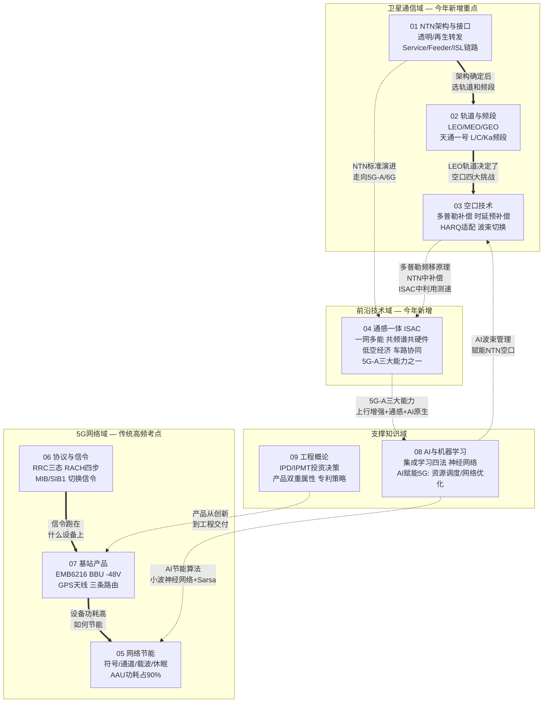
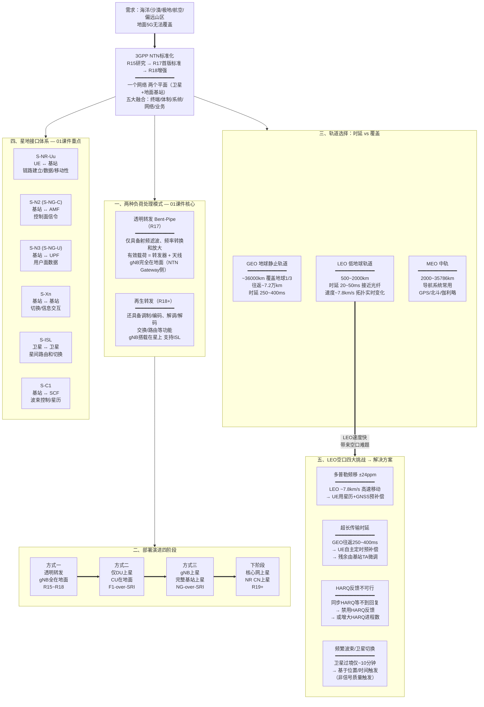
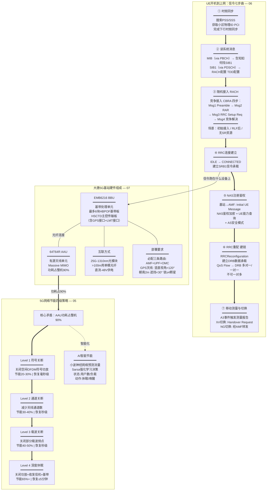
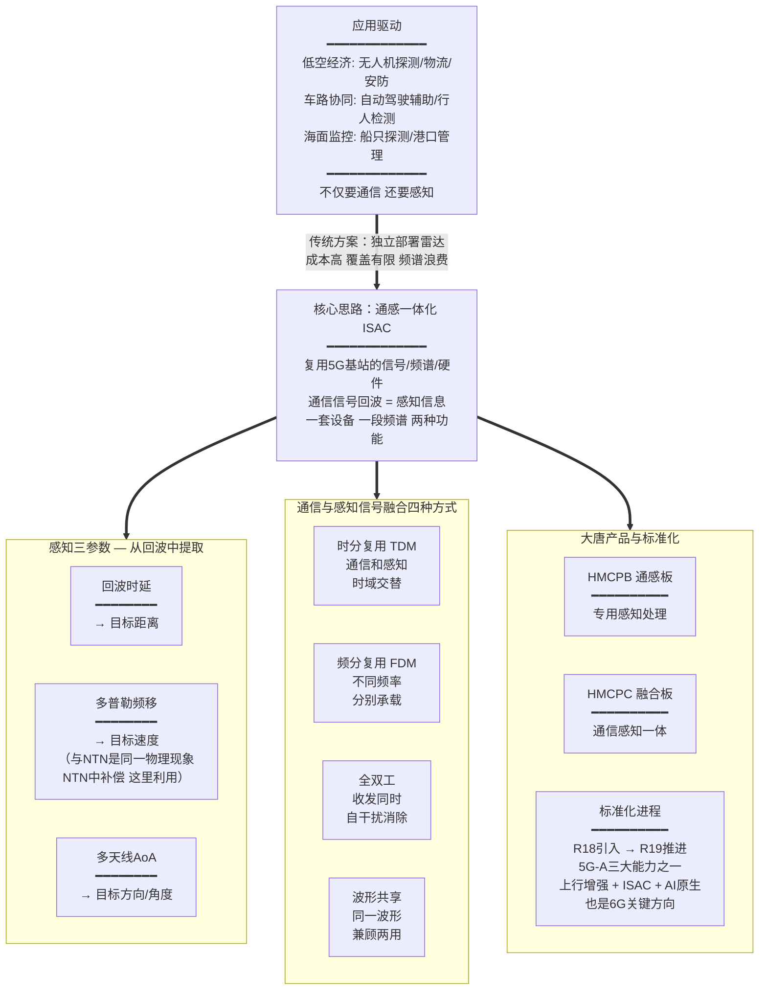
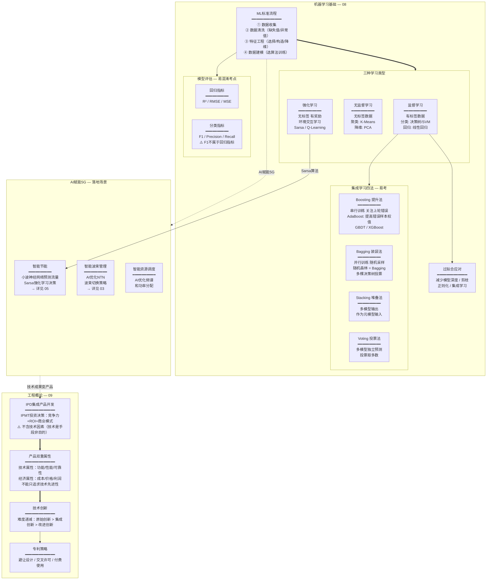
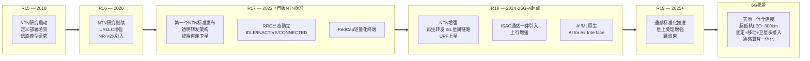

# 逻辑导图与记忆手册

> 本文件是9篇课程笔记的**逻辑串联版**，不重复罗列知识点，而是用因果故事线和概念关系图帮助理解记忆。具体知识点请回到对应课程笔记查阅。

---

## 一、全局知识地图

9个课题分属4个知识域，彼此之间存在跨域关联：

Mermaid 源码

**阅读指引**：实线箭头 = 域内递进关系，虚线箭头 = 跨域关联。先掌握域内主线，再记住跨域桥梁。

---

## 二、卫星通信域：从需求到解决方案（01+02+03）

### 因果故事线

地面5G网络再强大，也只能覆盖陆地人口密集区，**海洋、沙漠、极地、航空**这些场景无能为力。3GPP因此从**R15（2018年）**开始研究NTN（非地面网络），目标是把卫星纳入5G体系，实现天地一体覆盖。**R17（2022年）**发布了第一个正式NTN标准。

卫星互联网系统由**一个网络、两个平面**组成（卫星平面+地面基站平面），具备**五大融合**特征（终端、体制、系统、网络、业务融合）。卫星组网**多段协同**：空间段（卫星）+ 地面段（信关站、控制中心）+ 用户段（终端设备）。

NTN的核心架构围绕三条链路：**服务链路**（卫星↔UE）+ **馈电链路**（卫星↔信关站，无ISL时必须）+ **星间链路ISL**（卫星↔卫星）。卫星的负荷处理模式决定了两种架构：
- **透明转发**（R17）：卫星**仅具备**射频滤波、频率转换和放大功能，gNB完全在地面。有效载荷 = 转发器+天线
- **再生转发**（R18+）：还具备**调制/编码、解调/解码、交换/路由**等功能，gNB搭载在星上，支持ISL

部署演进四阶段：**透明转发 → 仅DU上星 → gNB上星 → 核心网上星**（对应R15~R18 → R18 → R19+）

那用什么轨道的卫星？这是一个**时延 vs 覆盖**的权衡：
- **GEO（~36000km）**：单颗覆盖地球表面约1/3区域，但往返约7.2万公里，时延约**250~400ms**，不适合实时交互
- **LEO（500~2000km）**：时延可降至**20~50ms**，接近地面光纤，但LEO卫星速度约**7.8km/s**，网络拓扑实时变化

频段选择也有类似权衡——**L频段**穿透力强用于卫星移动通信（天通一号），**C频段**是固定卫星主流（上行6G/下行4G），**Ka频段**带宽最大但雨衰严重。高轨系统还使用**Q/V频段**用于馈电和星间激光链路。

选了LEO就带来了空口技术上的挑战，因为卫星以~7.8km/s高速移动：
1. **大多普勒频移**（±24ppm）→ UE通过**星历+GNSS**在发射端预补偿频率
2. **长传输时延** → UE自主计算传播时延做**定时提前预补偿**，残余部分由基站TA微调
3. **HARQ不可行**（往返太久）→ **禁用HARQ反馈**或增大进程数
4. **频繁波束/卫星切换**（过境仅~10分钟）→ 基于星历的**位置/时间触发**切换（不是信号质量触发）

星地间的通信通过标准化接口实现：**S-NR-Uu**（UE↔基站）、**S-N2/S-NG-C**（基站↔AMF）、**S-N3/S-NG-U**（基站↔UPF）、**S-Xn**（基站↔基站）、**S-ISL**（卫星路由器间）、**S-C1**（基站↔SCF，传递波束控制和星历信息）。核心网基于**5GC+IMS**双域设计，低轨卫星可部署**S-UPF**实现星上数据处理。中国信科牵头完成了信关站、核心网、终端模拟器、多终端模拟器及星载基站等主要设备研制。

→ 详见 [01](01-卫星网络架构及接口介绍.md) 全文、[02](02-卫星产品分类分级及轨道.md) 第一~二节、[03](03-卫星通信空口技术.md) 全文

### 概念关系图

Mermaid 源码

### 记忆锚点

- **"R15研、R17标、R18强"**：R15开始研究，R17第一个标准，R18增强（再生转发/UPF上星）
- **透明转发三个字：滤转放**（射频滤波、频率转换、放大）；再生转发多三个：**编解路**（编码/调制、解调/解码、路由/交换）
- **有效载荷**：转发器+天线 = 卫星有效负荷
- **部署演进四阶段**："透DU全核"（透明转发→DU上星→gNB全上星→核心网上星）
- **LEO 7.8 / GEO 7.2万**：LEO速度~7.8km/s；GEO往返~7.2万公里、时延250~400ms；LEO时延仅20~50ms
- **五大融合**："终体系网业"（终端/体制/系统/网络/业务）；面向6G加两个：管理+频谱+平台=**七大融合**
- **星地接口核心三对**：S-N2=控制面（↔AMF）、S-N3=用户面（↔UPF）、S-ISL=星间
- **天通一号三要素**："GEO + 电信 + 3颗"（GEO同步轨道、中国电信运营、3颗卫星）
- **空口四大挑战**："延偏切损"（时延、频偏、切换、路径损耗）
- **中国信科角色**：牵头信关站、核心网、终端模拟器、多终端模拟器及星载基站

---

## 三、5G网络域：从接入到运维（06+07+05）

### 因果故事线

一部5G手机（UE）开机后要经历完整的信令流程才能上网。这个流程可以用"**找门→敲门→验身份→开通道→传数据**"来理解：

**第一步：找到基站的"门"在哪**。UE先搜索PSS/SSS完成时频同步并获取小区ID，然后读取**MIB**（通过PBCH广播，告诉UE怎么找SIB1），再读取**SIB1**（通过PDSCH广播，告诉UE RACH配置、TDD配置等）。MIB+SIB1构成"最小系统消息"，这是一切的起点。

**第二步：敲门——随机接入**。UE发起四步竞争随机接入（CBRA）：Msg1发Preamble → Msg2收RAR（含TA、TC-RNTI、UL Grant）→ Msg3发RRC Setup Request → Msg4收竞争解决。注意：初始接入、RLF后、无SR资源时**只能**用竞争方式；切换时可竞争可非竞争；波束恢复用非竞争。

**第三步：验身份——NAS注册与安全**。RRC连接建立后，基站向核心网发的第一条消息是**Initial UE Message**，随后是NAS鉴权加密、UE能力询问、AS安全模式。

**第四步：开通道——RRC重配与PDU Session**。通过RRCReconfiguration建立DRB，QoS Flow映射到DRB（多对一或一对一，**不可一对多**）。之后业务数据就可以在用户面流动了。

**第五步：移动中——测量与切换**。UE移动触发A3事件，Xn切换的第一条信令是源gNB→目标gNB的**Handover Request**；NG切换则经AMF转发。

这些信令跑在什么**物理设备**上？大唐的5G基站由**EMB6216 BBU**（最多6块HBPOF基带板，HSCTD主控传输板上有GPS和LMT接口）+ **64T64R AAU**（城区宏站）组成，供电均为**直流-48V**，BBU与AAU之间用25G-1310光模块连接（超过100m用单模光纤）。商用前必须配置到**AMF/UPF/OMC**三条路由。GPS天线竖直视角>120°，时钟源优先级GPS>北斗，至少锁定4颗卫星。

设备跑起来后，**AAU功耗占整机90%**，节能成为关键问题。大唐采用**四级递进**节能策略，负载从轻到重：
1. **符号关断**（毫秒级恢复，省20-30%）→ 2. **通道关断**（秒级，省30-40%）→ 3. **载波关断**（秒级，省40-50%）→ 4. **深度休眠**（5分钟内恢复，省65%+）

节能进入条件：RRC连接数和PRB利用率**都低于低门限**；退出条件：RRC连接数**高于高门限**、手动关闭、或超出时间段。更智能的方式是用**AI预测负荷**（小波神经网络）提前执行休眠/唤醒，或用**Sarsa强化学习**动态决策。

→ 详见 [06](06-5G接入网协议与信令.md) 全文、[07](07-5G基站产品及解决方案.md) 全文、[05](05-5G网络节能技术及算法.md) 全文

### 概念关系图

Mermaid 源码

### 记忆锚点

- **信令七步曲**："同步→系统消息→随机接入→注册鉴权→能力安全→重配建链→测量切换"
- **MIB记忆**："MIB就是SIB1的地图"（MIB最重要的作用 = 告诉UE怎么找SIB1）
- **竞争接入三场景**："初始、断链、无资源"（IDLE初始接入、RLF后、上行失步无SR资源）
- **四级节能递进**："符通载休"（符号→通道→载波→休眠），节能效果递增，恢复时间也递增
- **BBU三条必配路由**："信令（AMF）+ 数据（UPF）+ 管理（OMC）"
- **GPS天线**："120度视角、朝南2米、遮挡不超30度、锁4星"

---

## 四、前沿技术域：通感一体化 ISAC（04）

### 因果故事线

5G解决了"通信"问题，但未来的低空经济（无人机物流/安防）、车路协同（自动驾驶辅助）、海面监控等场景不仅需要通信，还需要**感知**——知道目标在哪、多快、朝哪个方向。传统方案是单独部署雷达系统，但成本高、覆盖有限。

**通感一体化（ISAC）**的核心思路是：既然5G基站已经在发射无线电信号，为什么不**顺便把反射回来的回波也利用起来**？原理和雷达完全一致：
- **回波时延** → 计算目标**距离**
- **多普勒频移** → 计算目标**速度**（这和NTN空口中的多普勒补偿是同一个物理现象，只是这里反过来利用它）
- **多天线到达角（AoA）** → 计算目标**方向/角度**

通信和感知共享同一套设备、频谱、站址，实现"一网多能"。信号融合方式有时分复用、频分复用、全双工、波形共享四种。大唐为此开发了**HMCPB（通感板）**和**HMCPC（融合板）**两款产品。

ISAC是**5G-A（R18-R20）三大新能力之一**（另外两个是上行增强和AI原生），3GPP在R19中进一步推进标准化，也是6G的关键技术方向。

→ 详见 [04](04-通感技术应用及架构介绍.md) 全文

### 概念关系图

Mermaid 源码

### 记忆锚点

- **感知三参数**："时距、频速、角方"（时延→距离，频移→速度，角度→方向）
- **5G-A三大能力**："上通智"（**上**行增强、**通**感一体、**智**能AI原生）
- **大唐两块板**："PB感知、PC融合"（HMCPB通感板、HMCPC融合板）
- **ISAC与NTN的桥梁**：多普勒频移在NTN中是"敌人"需要补偿，在ISAC中是"工具"用来测速

---

## 五、支撑知识域：AI赋能与工程落地（08+09）

### 因果故事线

5G网络面临的很多问题（节能策略选择、波束管理、故障预测）本质上都是**决策/优化**问题，而这恰恰是AI擅长的。所以理解"5G解决通信问题，AI解决决策问题，两者互为赋能"是核心认知。

AI的基础是**机器学习**，流程固定为四步：**数据收集→数据清洗→特征工程→数据建模**。学习类型有四种：监督学习（有标签，如分类/回归）、无监督学习（无标签，如聚类）、半监督学习、强化学习（环境交互+奖励，如Sarsa/Q-Learning）。

在5G网络中，AI的具体落地点包括：
- **智能节能**：用小波神经网络预测基站流量，提前休眠/唤醒（→ 详见 05）
- **智能节能决策**：用Sarsa强化学习算法，状态为用户数/负载，动作为休眠/唤醒
- **智能波束管理**：AI优化NTN波束切换（→ 详见 03）
- **智能资源调度**：AI优化频谱和功率分配

建模之后需要**评估模型**，这里有个易混淆考点：回归模型用R²/RMSE/MSE，分类模型用F1/Precision/Recall。**F1值不属于线性回归的评估指标**。

为了避免模型过拟合，可以减少深度、剪枝、或用集成学习（随机森林属于**Bagging**方法）。集成学习四大方法：Boosting、Bagging、Stacking、Voting。AdaBoost属于Boosting，核心机制是**提高**被错误分类样本的权值。

技术成果最终要变成产品，这就进入了工程概论的范畴。IPD（集成产品开发）中**IPMT**负责投资决策，关注综合竞争力、ROI、商业模式（**不含技术因素**——技术是手段不是目的）。产品具有**技术属性和经济属性**双重属性，不能只追求技术先进性。技术创新中难度最高的是**原始创新**。

→ 详见 [08](08-人工智能与机器学习-神经网络.md) 全文、[09](09-工程概论基础-信科赛专项培训.md) 全文

### 概念关系图

Mermaid 源码

### 记忆锚点

- **ML四步流程**："收洗特建"（收集、清洗、特征工程、建模）
- **集成学习四法**："提袋叠投"（Boosting提升、Bagging装袋、Stacking堆叠、Voting投票）
- **5G与AI的关系**："5G管通信，AI管决策；5G是AI的动能，AI是5G的大脑"
- **IPMT不含技术**：投资决策看"**钱景**"（竞争力/ROI/商业模式），不看技术本身
- **评估指标分家**："F1归分类，R²归回归"

---

## 六、3GPP标准演进时间线

将9篇笔记中涉及3GPP版本的知识点汇聚到一条时间线上，帮助理解"什么时候出了什么"。

Mermaid 源码

### 跨课题高频考点速查

| 关键词 | 出现课题 | 核心要点 |
|--------|---------|---------|
| **R15** | 01, 03 | NTN研究起点（2018年启动） |
| **R17** | 01, 03 | 第一个NTN标准，透明转发 |
| **R18 / 5G-A** | 01, 04 | 再生转发、ISAC、AI原生、基站上天 |
| **R19+** | 01 | 核心网上星、通感标准化推进 |
| **透明转发** | 01 | 仅具备射频**滤波、频率转换和放大**功能；有效载荷=转发器+天线 |
| **再生转发** | 01 | 还具备**调制编码、解调解码、交换路由**功能；gNB在星上 |
| **部署演进** | 01 | 透明转发→DU上星→gNB上星→核心网上星 |
| **LEO** | 01, 02, 03 | 500-2000km，时延20~50ms，速度~**7.8km/s**，多普勒大 |
| **GEO** | 01, 02 | ~36000km，覆盖地球1/3，往返~7.2万km，时延**250~400ms** |
| **五大/七大融合** | 01 | 五大：终端/体制/系统/网络/业务；6G加管理/频谱/平台=七大 |
| **S-N2 / S-N3** | 01 | S-N2=S-NG-C（↔AMF控制面）；S-N3=S-NG-U（↔UPF用户面） |
| **S-ISL** | 01 | 卫星间路由和切换信息 |
| **S-C1** | 01 | 基站↔SCF，传递波束控制和星历信息 |
| **5GC+IMS** | 01 | 卫星核心网双域设计；低轨可部署S-UPF |
| **多普勒频移** | 03, 04 | NTN中需补偿（±24ppm）；ISAC中用于测速 |
| **星历（ephemeris）** | 01, 03 | UE用星历+GNSS预补偿时延和频偏；S-C1接口下发星历 |
| **HARQ** | 03, 06 | 地面5G几ms反馈；NTN中禁用或增大进程数 |
| **直流-48V** | 07 | BBU和AAU供电（注意负号） |
| **GPS锁星** | 07 | 至少4颗（与北斗GPS定位4颗一致） |
| **AI节能** | 05, 08 | 小波神经网络预测 + Sarsa强化学习 |
| **Sarsa** | 05, 08 | 强化学习算法，用于节能决策 |
| **QoS Flow→DRB** | 06 | 多对一/一对一，不可一对多 |
| **中国信科** | 01, 07 | 牵头信关站/核心网/终端模拟器/星载基站研制 |

---

## 七、易混淆概念对比速查

### 7.1 透明转发 vs 再生转发（01 — PPT原文）

| | 透明转发（Bent-Pipe） | 再生转发（On Board Processor） |
|---|---------|---------|
| **PPT原文定义** | **仅具备**射频滤波、频率转换和放大功能 | 除了RF还具备**调制/编码、解调/解码、交换/路由**等功能 |
| **有效载荷** | 转发器、天线 | 星载gNB、路由器 |
| **gNB在哪** | **地面**（NTN Gateway侧） | **星上**（部分或全部） |
| **ISL星间链路** | 不支持 | 支持 |
| **3GPP版本** | **R17** | **R18+** |
| **部署演进** | 方式一 | 方式二(DU上星) → 方式三(gNB上星) → 核心网上星 |
| **类比** | 镜子（只反射） | 中转站（能拆包处理） |

### 7.2 Service Link vs Feeder Link vs ISL（01）

| 链路 | 两端 | 记忆方法 |
|------|------|---------|
| **Service Link** | 卫星 ↔ **UE** | "服务"用户，所以连UE |
| **Feeder Link** | 卫星 ↔ **网关** | "馈电"给网络，所以连地面站 |
| **ISL** | 卫星 ↔ **卫星** | "Inter-Satellite"，星间 |

### 7.3 竞争 vs 非竞争随机接入（06）

| | 竞争随机接入（CBRA） | 非竞争随机接入（CFRA） |
|---|---------|---------|
| **Preamble** | 随机选取，可能冲突 | 基站预分配，无冲突 |
| **步骤** | 四步（Msg1-4） | 两步（Preamble+RAR） |
| **适用场景** | 初始接入、RLF后、无SR资源 | 波束恢复 |
| **切换时** | **两种都可以** | **两种都可以** |
| **记忆** | "没资源就竞争抢" | "有预约就免排队" |

### 7.4 MIB vs SIB1（06）

| | MIB | SIB1 |
|---|-----|------|
| **承载信道** | PBCH（在SSB中） | PDSCH |
| **广播方式** | 周期广播 | 周期广播 |
| **核心内容** | SFN、SCS、**如何获取SIB1** | RACH配置、TDD配置 |
| **关系** | MIB是SIB1的"**地图**" | SIB1是接入的"**说明书**" |
| **MIB不含** | 小区ID（由PSS/SSS获取）、PHICH | — |

### 7.5 RRC状态 vs NAS状态（06）

| | RRC层状态 | NAS层状态 |
|---|----------|----------|
| **状态** | IDLE / INACTIVE / CONNECTED | RM REGISTERED / RM DEREGISTERED |
| **层级** | 接入层（AS） | 非接入层（NAS） |
| **考试陷阱** | RM REGISTERED/DEREGISTERED **不是**RRC状态 | — |

### 7.6 监督学习 vs 无监督学习 vs 强化学习（08）

| | 监督学习 | 无监督学习 | 强化学习 |
|---|---------|----------|---------|
| **数据** | 有标签 | 无标签 | 无标签，有奖励 |
| **目标** | 预测/分类 | 聚类/降维 | 最大化累计奖励 |
| **算法举例** | 线性回归、SVM、决策树 | K-Means、PCA | Sarsa、Q-Learning |
| **5G应用** | 负荷预测（小波神经网络） | — | 节能决策（Sarsa） |

### 7.7 回归评估 vs 分类评估（08）

| | 回归模型 | 分类模型 |
|---|---------|---------|
| **指标** | R², RMSE, MSE | F1, Precision, Recall |
| **考试陷阱** | **F1不属于回归指标** | — |

### 7.8 财务会计 vs 管理会计（09）

| | 财务会计 | 管理会计 |
|---|---------|---------|
| **报表使用者** | 企业**外部**（投资者、监管） | 企业**内部**管理者 |
| **记忆** | "财务对外报" | "管理对内看" |

### 7.9 四级节能对比（05）

| 级别 | 关闭对象 | 节能效果 | 恢复时间 |
|------|---------|---------|---------|
| 符号关断 | 部分OFDM符号功放 | 20-30% | **毫秒**级 |
| 通道关断 | 部分天线通道 | 30-40% | **秒**级 |
| 载波关断 | 部分载波频点 | 40-50% | **秒**级 |
| 深度休眠 | 功放+收发信机+基带 | 65%+ | **5分钟**内 |

**递进规律**：关的越多→省的越多→恢复越慢。通道关断**不会**导致符号关断终止。

### 7.10 Boosting vs Bagging（08）

| | Boosting | Bagging |
|---|---------|---------|
| **训练方式** | **串行**，关注上轮错误 | **并行**，随机采样 |
| **代表算法** | AdaBoost | 随机森林 |
| **AdaBoost机制** | 提高错误样本权值，降低正确样本权值 | — |
| **记忆** | "错了加倍练"（串行纠错） | "分头做再合"（并行投票） |

---

> 本手册最后更新：2026-04-13
>
> 建议配合使用方式：先通读一遍故事线建立逻辑框架 → 遇到模糊概念查速查表 → 考前过一遍记忆锚点

